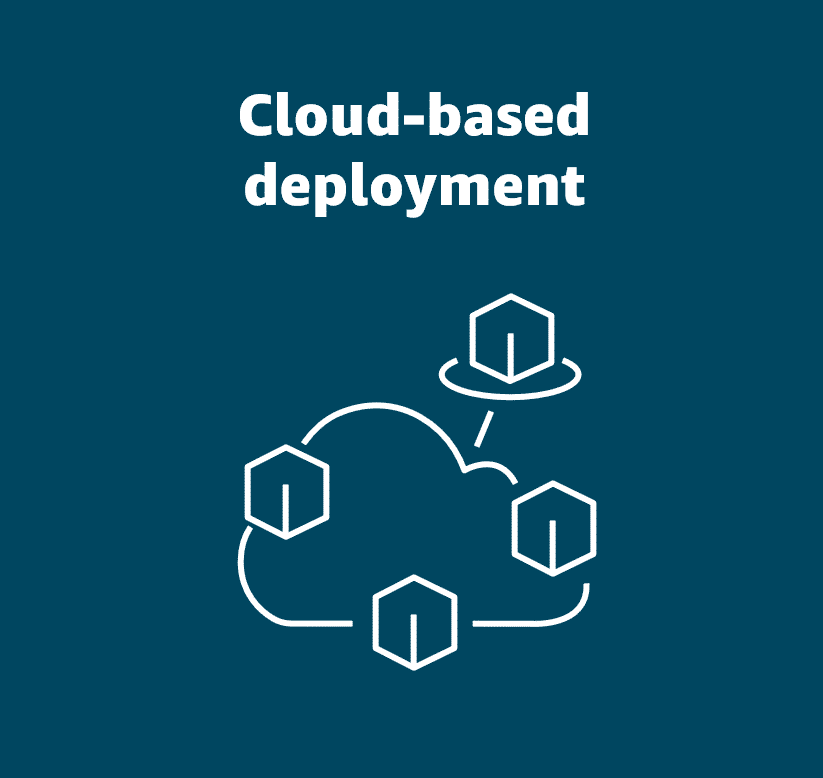
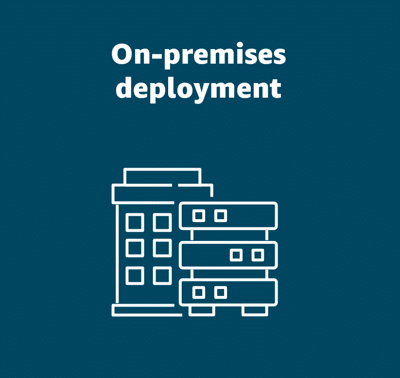
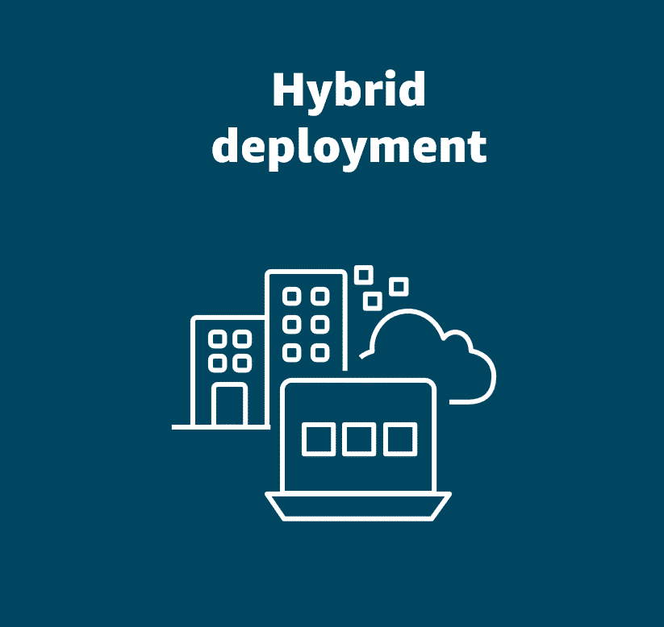
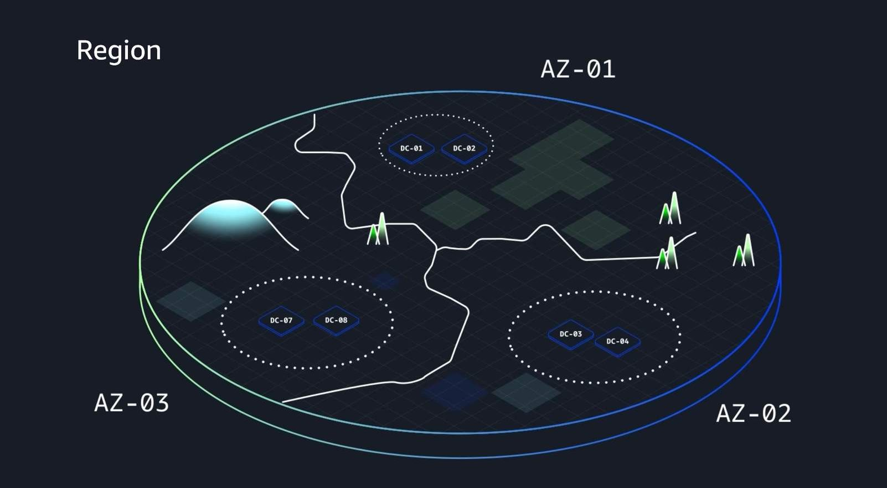

# Module 1: Introduction to the Cloud

## Status: ✅ Completed

## 🔗 Quick Navigation

- Q&A Review: [qa-review.md](qa-review.md)

## 👨‍🏫 Course Instructors & Overview

This AWS Cloud Practitioner Essentials course is delivered by experienced AWS professionals:

- **Morgan Willis** – Principal Cloud Technologist with 15+ years of IT experience; passionate about teaching and supporting cloud learners through their AWS journey
- **Rudy Chetty** – Chief Techfluencer & Principal Solutions Architect; 20+ years in technology helping customers realize their cloud transformation dreams
- **Alan Meridian** – AWS Training & Certification instructor with 8+ years delivering cloud trainings and certifications

**Course Purpose:** Build foundational cloud knowledge and establish a strong understanding of how AWS improves business operations while preparing you for AWS Cloud Practitioner certification.

---

## 📝 Learning Objectives

By the end of Module 1, you will understand:
- [x] The fundamental client-server model and its role in cloud computing
- [x] AWS's pay-only-for-what-you-use cost model
- [x] The breadth and depth of AWS services
- [x] How AWS enables businesses to increase agility, reduce costs, and innovate faster
- [x] The definition of cloud computing and how it works
- [x] The three types of cloud deployment: cloud, on-premises, and hybrid
- [x] The origins of AWS and how it evolved into a global cloud leader
- [x] The six key benefits of the AWS Cloud
- [x] AWS Regions and Availability Zones and how they are structured
- [x] The concepts of high availability and fault tolerance
- [x] The AWS Shared Responsibility Model and how responsibilities are divided
- [x] How cloud concepts work together in real-world business scenarios
- [x] Core concepts that form the foundation for becoming an AWS Cloud Practitioner

## 📚 Key Concepts

### 1. The Client-Server Model

**Overview:**
- Fundamental concept in computing that underpins cloud architecture
- Client makes a request to a server, server responds (if authorized)

**Coffee Shop Analogy:**
- **Customer** = Client (makes requests)
- **Barista** = Server (processes requests and provides responses)
- **Transaction flow:**
  1. Client makes a request (order coffee)
  2. Server validates the request (check payment, verify item availability)
  3. Server fulfills the request and returns a response (provide coffee)

**Real-World Application:**
- In web services, clients request resources (data, computation)
- Servers process these requests and return responses
- Examples of requests: rain pattern analysis, medical x-rays, video streaming

**Key Takeaway:** 
The client initiates communication by making a request, and the server responds with the appropriate resource or service, creating a fundamental interaction model for distributed computing.

---

**Q: In our coffee shop example, a barista and customer were used to represent the client-server model. The barista represents the server and a customer represents the client. Which scenario BEST describes how the client-server model works in this analogy?**

A: **The customer goes to the barista and places an order for a coffee. The barista prepares the coffee and hands it back to the customer. This describes how the client places the request, and the server responds.**

**Explanation of other options:**
- ❌ The customer takes a cup of coffee from a self-serve station without informing the barista = This describes how a client and server do not interact
- ❌ The barista proactively prepares a coffee and brings it to the customer without being asked = This describes how the client does not need to submit a request to the server
- ❌ The customer makes their own coffee using the coffee shop equipment without interacting with the barista = This describes how the client does not require the server
- ✅ The customer goes to the barista and places an order = Correct client-server model

---

### 2. Pay Only for What You Use (AWS Cost Model)

**Principle:**
AWS follows a pay-as-you-go model where you only pay for resources you actually consume.

**Coffee Shop Analogy:**
- Baristas are only paid for hours they actually work
- On busy days: hire more baristas
- On slow days: reduce staff
- Example: Launch of "Rudy's Rhubarb Refresher" might require 10 baristas during peak hours, but during slower periods, many would be idle and unproductive

**Traditional On-Premises vs. AWS:**

| **Aspect**               | **On-Premises Data Center**                       | **AWS Cloud**                                |
|:-------------------------|:--------------------------------------------------|:---------------------------------------------|
| **Pre-payment**          | Required (capacity planning upfront)              | No pre-payment needed                        |
| **Capacity Constraints** | Cannot easily scale beyond initial infrastructure | Unlimited scaling on-demand                  |
| **Idle Resources**       | Pay for resources even when unused                | Pay only for what you use                    |
| **Scaling Speed**        | Slow (requires hardware procurement)              | Instant (automatic provisioning)             |
| **Deprovisioning**       | No cost savings from unused resources             | Immediate stop to charges when deprovisioned |

**AWS Advantages:**
- Provision resources instantly when needed
- Deprovision (remove) resources immediately when no longer needed
- Stop paying instantly when resources are removed
- No need for upfront capacity planning
- Automatic configuration and scaling

**Real-World Benefit:**
Just like you only pay employees for hours worked, you only pay for AWS resources during actual consumption, resulting in significant cost savings.

---

### 3. AWS as a Comprehensive Cloud Platform

**What AWS Offers:**
AWS is the world's most comprehensive and broadly adopted cloud platform providing:
- **Compute** – Processing power for applications
- **Generative AI** – Advanced AI/ML services
- **Databases** – Relational and NoSQL solutions
- **Storage** – Scalable data storage options
- **Content Delivery** – Global distribution networks
- **Specialized Services** – Industry-specific solutions

**Three Core Business Benefits of AWS:**
1. **Increased Agility** – Rapid deployment and scaling of resources without upfront planning
2. **Lower Costs** – Pay-as-you-go model eliminates wasteful spending on unused capacity
3. **Faster Innovation** – Access to cutting-edge services and technologies enables competitive advantage

**Global Reach:**
- Used by millions of customers worldwide
- Enables organizations to be more agile than traditional on-premises solutions
- Reduces operational costs through efficient resource utilization
- Accelerates time-to-market for new applications and services

**Course Focus:**
- AWS offers a massive range of services, but we keep it simple
- Use analogies and real-world examples to build understanding
- Include AWS service demonstrations for practical context
- Concepts build progressively for inclusive mastery

---

### 4. How AWS Began — A Brief History

Understanding AWS's origins explains why it's built the way it is:

| **Year**        | **Milestone**                                                                                                                                     |
|:----------------|:--------------------------------------------------------------------------------------------------------------------------------------------------|
| **Early 2000s** | Amazon.com was an e-commerce site; IT team constantly scaled servers, storage, and compute to meet demand                                         |
| **2003**        | Amazon standardized internal tools and mechanisms for efficiency and scalability; employees proposed offering this capability to other businesses |
| **Nov 2004**    | AWS launched first public service: **Amazon Simple Queue Service (SQS)**                                                                          |
| **2006**        | AWS launched **Amazon S3** (storage) and **Amazon EC2** (scalable compute)                                                                        |
| **Post-2006**   | Rapid expansion — databases, networking, analytics, and many more cloud services added                                                            |
| **Today**       | AWS powers a significant portion of the internet, serving millions of customers globally — from startups to governments                           |

**Key Insight:**
AWS was born from Amazon's own need to solve internal IT scaling challenges. What started as an internal efficiency project became the world's leading cloud platform — proof that solving real business problems at scale creates enduring technology.

---

### 5. What is Cloud Computing?

> **Cloud computing is the on-demand delivery of IT resources over the internet with pay-as-you-go pricing.**

Breaking this definition down:

| **Term**              | **Meaning**                                                                                             |
|:----------------------|:--------------------------------------------------------------------------------------------------------|
| **On-demand**         | Use resources as and when needed — no pre-planning or pre-purchasing required                           |
| **IT resources**      | Servers, storage, databases, networking, software, analytics, AI — anything that runs on infrastructure |
| **Over the internet** | Access your resources remotely from anywhere with an internet connection                                |
| **Pay-as-you-go**     | Only pay for what you use; stop paying the moment you deprovision                                       |

**What is a Data Center?**
- A building (or set of buildings) housing servers that store and process all your data
- Designed with redundant power, cooling, and security for continuous operation
- Historically, businesses ran applications in their own data centers or co-located in shared facilities
- AWS changed this — companies can now run applications in data centers they **don't own or manage**

**Impact of Cloud:**
- No more managing physical infrastructure
- No more repetitive, time-consuming hardware tasks
- Teams can focus entirely on **innovation** rather than infrastructure maintenance

---

### 6. Cloud Deployment Types

AWS resources can be deployed in three models, each suited to different business needs:

#### ☁️ Cloud (Public Cloud)
- Migrate existing resources to the cloud, or build entirely new applications in the cloud
- All components (virtual servers, databases, networking) are hosted and managed in the cloud
- **Best for:** New applications, startups, teams wanting to minimize infrastructure management
- **Example:** A company migrates their database to Amazon RDS and builds a new web app on EC2



#### 🏢 On-Premises
- Resources deployed in a company's own data center using virtualization and resource management tools
- Essentially legacy IT infrastructure with some modernization via virtualization
- Provides dedicated resources and low latency, but misses most cloud benefits
- **Best for:** Situations requiring full infrastructure control or very low latency requirements
- **Example:** A financial firm runs its trading systems on local servers due to sub-millisecond latency needs



#### 🔀 Hybrid
- Cloud-based resources and on-premises infrastructure work together
- Multi-cloud deployments are also considered hybrid
- **Best for:** Businesses with legacy systems that can't move to cloud (regulatory, compliance, or maintenance reasons) but want cloud benefits for other workloads
- **Example:** A healthcare company keeps patient records on-premises for compliance but uses AWS for advanced data analytics and scaling



**Comparison at a Glance:**

| **Aspect**                 | **Cloud**           | **On-Premises**     | **Hybrid**      |
|:---------------------------|:--------------------|:--------------------|:----------------|
| **Managed by**             | Cloud provider      | Your team           | Both            |
| **Upfront cost**           | None                | High                | Medium          |
| **Scalability**            | Unlimited           | Limited             | Flexible        |
| **Control**                | Less                | Full                | Balanced        |
| **Compliance flexibility** | Depends on provider | Full control        | Best of both    |
| **Use case**               | New apps, agility   | Legacy, low latency | Mixed workloads |

---

**Q: You work for a local charity organization. Your organization has sensitive data that must remain within your country for compliance reasons. However, you also need a solution that can scale quickly to handle seasonal spikes in demand. You decide to keep on-premises resources for compliance and use cloud-based resources for dynamic scaling. Which type of cloud deployment does this situation describe?**

A: **Hybrid deployment.**

**Explanation of other options:**
- ❌ On-premises deployment = Everything runs locally; no cloud resources involved
- ❌ Public cloud deployment = Everything runs in the cloud; no on-premises component
- ❌ Data-compliance deployment = Not a real deployment type
- ✅ Hybrid deployment = Mix of on-premises (for compliant/regulated data) and cloud (for scalability) — exactly what the scenario describes

---

### 7. Six Key Benefits of the AWS Cloud

| # | **Benefit**                                                  | **What It Means**                                                                                               |
|:--|:-------------------------------------------------------------|:----------------------------------------------------------------------------------------------------------------|
| 1 | **Trade fixed expense for variable expense**                 | No large upfront investment in hardware/data centers — pay only for what you consume each month                 |
| 2 | **Benefit from massive economies of scale**                  | AWS buys hardware in huge volumes globally and passes the lower costs on to customers                           |
| 3 | **Stop guessing capacity**                                   | Scale resources up or down in minutes based on real demand — no over-provisioning or under-provisioning         |
| 4 | **Increase speed and agility**                               | Spin up test environments quickly, experiment freely, delete and stop paying when done — more time innovating   |
| 5 | **Stop spending money running and maintaining data centers** | No racking, stacking, or powering servers — redirect resources toward customers and strategy                    |
| 6 | **Go global in minutes**                                     | Deploy to AWS Regions worldwide in minutes, not months — no need to build your own international infrastructure |

**Deep Dive on Each Benefit:**

#### 1. Trade Fixed Expense for Variable Expense
- Traditional data centers require massive upfront capital: physical space, hardware, staff, and ongoing maintenance
- Costs can run hundreds of thousands to millions of dollars — and you pay the same regardless of utilization
- With AWS, your bill varies month to month based on actual resource consumption
- Start small, grow incrementally — AWS billing and budgeting tools help optimize spend

#### 2. Benefit from Massive Economies of Scale
- AWS builds data centers across the world and purchases hardware at enormous scale
- Bulk purchasing leads to lower per-unit costs for AWS
- These savings are passed directly to customers
- Small startups get access to the same advanced technology as large enterprises

#### 3. Stop Guessing Capacity
- Traditional approach: buy hardware based on 3-year projections (e.g., 10M users) — leads to either wasted capacity or a scramble to scale
- **Over-provisioned:** Hardware sits idle, money wasted
- **Under-provisioned:** Customers experience degraded service or churn
- AWS solution: Provision for today, scale up or down in **minutes** (vs. weeks/months on-premises)

#### 4. Increase Speed and Agility
- Cloud enables rapid experimentation — spin up environments, test ideas, delete if it doesn't work
- Fail fast and iterate without sunk hardware costs
- Free up engineering time from infrastructure provisioning → spend it on innovation and optimization

#### 5. Stop Spending Money Running and Maintaining Data Centers
- Beyond upfront CAPEX, on-premises data centers have ongoing operational costs: power, cooling, staff, hardware maintenance
- AWS absorbs all physical infrastructure responsibilities
- Your team focuses on customers and strategic work instead of server maintenance

#### 6. Go Global in Minutes
- Expanding to a new country traditionally required building/operating a local data center (months or years)
- With AWS, deploy to a geographically close AWS Region (e.g., Mumbai for India) in minutes
- AWS manages the underlying infrastructure; you focus on your application

---

**Q: A retail business plans to launch a new line of clothing, but they are struggling with accurately predicting how much server capacity they will need to support the launch. Which benefit of the AWS Cloud is most relevant to this situation?**

A: **Stop guessing capacity.**

**Explanation of other options:**
- ❌ Stop spending money to run and maintain data centers = Addresses operational/maintenance costs, not capacity planning
- ❌ Trade upfront expense for variable expense = Addresses cost model, not the ability to scale dynamically
- ❌ Go global in minutes = Addresses geographic expansion, not capacity
- ✅ Stop guessing capacity = AWS lets you scale resources up or down in minutes based on real demand, eliminating the need to predict and pre-provision capacity

---

### 8. AWS Global Infrastructure

#### Regions

- A **Region** is a physically separate geographic location around the world where AWS maintains clusters of data centers
- Examples: Paris, Tokyo, São Paulo, Dublin, Ohio, Mumbai
- Regions are built close to AWS customers to reduce latency
- Businesses commonly operate across **multiple Regions** — if one Region experiences an outage, operations can fail over to another

#### Availability Zones (AZs)

- Each Region contains **3 or more Availability Zones**
- AZs are **not built next to each other** — physically separated to protect against localized disasters (floods, power grid failures, etc.)
- Each AZ contains **one or more discrete data centers** with independent power, networking, and connectivity
- AZs within a Region are connected via low-latency links

**Region → AZ → Data Center hierarchy:**

```
AWS Region (e.g., US-East)
 ├── Availability Zone A  →  Data Center(s)
 ├── Availability Zone B  →  Data Center(s)
 └── Availability Zone C  →  Data Center(s)
```



#### High Availability

- **Definition:** Ensuring applications stay accessible with minimal downtime — if one component fails, another picks up the slack
- **How to achieve it:** Distribute resources across **multiple AZs** within a Region
- If one AZ has an outage, workloads in other AZs continue uninterrupted

**Coffee Shop Analogy:**
> A new barista spills a latte, frying the register and knocking out power — the shop must close.
> But because it's a **chain with multiple locations**, customers just visit a nearby branch. Business continues.
> AWS works the same way — distribute resources so no single failure takes everything down.

#### Fault Tolerance

- **Definition:** Designing a system to **continue operating even if multiple components fail simultaneously** — resilience built into every layer
- Goes beyond high availability: the system doesn't just recover quickly; it continues functioning through failures
- Achieved by spreading across multiple AZs and Regions with redundant infrastructure at every level

| **Concept**           | **Definition**                                             | **Scope**                           |
|:----------------------|:-----------------------------------------------------------|:------------------------------------|
| **High Availability** | Minimal downtime; quick failover when one component fails  | AZ or component level               |
| **Fault Tolerance**   | Continues operating despite multiple simultaneous failures | System-wide, multi-layer resilience |

> **Best Practice:** Always distribute application resources across **at least 2–3 AZs** within a Region to ensure continuity if one AZ goes down.

---

**Q: You just joined a tech start-up, and the business is growing rapidly. Your new company decides that they need to design a resilient and scalable infrastructure on AWS to handle increased traffic and help ensure high availability. Which statement BEST describes the AWS Global Infrastructure benefit of high availability?**

A: **AWS provides multiple data centers across different geographic regions so your website can remain operational even if one location faces issues.**

**Explanation of other options:**
- ❌ AWS stores all of your website's data in a single AWS storage bucket = Centralization is the opposite of high availability; a single point of failure
- ❌ AWS has many customer support options = Unrelated to infrastructure design or high availability
- ❌ AWS offers a single, highly secure data center = A single data center is a single point of failure, regardless of security
- ✅ AWS provides multiple data centers across regions = Correct; distributing resources ensures continuity if one location fails

---

### 9. The AWS Shared Responsibility Model

> **Both AWS and the customer are responsible for security — AWS for the security *of* the cloud, customers for security *in* the cloud.**

**House Analogy:**
> A builder constructs a house with solid walls and a strong door — that’s their responsibility.
> Closing and locking the door every day is *your* responsibility as the homeowner.
> AWS works exactly the same way.

#### Responsibility Breakdown

| **Layer**                            | **Responsible Party** | **Examples**                                       |
|:-------------------------------------|:----------------------|:---------------------------------------------------|
| Physical hardware, facilities        | AWS                   | Data center buildings, servers, power, cooling     |
| Network infrastructure               | AWS                   | Global networking, hypervisor isolation            |
| Hypervisor / virtualization          | AWS                   | Workload isolation between customers               |
| Operating System (OS)                | **Customer**          | Patching, updates, user accounts, login keys       |
| Applications                         | **Customer**          | Application code, configuration, security          |
| Data                                 | **Customer**          | What data is stored, who can access it, encryption |
| Client-side encryption               | **Customer**          | Encrypting data before sending to AWS              |
| Server-side encryption               | **Shared**            | Depends on the service used                        |
| Network traffic protection           | **Shared**            | Depends on the service used                        |
| Platform & application management    | **Shared**            | Varies by service type                             |
| OS, network & firewall configuration | **Shared**            | Varies by service type                             |

#### AWS Responsibilities (Security *of* the Cloud)
- Protecting the **underlying infrastructure**: hardware, software, networking, and physical facilities
- Maintaining the **hypervisor layer** that isolates customer workloads from each other
- Securing **physical access** to data centers: locks, access control lists, privilege separation
- AWS cannot access your OS, application, or data — there is no back door

#### Customer Responsibilities (Security *in* the Cloud)
- **Operating System:** Customer holds the only encryption key; responsible for patching and updates
  - If AWS finds a vulnerability in your OS version, they can **notify** you but cannot patch it for you
- **Applications:** You own them, you secure them
- **Data:** You decide who has access, how access is granted/revoked, and whether to encrypt it
  - Options range from fully public (e.g., retail product images) to fully locked down (e.g., healthcare records)
- **Client-side encryption:** Customer’s responsibility to encrypt data before it reaches AWS

#### Shared Responsibilities
- Responsibility shifts between AWS and customer depending on the **type of service** used
- Examples: server-side encryption, network traffic protection, OS/firewall configuration
- As you learn more services (EC2, RDS, Lambda, etc.), you’ll see exactly how the split differs per service

#### Key Mental Model

```
┌─────────────────────────────────────────────────────┐
│  CUSTOMER: Security IN the Cloud                    │
│  (Data, Applications, OS, Access Control)           │
├─────────────────────────────────────────────────────┤
│  SHARED: Varies by Service Type                     │
│  (Server-side encryption, Network, Firewall config) │
├─────────────────────────────────────────────────────┤
│  AWS: Security OF the Cloud                         │
│  (Hardware, Networking, Facilities, Hypervisor)     │
└─────────────────────────────────────────────────────┘
```


---

**Q: You work for a startup company that is developing an application in the cloud. A new security update is available for your operating system (OS), and you are tasked with verifying that the OS is patched accordingly. Which statement BEST describes which party is responsible for applying security patches to the OS that is running in the cloud?**

A: **Your company is responsible for applying security patches to the OS.**

**Explanation of other options:**
- ❌ AWS applies patches = AWS has no access to your OS; there is no back door; AWS can only notify you of vulnerabilities
- ❌ Both apply separate patches = OS patching is solely the customer’s responsibility, not shared
- ❌ OS vendor applies patches = Vendors may release patches, but deploying them to your cloud OS is always the customer’s task
- ✅ Customer applies patches = The customer holds the only key to their OS and is fully responsible for patching and updates

---

### 10. Cloud in Real Life: Concepts Working Together

> Cloud concepts don't operate in isolation — they combine as building blocks to create real business solutions.

**Use Case: Global E-Commerce Company Expansion**

A Seattle-based e-commerce company wants to expand operations globally. Here's how AWS concepts work together to make it happen:

#### Challenge: Latency and Global Reach
- Computing infrastructure far from customers = higher latency = worse user experience
- Traditional solution: build and operate your own data centers in each country (months/years, massive CAPEX)
- **AWS solution:** Deploy to geographically close AWS Regions in minutes

#### Solution Architecture

| **Expansion**       | **AWS Region**             | **Benefit Achieved**                    |
|:--------------------|:---------------------------|:----------------------------------------|
| Seattle (home base) | us-west-2 (Oregon)         | Low-latency serving of US customers     |
| Europe              | eu-west-1 (Ireland)        | Reduced latency for European customers  |
| Asia                | ap-southeast-1 (Singapore) | Reduced latency for Asian customer base |

#### How Global Infrastructure Helps
- Deploying across **multiple Regions** improves availability — if one Region has issues, others continue serving
- Within each Region, deploy to **at least 2 Availability Zones** for high availability and fault tolerance
  - Same configuration deployed in each AZ; if one fails, traffic fails over to the other
- Going global took **minutes**, not months or years
- Levels the playing field: **startups** can reach a global audience without large upfront capital investment

#### How the Shared Responsibility Model Helps
- The company does **not** need to worry about physical security of data centers in Ireland or Singapore — that's AWS's responsibility
- The company can focus entirely on:
  - Securing and encrypting their customer data
  - Managing user access to AWS resources
  - Ensuring applications comply with regulations (e.g., PCI-DSS for credit card data)
- AWS handles the locks on the data center doors; the company focuses on securing what's inside

#### Key Insight for Businesses
> AWS services are used together like **building blocks** to form complete solutions. No single concept operates alone:
> - **Global Infrastructure** → reduces latency, enables high availability and fault tolerance
> - **Shared Responsibility Model** → clarifies exactly who secures what, letting teams focus on value-add work
> - **Pay-as-you-go** → no upfront CAPEX to expand globally
> - Together → a startup or enterprise can achieve global scale, resilience, and security efficiently

## 🔗 References & Links

| **Resource**                                                                                         | **Description**                                         |
|:-----------------------------------------------------------------------------------------------------|:--------------------------------------------------------|
| [What is Cloud Computing?](https://aws.amazon.com/what-is-cloud-computing/?nc1=f_cc)                 | Official AWS overview of cloud computing basics         |
| [AWS Shared Responsibility Model](https://aws.amazon.com/compliance/shared-responsibility-model/)    | Detailed breakdown of AWS vs. customer responsibilities |
| [Regions and Availability Zones](https://aws.amazon.com/about-aws/global-infrastructure/regions_az/) | Complete list of AWS Regions and AZs worldwide          |

## ❓ Key Questions to Review

- What are the main benefits of cloud computing?
- What is the formal definition of cloud computing?
- How does AWS's global infrastructure work?
- What are the three types of cloud deployment and when is each used?
- What are the differences between cloud, on-premises, and hybrid deployments?
- How did AWS originate and what drove its creation?
- What are the six key benefits of the AWS Cloud?
- What is the difference between fixed and variable expenses in the context of AWS?
- How does AWS handle capacity planning differently from on-premises?
- What are AWS Regions and Availability Zones?
- What is the difference between high availability and fault tolerance?
- Why does AWS distribute resources across multiple Regions and AZs?
- How does the coffee shop analogy explain high availability?
- What is the AWS Shared Responsibility Model?
- What is AWS responsible for vs. what is the customer responsible for?
- What does "security of the cloud" vs. "security in the cloud" mean?
- Who is responsible for patching the OS on an EC2 instance?
- What are examples of shared responsibilities in AWS?
- How do AWS Global Infrastructure and the Shared Responsibility Model work together in practice?
- How would a company use AWS to expand globally with minimal latency?
- Why can startups compete globally on AWS without large upfront investment?

## 📌 Summary

**Module 1: Foundations of AWS Cloud Computing**

**Course Context:**
This course, delivered by experienced AWS professionals (Morgan, Rudy, and Alan), uses a progressive learning approach with analogies, real-world examples, and service demonstrations to make cloud concepts accessible and practical.

**Core Concepts Covered:**

1. **The Client-Server Model** – Fundamental architecture where clients make requests to servers, visualized through a coffee shop analogy. This pattern is essential for understanding how cloud applications work.

2. **Pay-As-You-Go Pricing** – AWS's revolutionary cost model where you only pay for resources during actual consumption, unlike traditional on-premises data centers requiring massive upfront investment and capacity planning.

3. **AWS Comprehensive Platform** – A vast ecosystem of services delivering three key business benefits: Increased Agility, Lower Costs, and Faster Innovation.

4. **AWS Origins** – AWS grew from Amazon's internal need to solve IT scaling challenges in the early 2000s. It launched publicly in 2004 (SQS), expanded rapidly with S3 and EC2 in 2006, and is now a global cloud leader.

5. **Cloud Computing Definition** – The on-demand delivery of IT resources over the internet with pay-as-you-go pricing. This eliminates the need to own or manage physical data centers.

6. **Cloud Deployment Types:**
   - **Cloud** – Fully hosted in the cloud; maximum agility, no infrastructure management
   - **On-Premises** – Legacy IT in your own data center; full control, limited cloud benefits
   - **Hybrid** – Mix of cloud and on-premises; ideal for regulated workloads needing cloud scalability

7. **Six Key Benefits of the AWS Cloud:**
   - **Variable over fixed expense** – Pay only for what you use, no upfront capital investment
   - **Economies of scale** – AWS's bulk purchasing passes cost savings to all customers
   - **No capacity guessing** – Scale in minutes, avoid over/under-provisioning
   - **Speed and agility** – Experiment fast, innovate more, waste less time on infrastructure
   - **No data center maintenance** – Redirect operational effort toward customers and strategy
   - **Go global in minutes** – Deploy worldwide without building your own international infrastructure

8. **AWS Global Infrastructure:**
   - **Regions** – Physically separate geographic locations worldwide (e.g., Paris, Tokyo, Ohio) housing applications close to customers
   - **Availability Zones (AZs)** – 3+ isolated data centers within each Region, each with independent power, networking, and connectivity
   - **High Availability** – Distribute resources across AZs/Regions so service continues if one location fails
   - **Fault Tolerance** – System continues operating even when multiple components fail; resilience built into every layer

9. **AWS Shared Responsibility Model:**
   - **AWS** – Security *of* the cloud (hardware, networking, facilities, hypervisor)
   - **Customer** – Security *in* the cloud (OS, applications, data, access control, client-side encryption)
   - **Shared** – Server-side encryption, network traffic protection, firewall config (varies by service)
   - Key rule: AWS cannot access your OS or data — the customer holds all keys

10. **Cloud in Real Life — Concepts Working Together:**
    - A global e-commerce company uses multiple Regions (Ireland, Singapore) to reduce latency for European and Asian customers
    - Deploying across 2+ AZs per Region achieves high availability and fault tolerance
    - The Shared Responsibility Model lets the company focus on data security and compliance instead of physical data center management
    - AWS enables global reach in **minutes** instead of months/years, with no large upfront capital investment

**Key Takeaway:**
AWS cloud concepts don't operate in isolation — they work together as building blocks. Global Infrastructure reduces latency and ensures resilience; the Shared Responsibility Model clarifies security ownership; pay-as-you-go eliminates CAPEX. Together these enable any business — startup or enterprise — to operate at global scale securely and cost-effectively.

---

**Module Status**: ✅ Completed  
