# Module 2: Compute in the Cloud

## Status: ✅ 100% Complete

## 🔗 Quick Navigation

- Q&A Review: [qa-review.md](qa-review.md)

**Documentation**: ✅ notes.md (4000+ lines, 9 sections, 24 Q&As, 32 images)  
**Q&A Review**: ✅ qa-review.md (30 Q&As: 20 course + 10 cert/interview prep)  
**Images**: 32 placeholders registered in `/images/` folder

## 📝 Learning Objectives

By the end of Module 2, you will understand:
- [x] What compute in the cloud means and why it matters
- [x] What Amazon EC2 is and how it works
- [x] The concept of multi-tenancy and how AWS manages it
- [x] Different Amazon EC2 instance types and when to use each
- [x] Amazon EC2 pricing models and when to use each
- [x] How Amazon EC2 Auto Scaling works and why it matters
- [x] What Elastic Load Balancing is and how it distributes traffic
- [x] Messaging and queuing services: Amazon SQS and Amazon SNS
- [x] Additional compute options: AWS Lambda and container services (references provided in resources)

## 📚 Key Concepts

### 1. Introduction to Amazon EC2

**What is Compute in the Cloud?**
- **Compute** refers to the processing power needed to run applications, manage data, and perform calculations
- In the cloud, this power is available **on-demand** — accessible remotely without owning physical hardware
- Compute in the cloud = creating virtual machines with a cloud provider to run applications over the internet

**What is Amazon EC2?**

Amazon Elastic Compute Cloud (Amazon EC2) is AWS's core compute service providing on-demand virtual server capacity.

**Challenges of On-Premises Resources:**
- Must purchase hardware upfront, wait for delivery, then install and configure
- Time-consuming, costly, and inflexible — locked into a specific capacity that may not match changing demand

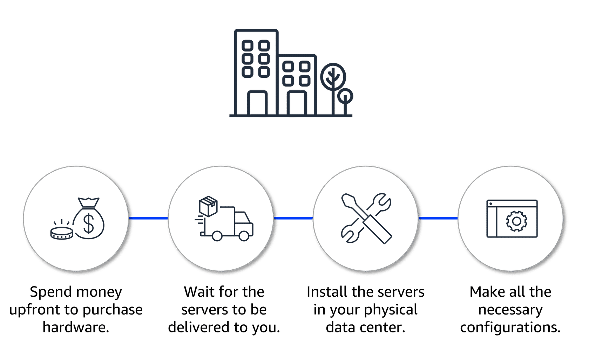

**Benefits of Cloud Resources with Amazon EC2:**
- Quickly launch, scale, and stop instances based on your needs
- No delays or upfront costs associated with traditional on-premises resources

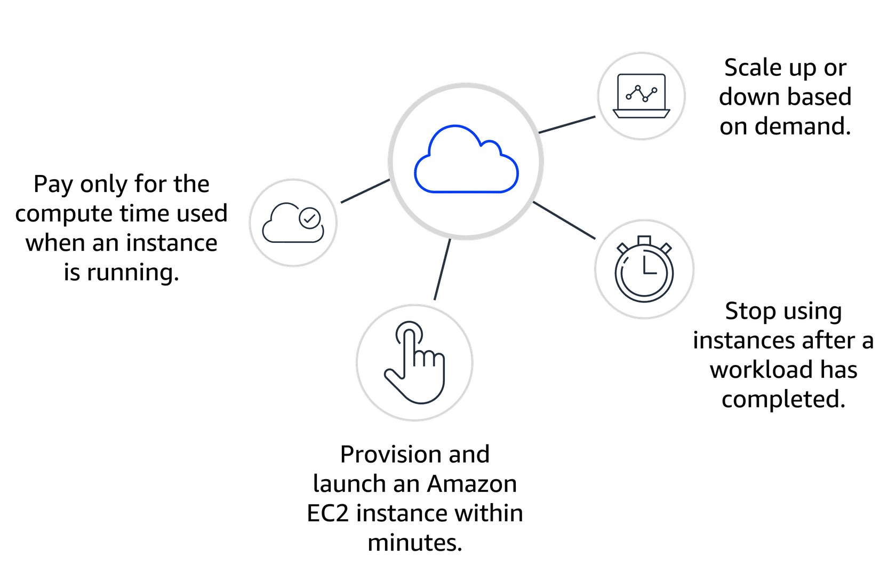

**On-Premises vs. Amazon EC2 — Comparison:**

| **Aspect**      | **On-Premises Servers**                                             | **Amazon EC2**                                     |
|:----------------|:--------------------------------------------------------------------|:---------------------------------------------------|
| **Setup**       | Purchase hardware upfront, wait for delivery, install and configure | Launch within minutes, ready to use immediately    |
| **Cost**        | Large upfront capital + ongoing maintenance                         | Pay only for what you use (running instances only) |
| **Flexibility** | Locked into fixed capacity                                          | Scale up, down, or terminate anytime               |
| **Speed**       | Weeks to months to get started                                      | Minutes to launch                                  |
| **Management**  | Your team manages all hardware                                      | AWS manages underlying infrastructure              |

**Key Benefits at a Glance:**
- **Flexible** — Launch as many or as few virtual servers as needed; configure security, networking, and storage
- **Cost-effective** — Pay only for running instances; stopped or terminated instances are not charged
- **Fast** — Instances launch and boot within minutes
- **Scalable** — Scale resources up or down based on demand (high traffic, compute-heavy tasks)

---

#### How Amazon EC2 Works

EC2 follows a simple three-step workflow:

**Step 1: Launch an Instance**
- Select an **Amazon Machine Image (AMI)** — defines the operating system and may include pre-installed software
- Choose an **Instance Type** — determines underlying hardware resources (CPU, memory, network performance)

**Step 2: Connect to the Instance**
- **SSH** — for Linux instances (Secure Shell)
- **RDP** — for Windows instances (Remote Desktop Protocol)
- **AWS Systems Manager** — secure, simplified access without needing open SSH/RDP ports
- Applications can also connect over the network to services running on the instance

**Step 3: Use the Instance**
- Run commands, install software, add storage, organize files
- Deploy business applications, web apps, databases, or third-party enterprise software
- Full control over what runs on the instance

---

#### Key Technical Concepts

**Multi-Tenancy:**
- EC2 instances are **virtual machines (VMs)** — they share an underlying physical host with multiple other instances
- A piece of software called the **hypervisor** manages resource sharing and isolates instances from each other
- AWS manages the host machine, hypervisor, and instance-to-instance isolation — customers never worry about this layer
- Each VM is isolated from others even while sharing the same physical hardware

**Vertical Scaling:**
- EC2 instances are **resizable** — start small and scale up when needed
- If an application starts maxing out its server, you can give that instance more CPU and memory
- This is called **vertical scaling** — making an instance bigger or smaller as needed

**Operating System Choices:**
- Choose **Windows** or **Linux** OS when launching
- Provision thousands of instances with different OS and software configurations
- Full control over what software runs on each instance

**Networking Control:**
- Decide what types of requests reach your server
- Configure whether instances are publicly or privately accessible

---

**Q: How does Amazon EC2 compare to running servers on premises?**

A: **It is more flexible, cost-effective, and quicker to get started.**

**Explanation of other options:**
- ❌ More expensive but offers more control = EC2 is actually less expensive; no upfront hardware costs
- ❌ Requires more time to set up and maintain = On-premises requires more time; EC2 launches within minutes
- ❌ Only useful for large businesses = EC2 is used by startups, individuals, and large enterprises alike
- ✅ More flexible, cost-effective, and quicker to get started = AWS manages the infrastructure; you just request instances

---

**Q: What is multi-tenancy in the context of Amazon EC2 instances?**

A: **Each virtual machine is isolated but shares resources from a host machine.**

**Explanation of other options:**
- ❌ Multiple servers run in the same data center = Multi-tenancy is about VMs sharing a physical host, not data center co-location
- ❌ Only one user can use the instance at a time = Multiple VMs from different customers can share the same physical host simultaneously
- ❌ A server can only run one type of application = Instances can run any application regardless of multi-tenancy
- ✅ Each VM is isolated but shares resources from a host = The hypervisor handles isolation and resource sharing on the physical host

---

**Q: A company uses Amazon EC2 instances to deploy their application. What would happen if they need to stop or terminate the EC2 instances?**

A: **You pay only for running instances, not for stopped or terminated ones.**

**Explanation of other options:**
- ❌ You are still charged for the instances = Charges stop when instances are stopped or terminated
- ❌ The instances will automatically restart after a set time = Instances do not restart automatically unless specifically configured
- ❌ Your instances are permanently deleted and cannot be recovered = Stopped instances can be restarted; only terminated instances are deleted
- ✅ Pay only for running instances = Stopping or terminating ends the billing for that instance immediately

---

**Q: What must be specified when preparing to launch an Amazon EC2 instance?**

A: **The type of instance and the operating system.**

**Explanation of other options:**
- ❌ The amount of storage and the number of users = Number of users is irrelevant at launch; storage is configurable but not the primary launch requirement
- ❌ The instance's location and backup plan = Region can be chosen but backup plan is not required at launch
- ❌ The network bandwidth and data transfer limit = These are determined by the instance type, not specified separately at launch
- ✅ The type of instance and the operating system = Instance type determines hardware resources; the AMI determines the OS — both required to launch

---

### 2. Amazon EC2 Instance Types

EC2 offers a broad range of instance types, each tailored to specific use case requirements. Instances come with varying combinations of CPU, memory, storage, and networking — choose the right mix to optimize performance for your workloads.

**Coffee Shop Analogy:**
> Just like a coffee shop needs different machines for espresso, drip coffee, and cold brew, AWS environments need different instance types for different workloads. Using the right instance type is key to efficient operations.

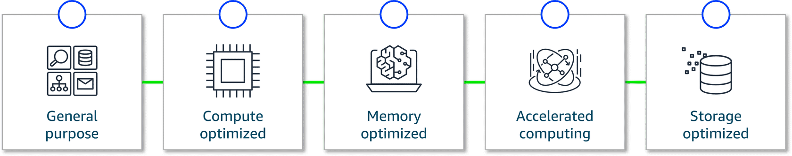

| **Instance Family**       | **Best For**                                     | **Example Use Cases**                                                                 |
|:--------------------------|:-------------------------------------------------|:--------------------------------------------------------------------------------------|
| **General Purpose**       | Balanced compute, memory, and networking         | Web servers, code repositories, unknown workload profiles                             |
| **Compute Optimized**     | Compute-intensive tasks                          | Gaming servers, HPC, machine learning, scientific modelling                           |
| **Memory Optimized**      | Memory-intensive tasks; large datasets in memory | Data analytics, large databases, in-memory processing                                 |
| **Accelerated Computing** | Hardware-accelerated tasks using GPUs            | Floating-point calculations, graphics processing, ML inference, data pattern matching |
| **Storage Optimized**     | High I/O performance for locally stored data     | Large databases, data warehousing, I/O-intensive applications                         |

**Instance Naming Convention:**
- Instance types are named based on **instance family** and **instance size**
- Example: `m5.large` → `m` = general purpose family, `5` = generation, `large` = size
- See [Amazon EC2 instance type naming conventions](https://docs.aws.amazon.com/ec2/latest/instancetypes/instance-type-names.html)

**Choosing the Right Size:**
- Bigger instances = more CPU, memory, and storage — but also higher cost
- Start with what you need; the cloud lets you change instance type or size at any time
- Find the balance between performance and cost — avoid paying for resources you don't need

**Key Takeaway:**
> You are never locked into an instance type. If the one you chose doesn't meet your performance or budget needs, change it. The cloud gives you the flexibility to pivot quickly.

---

**Q: A financial institution is running a real-time analytics application that processes large datasets stored across multiple servers to provide quick query results. Which Amazon EC2 instance type would be the BEST choice for this task?**

A: **Memory optimized.**

**Explanation of other options:**
- ❌ General purpose = Balanced resources; not optimized for memory-heavy workloads
- ❌ Compute optimized = Best for CPU-intensive tasks like gaming or HPC, not large in-memory datasets
- ❌ Storage optimized = Best for locally stored data with high I/O; this workload requires fast in-memory processing
- ✅ Memory optimized = Designed for workloads that process large datasets in memory with fast performance — exactly what this analytics application needs

---

**Q: A retail company is setting up a solution to analyze historical sales data stored locally. The solution requires fast access to large datasets with consistent, high disk throughput for quick data retrieval. Which Amazon EC2 instance type would be the MOST suitable?**

A: **Storage optimized.**

**Explanation of other options:**
- ❌ General purpose = Balanced resources; not designed for high disk throughput
- ❌ Compute optimized = Best for CPU-intensive tasks; this workload needs fast local disk access, not raw compute power
- ❌ Accelerated computing = Uses GPU hardware accelerators; not relevant for disk-based data retrieval
- ✅ Storage optimized = Designed for workloads requiring high performance for locally stored data with high I/O throughput — ideal for this use case

---

### 3. How to Provision AWS Resources

In AWS, all interactions with services are powered by **APIs** (Application Programming Interfaces). APIs provide predefined methods to interact with, manage, and configure AWS resources efficiently. You can call AWS APIs through three primary methods:

#### AWS Management Console
- **What it is**: A web-based visual interface for managing AWS services
- **How it works**: Browser-based point-and-click navigation through menus and forms
- **Features**:
  - Quick visual access to services
  - Search functionality for finding services
  - Simplified workflows for common tasks
  - Mobile app available — monitor resources, view alarms, check billing, support multiple logged-in identities
  - View AWS bills and monitoring dashboards
- **Best for**: Users who prefer a visual, easy-to-use interface; learning about AWS; testing environments; managing non-technical tasks

#### AWS Command Line Interface (AWS CLI)
- **What it is**: A text-based tool for managing AWS services from a terminal/command line
- **How it works**: Type commands to invoke AWS APIs programmatically
- **Supported platforms**: Windows, macOS, Linux
- **Key advantages**:
  - Enables **automation through scripting** — eliminate manual steps and human errors
  - Ideal for provisioning multiple resources in sequence
  - Example commands:
    - `aws ec2 run-instances` — launch an EC2 instance
    - `aws ec2 describe-availability-zones` — list all AZs in the current Region
  - Can be used manually or embedded in automation scripts
- **Best for**: Advanced users and developers who need to automate tasks, script actions, and manage AWS resources efficiently from the command line

#### AWS Software Development Kit (AWS SDK)
- **What it is**: Language-specific libraries that let you integrate AWS services into your applications
- **How it works**: Provides APIs in programming languages like Python, Java, C++, .NET, etc.
- **Use case**: Write applications that programmatically create, interact with, and manage AWS resources
- **Example**: Python script using boto3 SDK to list EC2 instances in the current region
- **Best for**: Developers looking to integrate AWS services into their applications using language-specific APIs

**Key Takeaway:**
> Whether you use the Management Console, CLI, or SDK, AWS APIs are being called behind the scenes. Choose the method that best fits your workflow — visual for learning, CLI for automation, SDK for application integration.

---

#### Compute and Shared Responsibility

The **AWS Shared Responsibility Model** outlines the division of duties between AWS and the customer:
- **AWS responsibility**: Security *of* the cloud (hardware, infrastructure, hypervisors)
- **Customer responsibility**: Security *in* the cloud (applications, data, OS, access control)

**Unmanaged vs. Managed Services**

**Unmanaged Services — Amazon EC2:**
- You have full control over the instance
- You are responsible for **all** security configuration and management
- When you deploy an EC2 instance, you must handle:
  - Configuring security rules (security groups)
  - Managing the guest operating system (OS)
  - Applying OS patches and updates
  - Installing and configuring software
  - Managing firewalls and network access
  - Securing applications and data

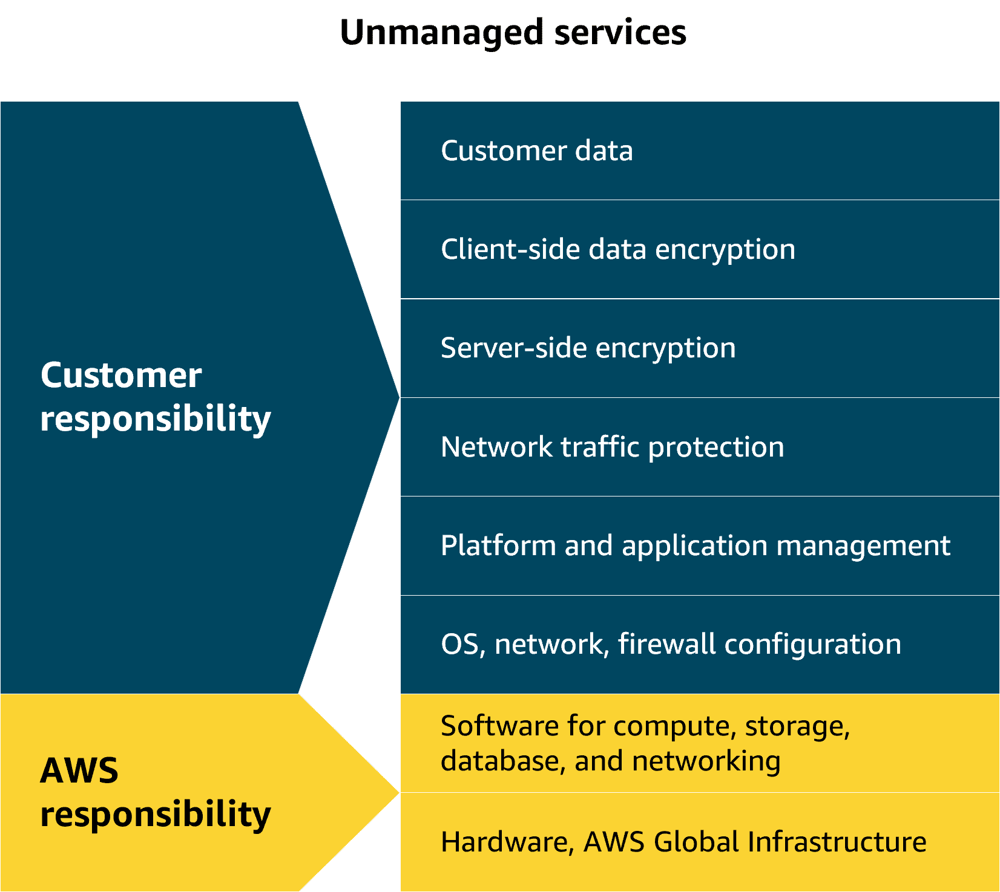

**Managed Services (compared to EC2):**
- AWS handles more of the operational burden
- Examples: Amazon RDS (database), AWS Lambda (serverless compute)
- You focus on data and application logic; AWS handles infrastructure

**Key Responsibility Shift:**
> EC2 is an **unmanaged service** — maximum flexibility but also maximum responsibility for the customer. If you want AWS to handle more of the operational tasks, you would choose a managed service instead.

---

**Q: What is a primary advantage of using the AWS Command Line Interface (AWS CLI) over the AWS Management Console?**

A: **It uses automation and scripting, which reduces manual steps and errors.**

**Explanation of other options:**
- ❌ It provides a visual, drag-and-drop interface = That's the Management Console; the CLI is text-based
- ❌ It is only available for Windows users = AWS CLI is available on Windows, macOS, and Linux
- ❌ It requires fewer configurations and is ideal for one-time manual provisioning = The opposite is true; CLI excels at automation and scripting
- ✅ It uses automation and scripting = CLI eliminates repetitive manual console navigation and reduces human error through scripts

---

**Q: What is the customer's responsibility when using compute services like Amazon EC2 according to the AWS Shared Responsibility Model?**

A: **The customer is responsible for configuring, securing, and managing the operating system, networking, and applications on their EC2 instances.**

**Explanation of other options:**
- ❌ AWS manages the security of the cloud, and the customer manages the security of the infrastructure = Incomplete; the customer also manages the OS, networking, and applications, not just infrastructure
- ❌ The customer is responsible for securing the physical hardware = AWS handles physical hardware security; the customer does not
- ❌ AWS is responsible for managing the OS, networking, and applications = AWS manages the underlying infrastructure; the customer manages the guest OS, applications, and networking configuration
- ✅ Customer responsible for configuring, securing, and managing OS, networking, and applications = EC2 is unmanaged; the customer has full responsibility for these layers

---

### 4. Demo: Launching an Amazon EC2 Instance

**What is an Amazon Machine Image?**

An **Amazon Machine Image (AMI)** is a pre-configured template containing everything needed to launch an EC2 instance. Instead of starting from scratch, you can use an AMI to clone the same environment across multiple instances.

**AMI Components:**

An AMI includes:
- Operating system (Windows, Linux, etc.)
- Storage configuration and setup
- Architecture type (32-bit or 64-bit)
- Permissions for who can launch instances from this AMI
- Pre-installed software and applications

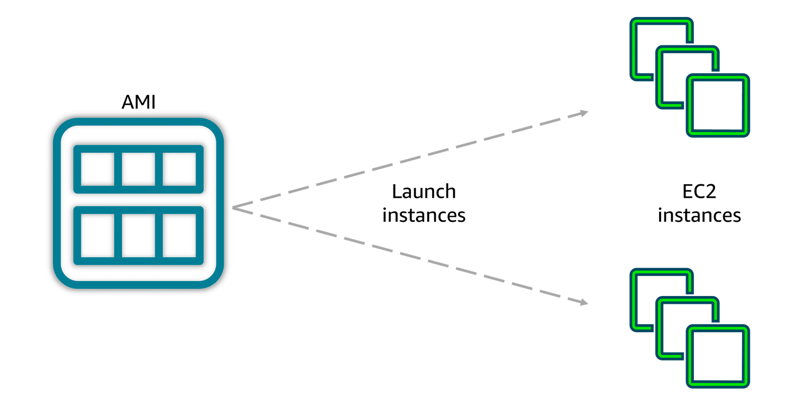

**Key benefit**: Launch multiple EC2 instances from the same AMI, and every instance will have identical configurations.

---

#### Three Ways to Use AMIs

**1. Create Your Own Custom AMI**
- Build a custom AMI with specific configurations tailored to your needs
- Install custom software, libraries, and tools
- Save the configured instance as a new AMI for future use

**2. Use Pre-configured AWS AMIs**
- AWS provides ready-made AMIs for common operating systems and software
- Amazon Linux, Ubuntu, Windows Server, etc.
- Optimized and maintained by AWS

**3. Purchase from AWS Marketplace**
- Third-party vendors offer specialized AMIs in the AWS Marketplace
- Pre-configured for specific use cases (web servers, databases, analytics tools, etc.)
- Often include licensed software or proprietary configurations

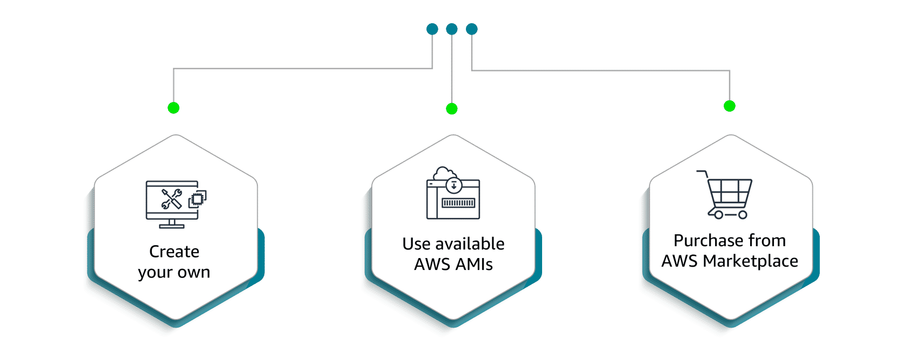

---

#### AMI Repeatability

AMIs provide **repeatability** through consistent, automated deployments:

| **Benefit**                  | **How It Helps**                                                                        |
|------------------------------|-----------------------------------------------------------------------------------------|
| **Identical Configurations** | Every instance launched from the same AMI has the same OS, software, and settings       |
| **Consistent Environments**  | Development, testing, and production environments are identical — reduces surprises     |
| **Automated Deployments**    | Scale from 1 instance to 100 with the same configuration — no manual setup per instance |
| **Reduced Errors**           | No configuration drift; every instance is a clone of the template                       |
| **Streamlined Management**   | Managing large-scale environments becomes predictable and efficient                     |

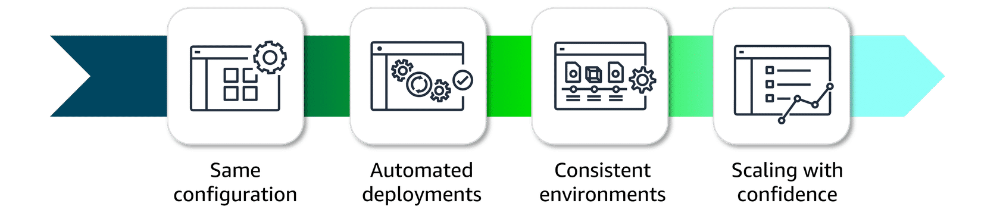

**Real-World Example:**
> A startup launches a web application on 1 EC2 instance with the AMI containing Ubuntu OS, Node.js, and their custom code. As traffic grows, they launch 99 more instances from the same AMI. All 100 instances are identical, configured the same way, ready to serve traffic immediately.

---

#### Demo Walkthrough: Launching an EC2 Instance for a Web Server

**Key Steps in the AWS Management Console:**

1. **Choose Instance Name** — Give it a descriptive name for easy identification later

2. **Select Amazon Machine Image (AMI)** — Choose the OS and pre-installed software
   - Example: Amazon Linux AMI (general-purpose, perfect for web servers)

3. **Choose Instance Type** — Select the hardware resources needed
   - Example: `t2.micro` (1 vCPU, 1 GB memory, Free Tier eligible)

4. **Select Key Pair** — Required for login access
   - Public key injected into the instance
   - Private key kept by you for SSH/RDP access

5. **Configure Network Settings** — Allow HTTP/HTTPS traffic
   - Inbound rules determine who can access your instance

6. **Choose Storage Options** — Define disk space and performance
   - Example: 8 GB gp3 EBS volume (general-purpose SSD)

7. **Add User Data (Optional but Important)** — Run scripts at startup
   - Script example: Install and activate Nginx web server
   - Runs automatically when the instance first launches
   - Eliminates manual software installation steps

8. **Review and Launch** — Click "Launch Instance" to create it

**After Launch:**
- Instance gets a **public IP address** for internet access
- Web server is running and ready to serve traffic
- You can connect via SSH (Linux) or RDP (Windows)

---

**Q: What are the required configurations when launching an Amazon EC2 instance for a web server? (Select THREE.)**

A: **Amazon Machine Image (AMI), Instance type, and Storage**

**Selected option explanations:**
- ✅ **Amazon Machine Image (AMI)** — Required; defines the OS and pre-installed software
- ✅ **Instance type** — Required; determines hardware resources (CPU, memory, network)
- ✅ **Storage** — Required; defines disk space and performance for the instance

**Explanation of other options:**
- ❌ Load balancing = Optional; only needed if distributing traffic across multiple instances
- ❌ Permissions = Not a launch-time requirement; security groups handle network access control
- ❌ Instance termination behavior = Optional configuration; not required for launch

---

**Q: What is an Amazon Machine Image (AMI) used for when launching an Amazon EC2 instance?**

A: **To pre-configure the operating system and software.**

**Explanation of other options:**
- ❌ To choose the instance size = Instance type is separate from AMI
- ❌ To configure networking settings = Security groups and network settings are configured separately
- ✅ To pre-configure the OS and software = AMI is a template containing OS, storage setup, and pre-installed software
- ❌ To store instance data = EBS volumes or other storage services store instance data; AMIs are templates, not storage

---

### 5. Amazon EC2 Pricing

**Understanding EC2 Pricing Options**

Amazon EC2 offers multiple pricing models to match different usage patterns and workload requirements. By choosing the right payment option, you can significantly reduce costs while maintaining flexibility. Let's explore each option and when to use it.

---

#### Available EC2 Pricing Options

**On-Demand Instances**
- **What it is**: Pay only for the compute capacity you consume with no upfront payments or long-term commitments required
- **Payment model**: Hourly or per-second billing (depends on instance type and OS)
- **Best for**: Unpredictable workloads, testing, development, or when you're unsure of usage patterns
- **Key benefit**: Maximum flexibility to start and stop instances without penalties
- **Use case example**: A developer testing a new application can spin up servers, experiment, and shut them down without financial commitment

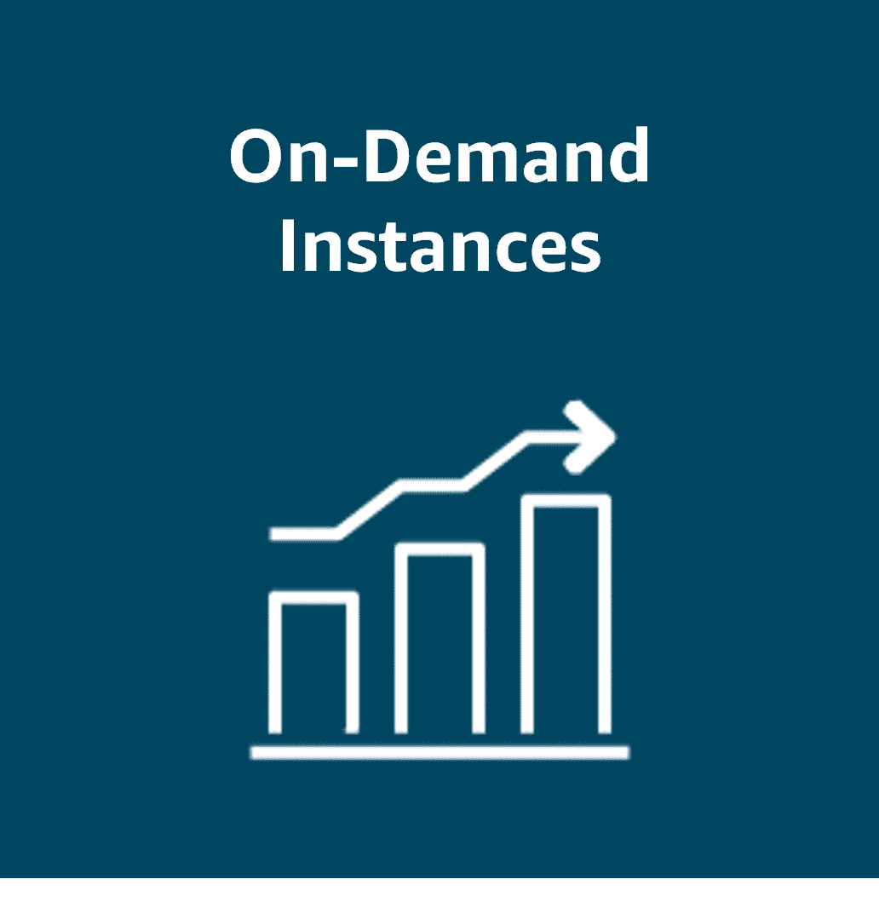

**Reserved Instances (RIs)**
- **What it is**: Commit to a 1-year or 3-year term for predictable workloads using specific instance families and AWS Regions
- **Savings**: Up to 75 percent discount compared to On-Demand pricing
- **Payment options**:
  - **All Upfront** — Pay for the entire term at the beginning; maximum savings
  - **Partial Upfront** — Pay for a portion upfront; discounted hourly rate for remainder
  - **No Upfront** — Pay hourly with discounted rates; minimal upfront commitment
- **Best for**: Steady-state workloads with predictable usage (e.g., production databases running 24/7)
- **Key constraint**: Must commit to specific instance family and AWS Region for the term

**Spot Instances**
- **What it is**: Bid on spare EC2 capacity at up to 90 percent discount compared to On-Demand pricing
- **The catch**: AWS can reclaim the instance at any time when capacity is needed by On-Demand customers
- **Warning**: You receive a 2-minute notice before interruption, allowing time to save progress
- **Best for**: Batch processing, data analysis, or any workload that can tolerate interruptions (not for critical services)
- **Real-world example**: A data science team running an overnight machine learning training job can use Spot Instances; if interrupted, they can resume later

**Savings Plans**
- **What it is**: Save up to 72 percent across a variety of instance types and services by committing to consistent usage levels
- **Commitment**: 1-year or 3-year terms measured in dollars per hour
- **Flexibility**: Unlike RIs, Savings Plans apply across:
  - Different instance families (t2, m5, c5, etc.)
  - Different instance sizes (micro, small, large, xlarge)
  - Different AWS Regions
  - Different operating systems and tenancy
  - AWS Fargate and AWS Lambda (serverless services covered later)
- **Best for**: Predictable workloads where you know your hourly usage but may change instance types or regions
- **Key advantage**: More flexible than Reserved Instances while still offering significant savings

**Dedicated Hosts**
- **What it is**: Reserve an entire physical server for your exclusive use
- **Control**: Full control over instance placement and resource allocation
- **Isolation**: No other customer's workloads share the server
- **Best for**: Security-sensitive workloads, compliance-driven applications, licensing needs (e.g., Windows or SQL Server)
- **Use case**: A financial services firm handling sensitive customer data needs complete control and compliance assurance
- **Cost**: More expensive than other options due to exclusive server access

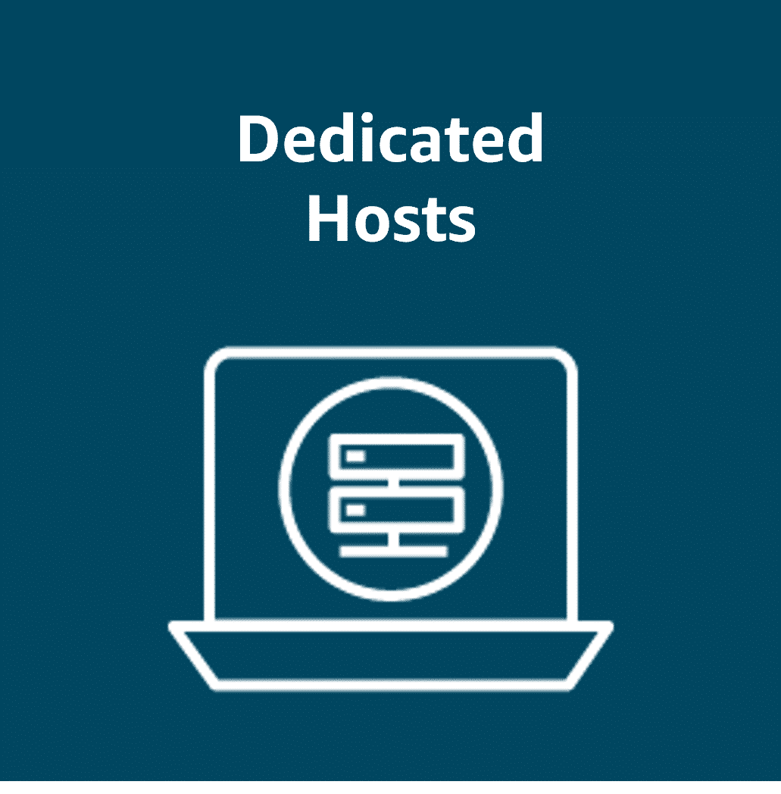

**Dedicated Instances**
- **What it is**: Pay for instances running on hardware dedicated solely to your AWS account
- **Isolation**: Physical isolation from other AWS customer instances
- **Control**: Unlike Dedicated Hosts, you don't choose which physical server; AWS manages placement
- **Flexibility**: Offers isolation without complete server control
- **Best for**: Workloads requiring isolation but not needing full server control or specialized licensing
- **Cost**: Between standard On-Demand and Dedicated Hosts in terms of pricing

**Dedicated Hosts vs. Dedicated Instances:**

| **Feature**                    | **Dedicated Hosts**                              | **Dedicated Instances**                        |
|:-------------------------------|:-------------------------------------------------|:-----------------------------------------------|
| **Physical server**            | Entire physical server for exclusive use         | Isolated instances on shared physical hardware |
| **Instance placement control** | ✅ Full control — you choose which server         | ❌ No control — AWS manages placement           |
| **Server management**          | ✅ You manage instance placement                  | ❌ AWS manages placement                        |
| **Cost**                       | Higher (exclusive server)                        | Moderate (isolation without control)           |
| **Best for**                   | Licensing, compliance, full control requirements | Isolation needs without placement control      |

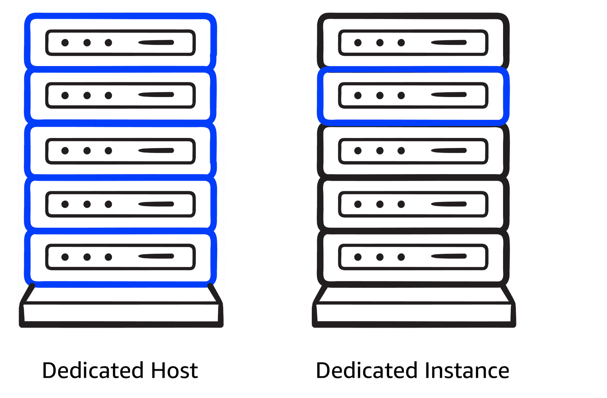

---

#### Cost Optimization Strategies

**Savings Plans**

Savings Plans offer the best balance of flexibility and savings for predictable workloads:
- Commit to a consistent amount of compute usage (measured in dollars per hour)
- 1-year or 3-year term options
- Covers EC2, Fargate, Lambda, and SageMaker usage
- Payment options: All upfront, Partial upfront, or No upfront
- **Key insight**: More flexible than Reserved Instances while still providing up to 72% savings

**Amazon EC2 Capacity Reservations**

Capacity Reservations are ideal for critical workloads with strict capacity requirements:
- Reserve compute capacity in a specific Availability Zone
- Charged at On-Demand rates, whether the capacity is used or not
- Ensures capacity is available when you need it
- **Best for**: Business-critical applications with strict SLA requirements
- **Use case**: A healthcare provider must ensure sufficient capacity for 24/7 patient records systems
- **Key benefit**: Guarantees capacity availability; prevents "No capacity" errors

**Reserved Instance Flexibility**

Reserved Instances offer flexibility in how discounts are applied:
- Discounts apply across instance sizes **within the same family** (e.g., m5.large → m5.xlarge)
- Discounts apply across **multiple Availability Zones** within a Region
- **Instance size flexibility**: AWS automatically applies the RI discount based on "instance size footprint"
- **Regional flexibility**: Use your RI discount in any AZ within the purchased Region
- **Key advantage**: Your 1 RI can cover multiple instance configurations, adapting to your changing needs

---

#### Why Multiple Pricing Options?

Choosing the right EC2 pricing option depends on your specific situation:

1. **Start with On-Demand** — Use this when starting a new project; it helps you establish baseline usage patterns without commitment

2. **Observe usage patterns** — Track your typical hourly/daily/monthly usage and identify which resources run consistently

3. **Shift to cost optimization** — Once patterns are clear, evaluate Savings Plans or Reserved Instances

4. **Explore advanced options** — Add Spot Instances for batch jobs and Capacity Reservations for critical systems

5. **Use Dedicated resources if needed** — For compliance or licensing requirements, use Dedicated Hosts or Dedicated Instances

**Key Takeaway:**
> AWS provides pricing flexibility so you can choose the most cost-effective model for your workload. Most organizations use a mix of all these options: On-Demand for flexibility, Reserved Instances or Savings Plans for predictable workloads, and Spot Instances for non-critical, interruptible tasks.

---

**Q: A financial services company needs to run sensitive applications that handle confidential customer data and require compliance with industry regulations. They need complete control over the physical server, including instance placement and resource allocation. Which pricing option should they choose?**

A: **Dedicated Hosts**

**Explanation of other options:**
- ❌ Savings Plans = Offers cost savings but does not provide physical server isolation or placement control required for compliance
- ❌ On-Demand = No control over physical server or placement; data isolation concerns for sensitive workloads
- ❌ Spot Instances = No server control, and instances can be interrupted; unsuitable for compliance-critical applications
- ✅ Dedicated Hosts = Provides exclusive physical server access with complete placement control, meeting strict security and compliance requirements

---

**Q: A startup is running a batch processing workload that can tolerate occasional interruptions, and they want to reduce costs by taking advantage of unused Amazon EC2 capacity. Which pricing option would offer them the most savings?**

A: **Spot Instances**

**Explanation of other options:**
- ❌ Reserved Instances = Require long-term commitment and upfront payment; better for steady workloads than batch processing
- ❌ Savings Plans = Require commitment but don't offer the 90% discount available with Spot
- ❌ On-Demand = Standard pricing with no discounts; most expensive option
- ✅ Spot Instances = Offers up to 90% discount for spare capacity; perfect for batch jobs that can tolerate interruptions with 2-minute warning

---

**Q: A customer is building a new application and is unsure of their usage patterns but expects to grow and stabilize usage over time. They want to start without a long-term commitment. Which pricing option should they use?**

A: **On-Demand**

**Explanation of other options:**
- ❌ Reserved Instances = Require 1-3 year commitment; not suitable when usage patterns are uncertain
- ❌ Savings Plans = Require commitment to consistent hourly usage; requires knowing your baseline before committing
- ❌ Spot Instances = Risk of interruption; unsuitable for new applications still in development/testing phase
- ✅ On-Demand = No commitment needed; allows testing and development to establish true usage patterns; switch to Savings Plans or Reserved Instances later

---

### 6. Scaling Amazon EC2

**Understanding Scalability and Elasticity**

As your business grows and customer demand changes, you need the ability to adjust your compute resources up or down. AWS provides two key concepts for managing this: **scalability** and **elasticity**. While they sound similar, they serve different purposes in cloud architecture.

---

#### Scalability vs. Elasticity

**Scalability**
- **Definition**: The ability of a system to handle increased load by adding resources over time
- **Focus**: Long-term capacity planning and growth
- **How it works**: You can scale **up** (vertical scaling) by adding more power to existing machines, or scale **out** (horizontal scaling) by adding more machines
- **Timeline**: Designed for planned, anticipated growth
- **Example**: A growing e-commerce company knows traffic will increase during holiday seasons and plans additional capacity months in advance
- **Key benefit**: Ensures your system can grow to accommodate more users and workloads

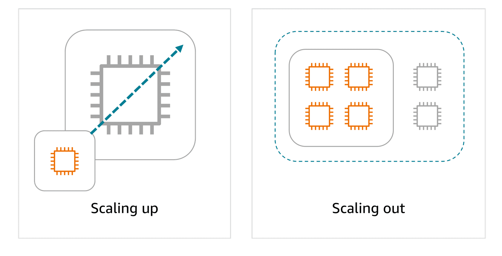

**Elasticity**
- **Definition**: The ability to automatically scale resources up or down in response to real-time demand
- **Focus**: Dynamic, on-demand adjustment of resources in real time
- **How it works**: Resources automatically scale out during high demand periods and scale in when demand decreases
- **Timeline**: Responds immediately to changing conditions; adjusts every minute, every hour
- **Example**: A video streaming service automatically adds instances during peak viewing hours and removes them at midnight when fewer users are online
- **Key benefit**: Provides cost efficiency and optimal resource usage at any given moment

**Key Difference:**
> Scalability is about your system's *potential* to grow, while elasticity is about *automatic adjustment* to real-time demand. Scalability = long-term planning; Elasticity = immediate response.

---

#### Horizontal vs. Vertical Scaling

When scaling your EC2 instances, you have two approaches:

**Horizontal Scaling (Scale Out)**
- **What it is**: Add more machines (instances) to distribute the workload
- **How it works**: Increase the number of EC2 instances running in parallel
- **Benefits**:
  - No single instance is overloaded; work is distributed across many machines
  - Better for applications that can process requests independently
  - Can scale out indefinitely (depending on AWS limits)
- **Best for**: Web servers, API endpoints, stateless applications
- **Coffee shop analogy**: Instead of getting a faster cashier (Morgan), add more cashiers to handle more customers simultaneously

**Vertical Scaling (Scale Up)**
- **What it is**: Add more power to existing machines (bigger instances)
- **How it works**: Change instance type to one with more CPU, memory, or storage
- **Benefits**:
  - Single instance gets more processing power
  - Simpler to implement for monolithic applications
- **Limitations**:
  - Can only scale until you reach the largest instance type available
  - Still a single point of failure if the instance stops
  - May require application downtime during the scaling operation
- **Best for**: Databases, large data processing, applications requiring high memory per instance
- **Coffee shop analogy**: Give Morgan a faster register and better organizational system so she can serve customers more quickly

**Why Horizontal Scaling for EC2?**
> For most EC2 workloads, horizontal scaling is better. Order-taking and order-making work faster with more workers in parallel, not with one superhuman worker. This is why horizontal scaling is the foundation of AWS elasticity.

---

#### Building Highly Available Systems

To ensure your application never experiences downtime, AWS recommends deploying EC2 instances across multiple Availability Zones with redundancy.

**The Problem with Single Instances:**
- If one EC2 instance fails, your application is down until you launch a replacement
- Customers lose service immediately
- You have a single point of failure

**The Solution: Redundant Instances Across AZs**
- Deploy the same instance configuration across multiple Availability Zones
- If one AZ experiences an outage, instances in other AZs continue to serve traffic
- Customers never experience service interruption
- You can replace failed instances while others handle the load
- This is what AWS calls **high availability** — the system remains operational even when hardware fails

**Best Practice:**
> Always deploy EC2 instances across multiple Availability Zones. Use the same programmatic methods (AMIs, scripts, automation) to create identical instances. This ensures no single point of failure and maximum uptime for your customers.

---

#### Amazon EC2 Auto Scaling

Amazon EC2 Auto Scaling automatically adjusts the number of EC2 instances based on changes in application demand. Instead of manually adding or removing instances, you define scaling policies and let AWS handle the rest.

**Two Scaling Approaches:**

**Dynamic Scaling**
- Adjusts resources in real time as demand fluctuates
- Responds to changing conditions minute-by-minute, hour-by-hour
- Best when demand is unpredictable but changes frequently

**Predictive Scaling**
- Uses machine learning to anticipate demand based on historical patterns
- Preemptively schedules the right number of instances before demand arrives
- Best when you have predictable, recurring demand patterns
- Example: A retail business knows traffic spikes on Friday evenings; predictive scaling pre-scales before the rush

---

#### Auto Scaling Groups: Key Configuration

An **Auto Scaling group** is a collection of EC2 instances that can automatically scale in or out to meet your application's needs. Three key settings define how the group behaves:

**1. Minimum Capacity**
- **Definition**: The least number of EC2 instances that must always be running
- **Purpose**: Ensures the application never scales below a threshold that would impact performance
- **What happens**: When you create the Auto Scaling group, it launches instances equal to the minimum capacity immediately
- **Example**: If minimum capacity is 4, your application will always have at least 4 instances running, even during the slowest times
- **Cost implication**: You're always paying for at least this many instances

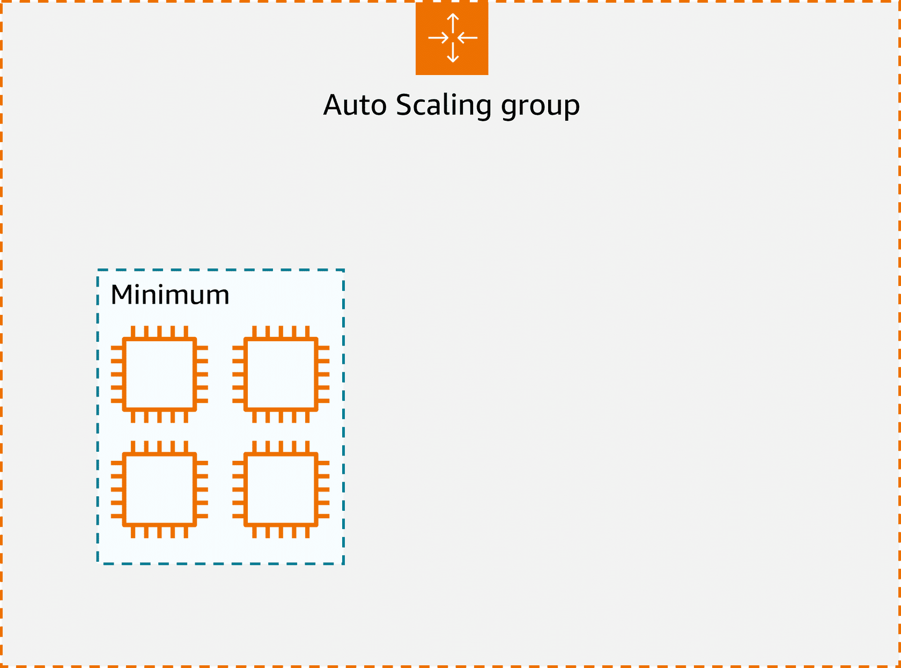

**2. Desired Capacity**
- **Definition**: The ideal number of instances needed to handle the current workload
- **Purpose**: AWS aims to maintain this number at all times through automatic scaling adjustments
- **Adjustment**: If actual instances exceed desired capacity, Auto Scaling terminates extras; if below, it launches more
- **Example**: If desired capacity is 6 but only 4 instances are running due to a failure, Auto Scaling launches 2 more
- **Default**: If not specified, defaults to minimum capacity
- **Flexibility**: You can change desired capacity anytime

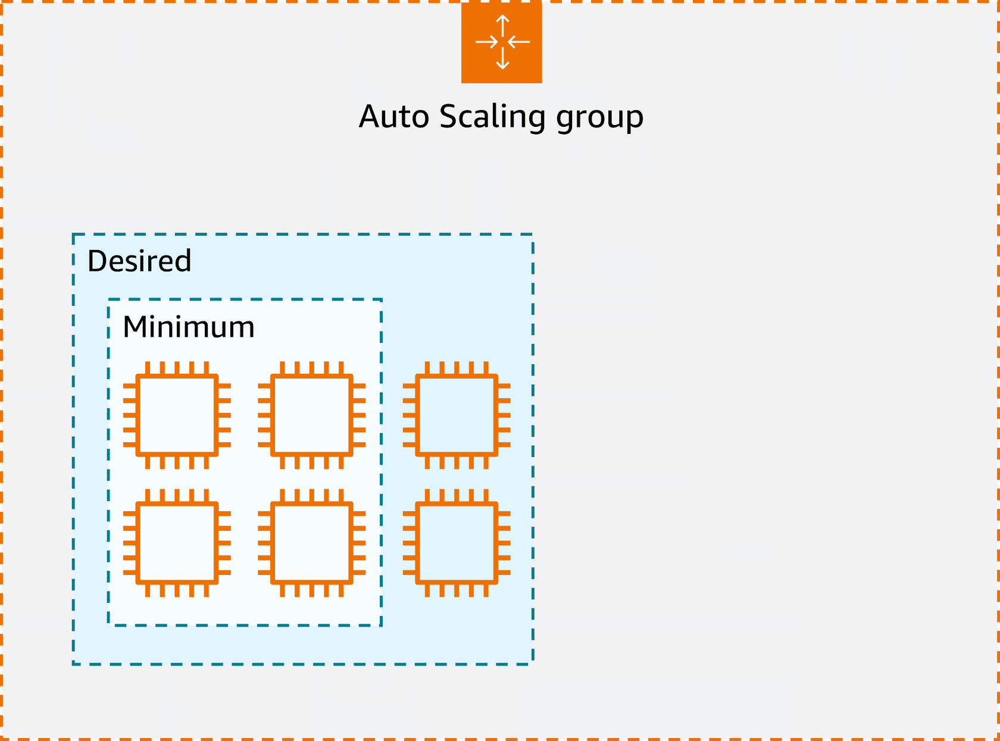

**3. Maximum Capacity**
- **Definition**: The upper limit on the number of instances that can be launched
- **Purpose**: Prevents over-scaling and controls costs
- **Safety feature**: Auto Scaling will never exceed this number, even during extreme demand spikes
- **Example**: If maximum capacity is 12, Auto Scaling stops launching instances even if demand continues to rise
- **Cost control**: Protects you from unexpectedly high costs during traffic surges
- **Trade-off**: Prevents scaling endlessly but may limit availability during extreme peaks

**How They Work Together:**

| **Setting** | **Purpose**                  | **Example Value**                     |
|:------------|:-----------------------------|:--------------------------------------|
| **Minimum** | Always-running baseline      | 4 instances (minimum customers needs) |
| **Desired** | Target to maintain           | 6 instances (typical usage level)     |
| **Maximum** | Upper limit for cost control | 12 instances (peak load threshold)    |

> Auto Scaling maintains the **desired capacity** by adjusting between **minimum** and **maximum**. If demand spikes beyond maximum, you have other solutions like load balancing (coming next).

---

#### How Auto Scaling Works in Practice

**The Monitoring System:**
1. **Amazon CloudWatch** continuously monitors metrics from your EC2 instances
   - CPU utilization
   - Network traffic (bytes in/out)
   - Request latency
   - Custom application metrics
2. **Scaling policies** define when to scale up or down
   - Example: "If CPU > 70% for 5 minutes, add 2 instances"
   - Example: "If CPU < 30% for 10 minutes, remove 1 instance"
3. **Auto Scaling group** automatically adjusts the number of instances
   - Launches new instances when demand increases
   - Terminates instances when demand decreases
4. **Result**: Your application always has the right amount of capacity

**Cost Efficiency:**
- You only pay for instances you actually use
- During busy hours, you have many instances (higher cost, but meeting demand)
- During slow hours, instances are terminated (lower cost)
- This dynamic adjustment provides "just-right" pricing — never paying for idle resources

**Coffee Shop Example:**
> During the morning rush (7-9 AM), Auto Scaling launches 12 instances to handle customers. By 10 AM when the rush clears, excess instances are terminated automatically. At lunch (12-1 PM), instances scale back up. At closing (10 PM), only 4 instances remain. Over 24 hours, you pay exactly for what you use, not for peak capacity sitting idle 20 hours a day.

---

#### Why Both Redundancy and Auto Scaling?

**Redundancy (across multiple AZs)** = High availability
- Protects against AZ failures
- Maintains uptime when infrastructure fails

**Auto Scaling** = Cost efficiency + responsive capacity
- Adjusts to demand changes in real time
- Reduces costs by eliminating idle resources
- Improves customer experience by ensuring capacity is always available

**Together:**
> Redundant instances deployed across AZs provide reliability. Auto Scaling adjusts the number of instances across all AZs based on demand. This combination ensures high availability with optimal costs.

---

**Q: What is the primary benefit of scalability and elasticity in AWS?**

A: **The ability to grow and shrink resources dynamically based on real-time demand**

**Explanation of other options:**
- ❌ The ability to manually adjust resources based on peak usage = Manual adjustment is outdated; AWS automates this process
- ❌ The ability to create fixed resources that never change in size = Fixed resources waste money and fail to serve fluctuating demand
- ❌ The ability to permanently increase resource capacity for long-term growth = This is only scalability, not the dynamic adjustment that elasticity provides
- ✅ The ability to grow and shrink resources dynamically = Elasticity automatically adjusts resources based on real-time demand; scalability plans for growth; together they provide flexibility and cost efficiency

---

**Q: What is the main reason for deploying Amazon EC2 instances across multiple Availability Zones?**

A: **To provide high availability by allowing instances in different Availability Zones to handle traffic if one Availability Zone fails**

**Explanation of other options:**
- ❌ To increase the power and speed of each individual instance = Deploying across AZs doesn't change instance power; that's vertical scaling
- ❌ To decrease the cost of instances by distributing them evenly across AWS Regions = Cost savings come from Auto Scaling based on demand, not from AZ distribution; also Regions are different from AZs
- ❌ To automatically scale instances based on resource usage in each Availability Zone = Auto Scaling handles this, but the primary reason for multi-AZ deployment is high availability
- ✅ To provide high availability = Distributing across AZs ensures that if one AZ fails, instances in other AZs continue serving customers; this is the foundation of highly available systems

---

**Q: How does AWS make sure that a business can meet fluctuating demand without over-provisioning resources?**

A: **By allowing businesses to provision resources that automatically scale based on demand**

**Explanation of other options:**
- ❌ By providing fixed resources that are always available = Fixed resources require over-provisioning to handle peaks; defeats cost efficiency
- ❌ By requiring businesses to purchase excess resources in advance = This causes unnecessary spending on unused capacity
- ❌ By offering resources that are always running, regardless of demand = This wastes money during low-demand periods
- ✅ By allowing automatic scaling = EC2 Auto Scaling adjusts the number of instances based on real-time demand, ensuring you have enough capacity without paying for over-provisioning

---

### 7. Directing Traffic with Elastic Load Balancing

**The Traffic Distribution Challenge**

When you have multiple EC2 instances serving traffic, a new problem emerges: how do you distribute incoming requests evenly across all those instances? Without proper traffic management:
- Some instances might become overloaded while others sit idle
- Customers might experience slow performance or timeouts
- Traffic management becomes manually intensive and error-prone
- Adding or removing instances requires updating all frontend code

**The Solution: Elastic Load Balancing (ELB)**

Elastic Load Balancing (ELB) automatically distributes incoming application traffic across multiple resources, such as EC2 instances, to optimize performance and reliability. A load balancer serves as the **single point of contact** for all incoming web traffic to an Auto Scaling group.

**Coffee Shop Analogy:**
> Imagine a coffee shop with three cashiers. Customers keep lining up at my register because I'm adorable, while Morgan and Alan take selfies with no customers. So the manager hires a host who stands at the entrance and directs each arriving customer to the shortest line. This is exactly what ELB does — it directs traffic to the least busy instances.

---

#### How ELB Works with Auto Scaling

Although ELB and Amazon EC2 Auto Scaling are distinct services, they work in tandem:

1. **Auto Scaling adds/removes instances** based on demand
2. **ELB immediately becomes aware** of the new instances
3. **ELB starts routing traffic** to the new instances
4. **Frontend applications don't need updates** — they just send requests to the load balancer's single URL
5. **Backend instances can scale independently** of the frontend

**Key Benefit:**
> ELB decouples frontend and backend tiers. When a new backend instance spins up, it registers with the load balancer and immediately receives traffic. No manual synchronization needed, even with thousands of instances.

---

#### ELB Benefits

**Efficient Traffic Distribution**

ELB evenly distributes traffic across all available EC2 instances, preventing any single instance from becoming overwhelmed.
- Requests are routed based on current instance load
- No manual reassignment needed as instances are added or removed
- Resource utilization is optimized across all instances

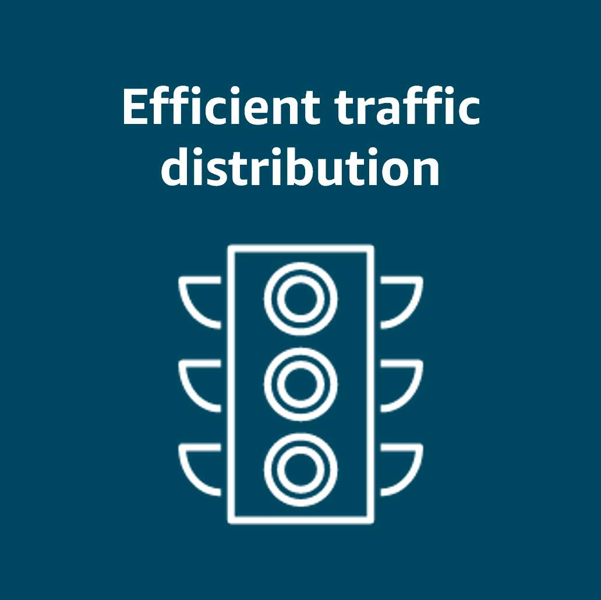

**Automatic Scaling Integration**

ELB scales seamlessly with your Auto Scaling group. As backend instances are added or removed, ELB automatically routes traffic accordingly without interruption.
- New instances are automatically discovered and receive traffic
- Terminated instances are removed from the routing pool
- Traffic remains balanced during scaling events

**Simplified Management**

ELB decouples tiers and reduces operational overhead by handling many tasks automatically.
- No need to update frontend applications when backend instances change
- AWS handles maintenance, updates, patches, and failover automatically
- Reduces complexity and manual synchronization between tiers
- You configure it once and it works automatically

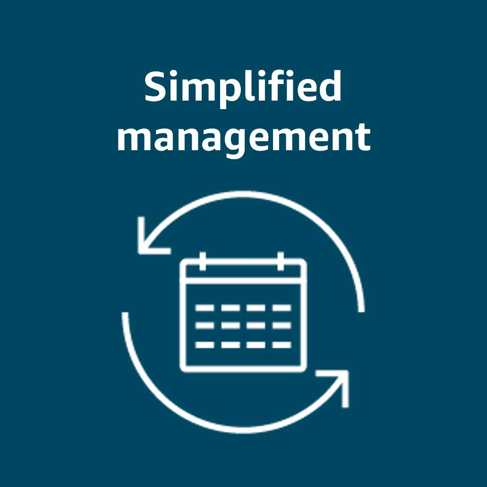

---

#### ELB Routing Methods

To optimize traffic distribution, ELB uses several intelligent routing strategies. Different strategies work best for different use cases:

**Round Robin**
- **How it works**: Distributes traffic evenly across all available servers in a cyclic manner
- **Pattern**: Request 1 → Server A, Request 2 → Server B, Request 3 → Server C, Request 4 → Server A (repeat)
- **Best for**: Servers with similar capacities and processing times
- **Advantage**: Simple and predictable; ensures fair distribution
- **Limitation**: Doesn't account for current server load

**Least Connections**
- **How it works**: Routes traffic to the server with the fewest active connections at that moment
- **Example**: If Server A has 5 active connections, Server B has 3, and Server C has 2, the next request goes to Server C
- **Best for**: Applications with long-lived connections or varying request processing times
- **Advantage**: Dynamically adapts to current load rather than predetermined rotation
- **Real-world example**: Video streaming where connection duration varies widely

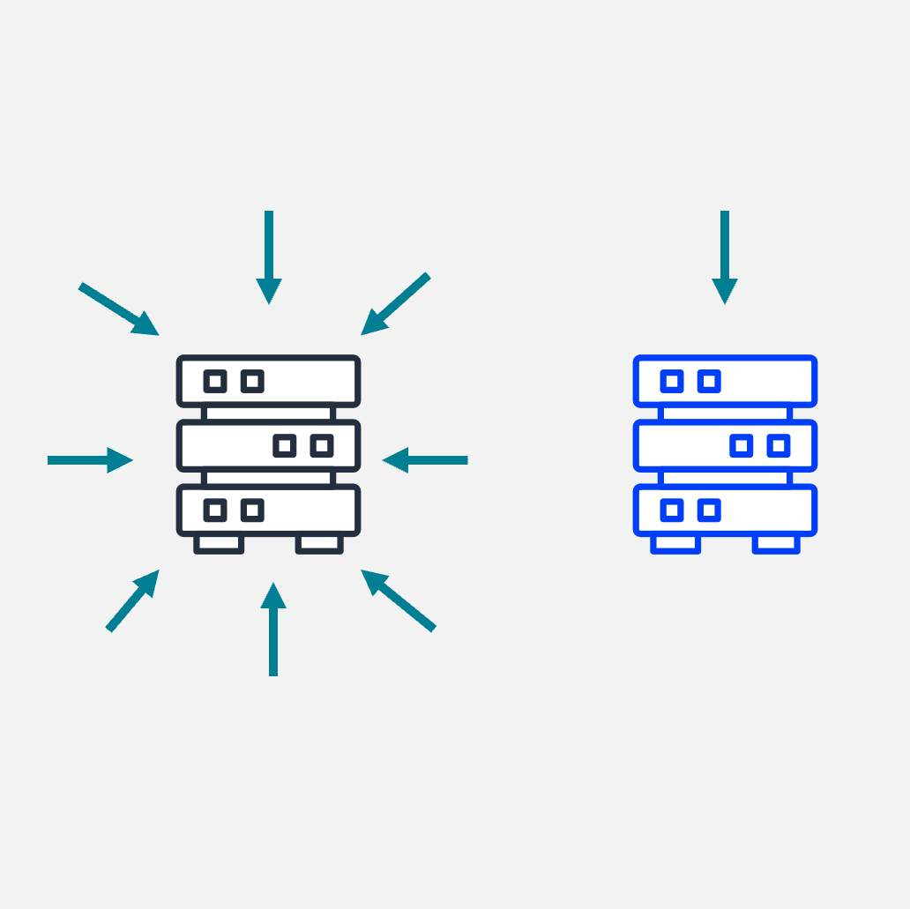

**IP Hash**
- **How it works**: Uses the client's IP address to consistently route traffic to the same server
- **Pattern**: Client IP 192.168.1.100 always routes to Server A; Client IP 192.168.1.101 always routes to Server B
- **Best for**: Session persistence (keeping a user on the same server across requests)
- **Advantage**: Ensures sticky sessions without server-side session storage
- **Use case**: E-commerce sites where shopping cart data must stay on the same server

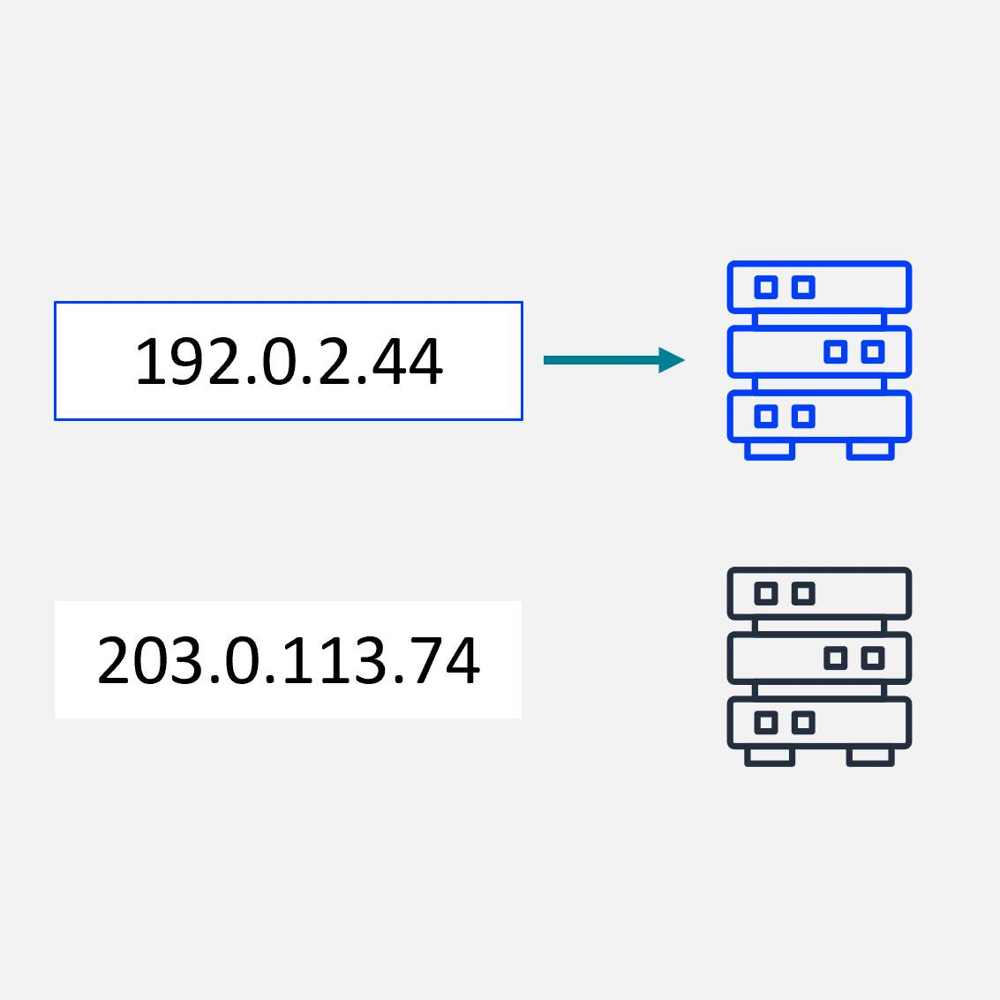

**Least Response Time**
- **How it works**: Directs traffic to the server with the fastest response time, minimizing latency
- **Pattern**: Continuously measures response times and routes new requests to the fastest responder
- **Best for**: Optimizing user experience and reducing latency
- **Advantage**: Provides the best performance by routing to the fastest server
- **Use case**: Real-time applications where speed matters (financial trading, gaming, real-time analytics)

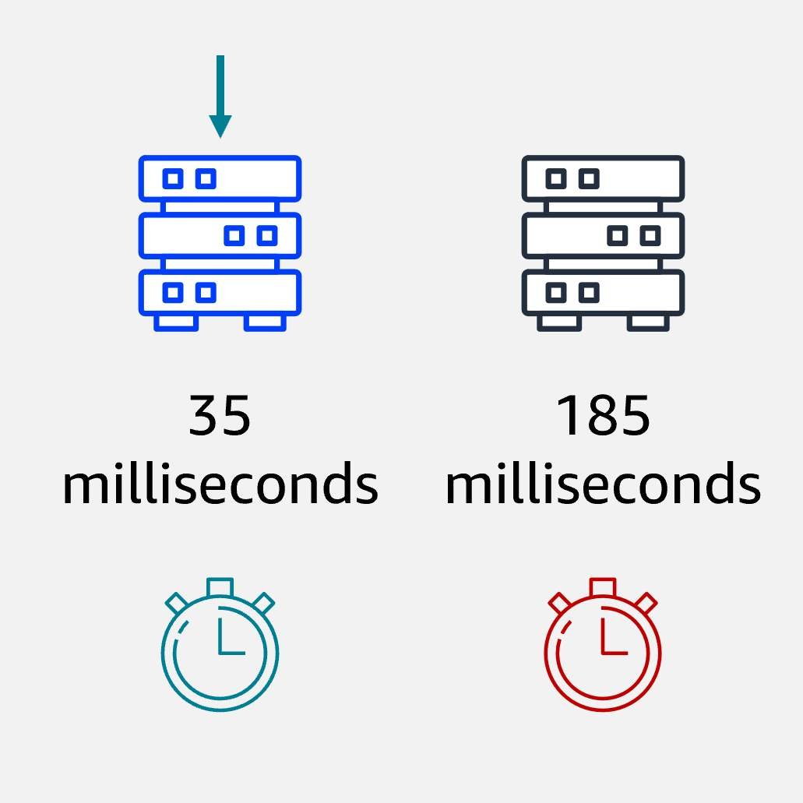

---

#### Real-World Example: Healthcare Patient Portal

Let's examine how ELB and Auto Scaling work together in a healthcare system providing an online patient portal for appointment booking and medical records access.

**Initial Setup — Low-Demand Period**

Early in the morning, patient traffic is light.
- Only 2 web servers are needed to handle scheduling and portal requests
- The load balancer efficiently distributes the small number of incoming requests
- All systems run smoothly with no instances sitting idle
- Cost is optimized — you're only paying for what you need

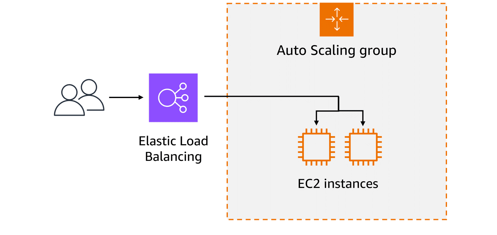

**Scaling Up — High-Demand Period**

As the day progresses, patient traffic increases significantly:
- Morning rush (8-10 AM): Patients book appointments before work
- Late afternoon (4-6 PM): Patients access test results and contact providers  
- Pre-weekend surge (Friday 3-5 PM): Heaviest traffic period

Auto Scaling detects increased demand and automatically launches additional web servers.

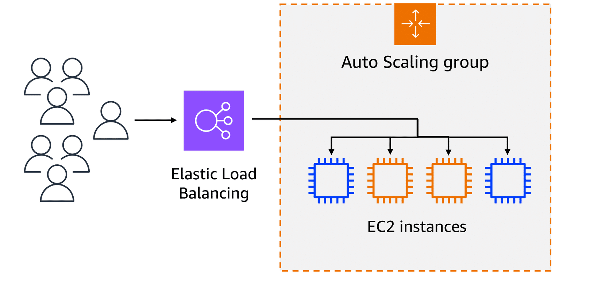

**Load Balancing — Traffic Distribution**

Now 5 web servers are running, but traffic distribution would be uneven without ELB:
- **Without ELB**: Frontend would need to know about all 5 servers, and manually direct traffic — complex and error-prone
- **With ELB**: Single point of contact; ELB manages all traffic distribution automatically

The load balancer:
1. Receives all incoming requests from patients accessing the portal
2. Monitors each server's current connections and response time
3. Routes each request to the server with the least load
4. Ensures no single server becomes bottle necked
5. Automatically adapts as new servers are added or removed

**Result**: 
- Patients experience fast, responsive access to medical appointments and records
- All servers operate at optimal capacity (none overloaded, none idle)
- Cost is minimized by scaling up only when demand increases
- System maintains high availability even during peak loads

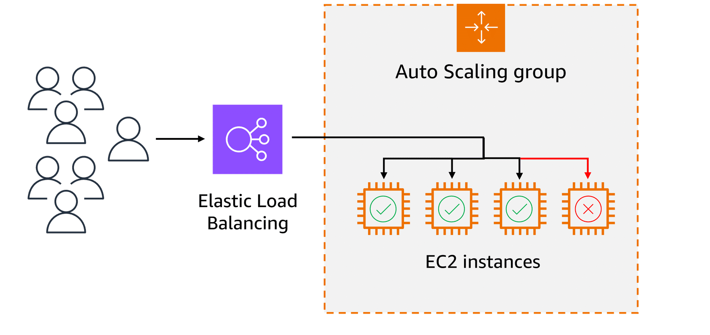

**Scaling Down — Low-Demand Period (Evening)**

As evening approaches and patient traffic decreases:
- Auto Scaling removes excess instances
- ELB automatically stops routing traffic to terminated servers
- Remaining instances handle the lower volume efficiently
- Cost automatically decreases without manual intervention

---

#### Architecture Decoupling with ELB

**Without ELB (Tightly Coupled):**
- Frontend instances must know the IP addresses of all backend instances
- When a new backend instance launches, every frontend must be updated
- When a backend instance is removed, every frontend must be notified
- Scaling becomes complex; synchronization is time-consuming and error-prone
- Difficult to maintain with hundreds or thousands of instances

**With ELB (Decoupled):**
- Frontend instances only know the load balancer's single URL
- New backend instances automatically register with ELB
- Frontend applications don't need any updates during scaling
- Each tier (frontend, backend, database) scales independently
- Massive environments with thousands of instances become manageable

**Key Insight:**
> Decoupling is one of the biggest advantages of ELB. Each tier becomes an independent entity that scales as needed, without coordination with other tiers. This architectural flexibility is essential for building scalable cloud applications.

---

**Q: How does Elastic Load Balancing (ELB) improve scalability in AWS?**

A: **It automatically routes traffic to instances based on various routing methods**

**Explanation of other options:**
- ❌ It manually adjusts the number of EC2 instances = Manual adjustment is the opposite of what ELB does; Auto Scaling adjusts instance count, not ELB
- ❌ It directly increases the size of EC2 instances = ELB handles traffic distribution, not instance resizing (that's vertical scaling)
- ❌ It creates new EC2 instances for each request = That would be extremely inefficient; ELB distributes requests to existing instances
- ✅ It automatically routes traffic based on various routing methods = This is ELB's core function; it uses round-robin, least-connections, IP hash, and response time methods

---

**Q: Which task does Elastic Load Balancing (ELB) perform?**

A: **Distributes a workload across several Amazon EC2 instances**

**Explanation of other options:**
- ❌ Automatically adjusts the number of instances to match demand = That's Auto Scaling's responsibility, not ELB's
- ❌ Removes unneeded instances when demand is low = Auto Scaling handles termination; ELB just stops routing traffic to them
- ❌ Adds a second instance during a popular sale = Adding instances is Auto Scaling; ELB just routes traffic to existing ones
- ✅ Distributes a workload across several EC2 instances = ELB's primary function is traffic distribution across available backend instances

---

### 8. Messaging and Queuing

**The Communication Challenge in Applications**

In software architecture, application components need to communicate with each other to exchange data and coordinate work. However, how they communicate determines system reliability:
- **Direct communication** creates dependencies and brittleness
- **Buffered communication** creates flexibility and resilience

This is where messaging and queuing services come in.

---

#### Tightly Coupled vs. Loosely Coupled Architectures

**Tightly Coupled Architecture (Direct Communication)**

Components communicate directly with each other without any intermediary.

**Characteristics:**
- Components depend directly on each other
- Each component must know about and wait for other components
- If one component fails, it causes failures in other components
- Adding new components requires changes to existing ones
- Difficult to scale or maintain

**Coffee Shop Analogy (The Problem):**
> A cashier takes an order and directly hands it to the barista. If the barista is on break or busy, the cashier must wait. If the barista stops working, orders pile up and the cashier can't do anything but wait. As more orders come, the system breaks down.

**Real-World Example:**
> Application A sends messages directly to Application B. If Application B fails, Application A receives errors and stops functioning. The failure cascades through the system.

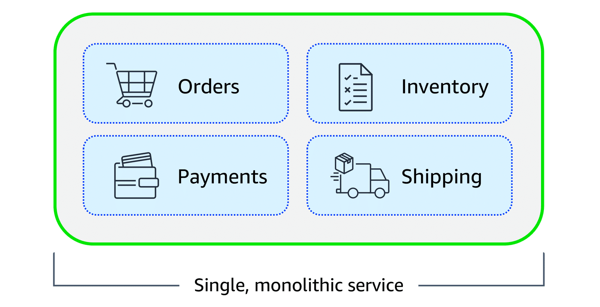

**Loosely Coupled Architecture (Buffered Communication)**

Components communicate through an intermediary buffer or queue, decoupling them from direct dependencies.

**Characteristics:**
- Components operate independently
- Components communicate via a messaging service/queue
- If one component fails, others continue operating
- New components can join without changing existing ones
- Scales more easily; each component can scale independently
- Failures are isolated

**Coffee Shop Analogy (The Solution):**
> Instead of directly handing orders to the barista, the cashier posts them on an order board. The barista retrieves orders from the board when ready. If the barista is on break, orders still accumulate on the board. When the barista returns, they process the accumulated orders at their own pace.

**Real-World Example:**
> Application A sends messages to a queue. Application B processes messages from the queue at its own pace. If Application B fails, messages stay in the queue and are processed once it recovers. Application A is unaffected.

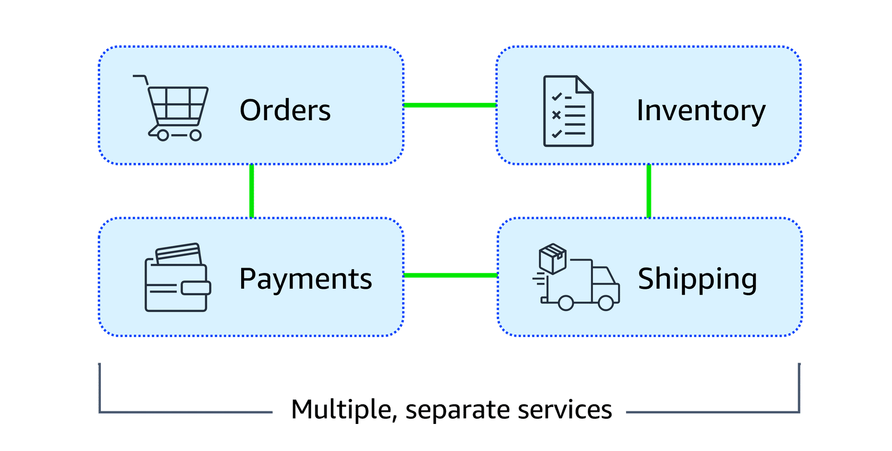

**Key Difference:**
> In tightly coupled systems, component failures cascade. In loosely coupled systems, failures are isolated and the system continues operating.

---

#### Amazon EventBridge

Amazon EventBridge is a serverless event bus service that connects different applications and AWS services using events. It enables event-driven architectures where components communicate asynchronously.

**How EventBridge Works:**
- Components publish **events** when something important happens
- EventBridge routes events to interested services based on rules
- Services receive and process events independently
- No direct dependencies between services

**Real-World Example: Food Delivery Service**

When a customer orders food through a mobile app, multiple services need to coordinate:

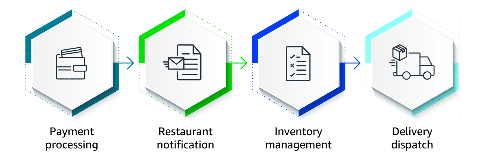

**The Flow:**
1. **Order Placed Event** → EventBridge receives the event
2. **Payment Processing** — Payment service verifies and processes the customer's payment
3. **Restaurant Notification** — Restaurant system receives notification to start preparing the meal
4. **Inventory Management** — Inventory system checks if ingredients are available
5. **Delivery Dispatch** — Delivery driver is notified to pick up and deliver the meal

**EventBridge Benefits:**
- Routes events to the right services automatically
- Services work independently at their own pace
- If one service fails (e.g., payment service down), EventBridge stores the event
- When the service recovers, EventBridge delivers the stored event
- Handles high volumes of events during peak times (lunch rush, dinner rush)
- Provides a smooth, reliable operation across the entire system

---

#### Amazon SQS (Simple Queue Service)

Amazon SQS is a message queuing service that facilitates reliable, asynchronous communication between software components. Messages are placed in a queue, processed at the receiver's pace, and then removed.

**How SQS Works:**
1. **Sender** places a message in the queue
2. **Queue** stores the message reliably
3. **Receiver** retrieves the message when ready
4. **Receiver** processes the message
5. **Message** is deleted from the queue

**Coffee Shop Analogy:**
> Messages are coffee orders. The queue is an order board. The barista retrieves orders from the board when ready and makes them.

**Real-World Example: Customer Support System**

**Scenario**

A customer support team consists of a support agent and a technical specialist.

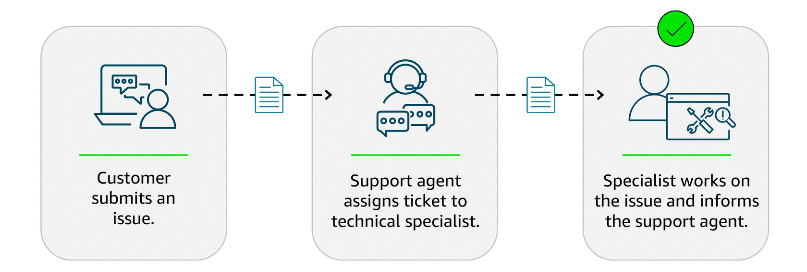

**Challenge — Before SQS (Tightly Coupled)**

The support agent receives customer issues directly and must pass them to the technical specialist. Problems emerge:
- Support agent receives customer issue directly and must pass immediately to specialist
- If specialist is busy, agent is stuck waiting
- Issues get lost; agent is forced to abandon them
- System breaks under high volume

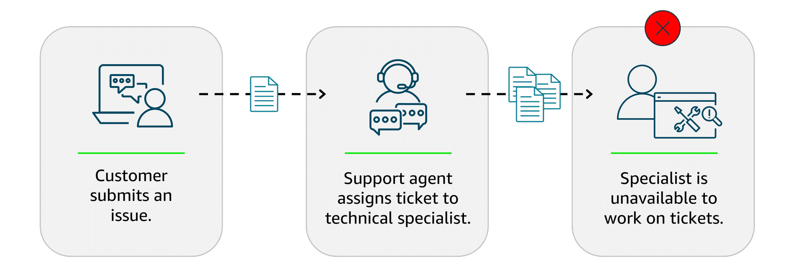

**Solution — With SQS (Loosely Coupled)**

Implement a queue system using Amazon SQS:
- Support agent adds customer issues to an SQS queue
- Agent can continue receiving new issues without waiting
- Queue reliably stores all issues
- Technical specialist checks the queue whenever ready
- Specialist processes issues at their own pace
- No issues are lost
- System handles high volumes smoothly

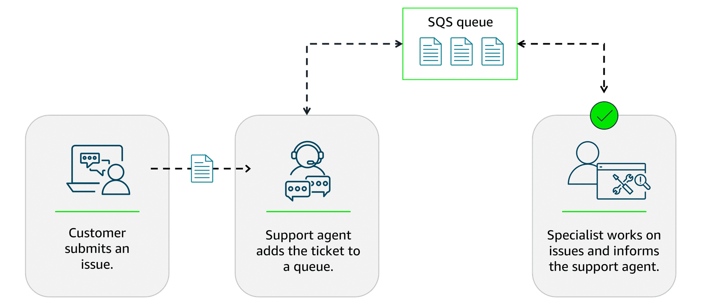

**SQS Benefits:**
- **Decouples sender and receiver** — Sender doesn't need receiver to be available
- **Stores messages reliably** — Messages persist in queue; not lost if receiver is down
- **Scales automatically** — Handles any volume of messages
- **Asynchronous processing** — Receiver processes at its own pace
- **Prevents message loss** — Messages stay until explicitly deleted

**Key Point:**
> With SQS, if the technical specialist is unavailable, new customer issues still get added to the queue. When the specialist becomes available, they find all accumulated issues waiting, and can process them without any loss.

---

#### Amazon SNS (Simple Notification Service)

Amazon SNS is a publish-subscribe service where publishers send messages to **topics**, and multiple subscribers receive those messages instantly. Unlike SQS (which stores messages in a queue), SNS delivers messages immediately to all subscribers.

**How SNS Works:**
1. **Publisher** sends a message to an SNS Topic
2. **SNS** immediately delivers the message to all subscribers
3. **Subscribers** (web servers, email, mobile, Lambda, etc.) receive the message instantly
4. Message is **not stored** — if subscriber is unavailable, it misses the message

**Core Difference from SQS:**
- **SQS**: Messages are **stored** in a queue until processed (Pull model)
- **SNS**: Messages are **delivered immediately** to all subscribers (Push model)

**Coffee Shop Analogy:**
> If SQS is the order board where orders accumulate, SNS is the barista yelling out "One Rudy's Rhubarb Refresher, to go!" The customer hears it right now, or they miss it.

**Real-World Example: E-Commerce Email Notifications**

**Scenario — Before SNS (Tightly Coupled):**
- Company sends a single email to all customers with mixed updates
- Customers receive unwanted notifications (new products when they only want sales)
- Low engagement; customer dissatisfaction
- One-size-fits-all approach doesn't work

**Solution — With SNS (Loosely Coupled, Targeted):**

**Step 1: Segment Communication**
- Create three SNS Topics:
  - **Topic 1: New Products** — For customers interested in new items
  - **Topic 2: Special Offers** — For customers interested in sales
  - **Topic 3: Events** — For customers interested in company events

**Step 2: Let Customers Choose**
- Customer A subscribes only to **New Products**
- Customer B subscribes only to **Special Offers**
- Customer C subscribes to **New Products + Special Offers**
- Customer D subscribes to all three

**Step 3: Send Tailored Notifications**
- When new products launch → Publish to "New Products" topic → Only subscribed customers receive it
- When special sale happens → Publish to "Special Offers" topic → Only subscribed customers receive it
- When event occurs → Publish to "Events" topic → Only subscribed customers receive it

**Result:**
- Customers receive only relevant notifications
- Engagement increases; satisfaction improves
- Company can target communications effectively

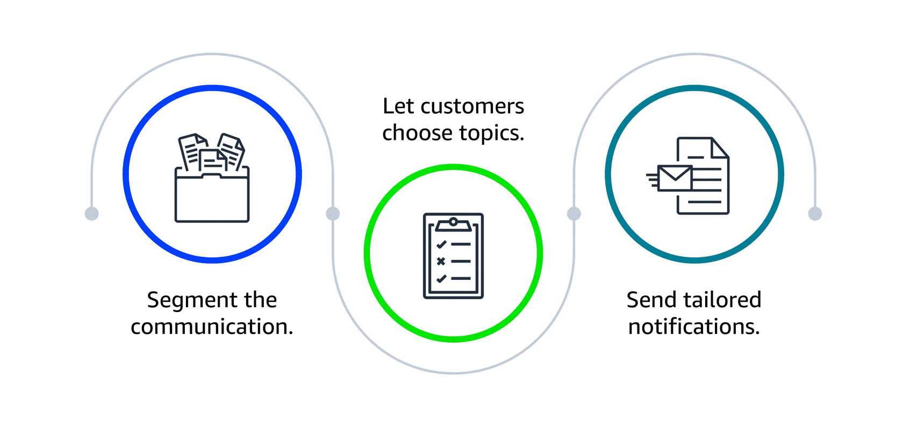

**SNS Subscriber Types:**
- Email addresses
- Mobile push notifications (Apple, Android)
- SMS text messages
- Web servers (HTTP/HTTPS endpoints)
- Lambda functions
- SQS queues
- Other AWS services

**SNS Benefits:**
- **Instant delivery** — Messages delivered immediately to all subscribers
- **Targeted communication** — Subscribers choose topics they care about
- **Multi-channel** — Support email, SMS, mobile push, Lambda, etc.
- **Fan-out capability** — One message delivered to many endpoints
- **Flexible subscribers** — Messages can go to people (email, SMS) or systems (Lambda, SQS)

**When to Use SNS:**
- Real-time notifications needed
- Want to reach multiple audiences simultaneously (mobile app, email, SMS)
- Notifications essential; missing one is acceptable
- Broadcasting messages to many subscribers

---

#### SQS vs. SNS at a Glance

| **Feature**                 | **SQS**                           | **SNS**                                     |
|:----------------------------|:----------------------------------|:--------------------------------------------|
| **Communication Model**     | Queue (Pull)                      | Publish-Subscribe (Push)                    |
| **Message Storage**         | ✅ Stores messages until processed | ❌ Delivers immediately, not stored          |
| **Delivery**                | Receiver pulls when ready         | Instant push to all subscribers             |
| **If Receiver Unavailable** | Message waits in queue            | Message is missed                           |
| **Multiple Receivers**      | One receiver processes one copy   | All subscribers receive same message        |
| **Use Case**                | Decoupled async processing        | Real-time notifications to multiple targets |
| **Example**                 | Customer support tickets queue    | Order confirmation text/email to customer   |

---

#### Building Resilient Applications

**Combining SQS and SNS:**
- **SNS publishes** an event (order placed)
- **SQS subscribers** to the topic and queues the event
- Processing services pull from SQS queue at their pace
- Best of both worlds: real-time notification + reliable storage

**Architecture Principle:**
> Use **loosely coupled, message-driven architectures** with EventBridge, SQS, and SNS to build systems that are:
- **Resilient**: Failures are isolated; system continues operating
- **Scalable**: Each component scales independently
- **Flexible**: Easy to add new components without changing existing ones
- **Reliable**: Messages are stored and delivered

---

**Q: What BEST describes the key difference between tightly coupled and loosely coupled architectures?**

A: **In a tightly coupled architecture, components are tightly connected and dependent on each other, whereas in a loosely coupled architecture, components can operate independently**

**Explanation of other options:**
- ❌ Tightly coupled systems are more flexible in adding new components = Opposite is true; loosely coupled are more flexible
- ❌ Tightly coupled architectures are designed for scalability = Loosely coupled architectures scale better
- ❌ Loosely coupled systems require components to share data directly = Loosely coupled systems avoid direct data sharing; they use intermediaries
- ✅ Components tightly connected vs. can operate independently = This is the core difference; tight coupling creates dependencies; loose coupling creates independence

---

**Q: In a banking system, when customers transfer money, the transaction details are sent from the transaction service to a fraud detection service for verification. Sometimes, the fraud detection service is temporarily down. What is the MAIN advantage of using Amazon Simple Queue Service (Amazon SQS) in this banking scenario?**

A: **It stores transaction details until the fraud detection service can process them, even if the service is down**

**Explanation of other options:**
- ❌ It guarantees immediate approval of transactions = SQS doesn't guarantee approval; it queues transactions for processing
- ❌ It speeds up transaction processing by avoiding the use of a buffer = Buffers actually enable faster overall processing by decoupling components
- ❌ It forces the transaction service and fraud detection service to depend on each other = SQS does the opposite; it decouples dependencies
- ✅ It stores transaction details until fraud detection service can process them = This is SQS's core function; it queues messages and holds them until the receiver is ready

---

### 9. Module Summary and Resources

**Module Recap**

In these lessons about compute, you learned how Amazon EC2 and cloud resources help scale applications. You gained knowledge of EC2 instance types, pricing options, and how to choose the best instance types for your unique business needs. You also became familiar with using AWS tools and services like Elastic Load Balancing, Amazon EC2 Auto Scaling, Amazon SQS, and Amazon SNS to manage traffic and communication.

**Key Takeaways:**
- **EC2** provides flexible, scalable compute capacity on demand
- **Instance types** are optimized for different workload requirements (general purpose, compute, memory, accelerated, storage)
- **Pricing models** (On-Demand, Reserved, Spot, Savings Plans, Dedicated) allow you to optimize costs based on usage patterns
- **Auto Scaling** automatically adjusts capacity based on demand, reducing costs and improving availability
- **Elastic Load Balancing** distributes traffic evenly and decouples frontend from backend
- **Messaging services** (SQS, SNS, EventBridge) enable loose coupling and resilient architectures
- **Loosely coupled architectures** scale better, fail more gracefully, and are easier to modify than tightly coupled systems

---

## 📚 Resource Links and References

| **Resource**                                 | **Description**                                                              | **URL**                                                                                                                                                                                                |
|:---------------------------------------------|:-----------------------------------------------------------------------------|:-------------------------------------------------------------------------------------------------------------------------------------------------------------------------------------------------------|
| **Compute on AWS**                           | Overview of different cloud computing services offered by AWS                | [aws.amazon.com/products/compute](https://aws.amazon.com/products/compute)                                                                                                                             |
| **AWS Compute Blog**                         | Updates, tutorials, and best practices for EC2, Lambda, ECS, and more        | [aws.amazon.com/blogs/compute](https://aws.amazon.com/blogs/compute/)                                                                                                                                  |
| **AWS Compute Services Whitepaper**          | In-depth introduction to compute services available in AWS Cloud             | [docs.aws.amazon.com/whitepapers](https://docs.aws.amazon.com/whitepapers/latest/aws-overview/compute-services.html)                                                                                   |
| **Hands-On Tutorials: Compute**              | Practical step-by-step tutorials for gaining hands-on AWS compute experience | [aws.amazon.com/getting-started/hands-on](https://aws.amazon.com/getting-started/hands-on/?awsf.getting-started-category=category%23compute&awsf.getting-started-content-type=content-type%23hands-on) |
| **Amazon EC2**                               | Virtual servers in the cloud with flexible computing capacity                | [aws.amazon.com/ec2](https://aws.amazon.com/ec2/)                                                                                                                                                      |
| **Amazon EC2 Instance Types**                | Detailed guide on instance types and choosing based on workload needs        | [aws.amazon.com/ec2/instance-types](https://aws.amazon.com/ec2/instance-types/)                                                                                                                        |
| **Amazon EC2 Pricing**                       | Explanation of pricing models (On-Demand, Reserved, Spot)                    | [aws.amazon.com/ec2/pricing](https://aws.amazon.com/ec2/pricing/)                                                                                                                                      |
| **Amazon EC2 Auto Scaling**                  | Automatic instance adjustment based on demand                                | [aws.amazon.com/ec2/autoscaling](https://aws.amazon.com/ec2/autoscaling/)                                                                                                                              |
| **Elastic Load Balancing**                   | Automatic traffic distribution across EC2 instances                          | [aws.amazon.com/elasticloadbalancing](https://aws.amazon.com/elasticloadbalancing/)                                                                                                                    |
| **Amazon Simple Notification Service (SNS)** | Messaging service for sending notifications via SMS, email, mobile push      | [aws.amazon.com/sns](https://aws.amazon.com/sns/)                                                                                                                                                      |
| **Amazon Simple Queue Service (SQS)**        | Message queuing for decoupling application components                        | [aws.amazon.com/sqs](https://aws.amazon.com/sqs/)                                                                                                                                                      |

---

## ✅ Module 2 Completion Status

**All learning objectives achieved:**
- ✅ What compute in the cloud means and why it matters (Sections 1-4)
- ✅ What Amazon EC2 is and how it works (Sections 1-4)
- ✅ The concept of multi-tenancy and how AWS manages it (Section 1)
- ✅ Different Amazon EC2 instance types and when to use each (Section 2)
- ✅ Amazon EC2 pricing models and when to use each (Section 5)
- ✅ How Amazon EC2 Auto Scaling works and why it matters (Section 6)
- ✅ What Elastic Load Balancing is and how it distributes traffic (Section 7)
- ✅ Messaging and queuing services: Amazon SQS and Amazon SNS (Section 8)

---

