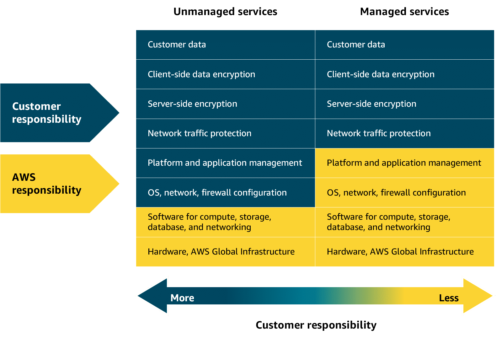
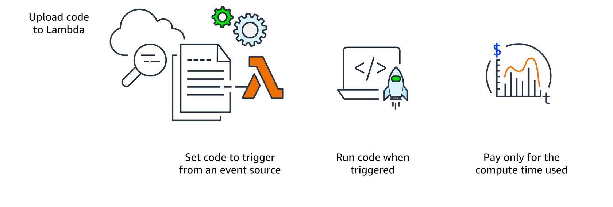
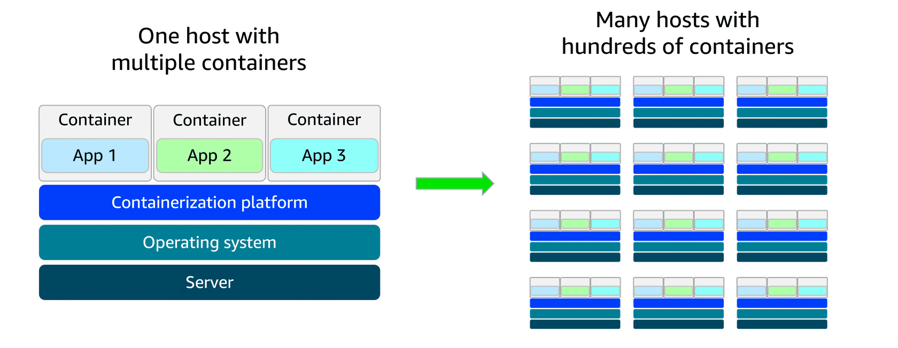

# Module 3: Exploring Compute Services

## Status: ✅ Completed

## 🔗 Quick Navigation

- Q&A Review: [qa-review.md](qa-review.md)

## 📝 Learning Objectives

- [x] Describe differences between unmanaged, managed, and serverless compute services
- [x] Describe customer and AWS responsibilities for each service model
- [x] Explain how AWS Lambda works and when to use it
- [x] Understand container services: Amazon ECS, Amazon EKS, AWS Fargate
- [x] Describe how AWS Elastic Beanstalk simplifies application deployment
- [x] Explain how AWS Batch manages large-scale batch workloads
- [x] Identify how Amazon Lightsail simplifies web application hosting
- [x] Describe how AWS Outposts supports hybrid cloud use cases

## 📚 Key Concepts

### 1. Introduction to Serverless Computing

AWS offers compute services across a spectrum of control and management responsibility. Understanding this spectrum helps you choose the right service and know where your responsibilities begin and end.

#### Service Model Overview

| Model                          | Example Services | Your Responsibility                             | AWS Responsibility                              |
|--------------------------------|------------------|-------------------------------------------------|-------------------------------------------------|
| **Unmanaged**                  | Amazon EC2       | OS, patching, scaling, network config, app code | Physical infrastructure                         |
| **Managed**                    | ELB, SNS, SQS    | Deployment options, environment config          | Infrastructure, availability, maintenance       |
| **Fully Managed / Serverless** | AWS Lambda       | Application code & its security                 | Infrastructure, scaling, availability, patching |

#### Unmanaged Services (e.g., Amazon EC2)

- You control everything above the physical hardware: OS setup, security patches, network settings, scaling
- AWS manages only the physical servers and data center infrastructure
- High level of customization — ideal when you need fine-grained control
- **Coffee shop analogy:** Like a high-end espresso machine — you choose the beans, adjust every setting, but you're responsible for all maintenance

#### Managed Services (e.g., ELB, SNS, SQS)

- AWS handles the operational overhead of running the service
- You configure the service behavior: deployment options, scaling rules, environment settings
- No server management required on your part
- **Coffee shop analogy:** Like a pod coffee maker — convenient, less customizable, AWS handles the upkeep

#### Serverless / Fully Managed Services (e.g., AWS Lambda)

- No servers to provision, see, or manage — infrastructure is fully abstracted
- AWS handles all provisioning, scaling, high availability, and maintenance automatically
- You focus **only** on writing and deploying your application code
- You remain responsible for **securing your application code** (Shared Responsibility Model still applies)
- **Coffee shop analogy:** Like ordering coffee from a café — just tell them what you want; everything else is handled

#### How to Choose: Control vs. Convenience

> *"Sometimes you'll want to be the barista, brewing everything from scratch, and other times you just need that quick cup of coffee without all the fuss."*

- **Need precise configuration?** → Use EC2 (unmanaged)
- **Want operational simplicity with some control?** → Use managed services (ELB, SNS, SQS)
- **Want to focus only on code?** → Use serverless (Lambda)

---

### 2. AWS Lambda

AWS Lambda is a **serverless compute service** (also called Function as a Service) that runs your code in response to events without requiring you to provision or manage any servers.

#### How Lambda Works

| Step                        | What Happens                                                                                         |
|-----------------------------|------------------------------------------------------------------------------------------------------|
| **1. Upload code**          | You upload your code to Lambda as a **Lambda function**                                              |
| **2. Set a trigger**        | Configure an event source (AWS service, HTTP request, mobile app, etc.) to trigger the function      |
| **3. Code runs on trigger** | Lambda executes your function only when the event occurs; AWS manages all infrastructure             |
| **4. Pay per use**          | Billed only for compute time consumed, down to the **millisecond**; cost depends on memory allocated |

#### Key Characteristics

- **Event-driven:** code runs only in response to a trigger (e.g., file upload, user action, queue message, HTTP request)
- **Automatic scaling:** scales from one trigger to thousands instantly — no configuration needed
- **Fully managed runtime:** AWS handles patching, updates, security, provisioning, and high availability
- **Max execution duration:** **15 minutes** per invocation — not suitable for long-running processes
- **Language support:** Java, Python, Node.js, and many more via built-in runtimes; custom runtimes also supported
- **Easy integration:** natively integrates with other AWS services (S3, SQS, DynamoDB, API Gateway, etc.)

#### Lambda Components

| Component           | Description                                                                              |
|---------------------|------------------------------------------------------------------------------------------|
| **Lambda function** | Your code package uploaded to Lambda                                                     |
| **Trigger**         | Event that causes the function to run (S3 upload, SQS message, HTTP request, etc.)       |
| **Runtime**         | Language-specific environment (Python, Java, Node.js, custom) that executes the function |
| **Execution role**  | IAM role granting the function permissions to access other AWS services                  |

#### Your Responsibilities vs. AWS Responsibilities

| Your Responsibility           | AWS Responsibility          |
|-------------------------------|-----------------------------|
| Application code & logic      | Infrastructure provisioning |
| Data access permissions (IAM) | Scaling & availability      |
| Securing application code     | OS patching & maintenance   |
| Memory/timeout configuration  | Server management           |

#### Lambda Use Cases

- **Real-time image processing** — resize/filter images on upload (auto-scales with volume, pay per image)
- **Personalized content delivery** — fetch & process data on demand; scales with user traffic
- **Real-time event handling** — in-game events, leaderboard updates, player state changes
- **Data processing** — batch jobs, expense report generation, stream processing
- **Web backends** — handling API/HTTP requests via API Gateway

#### When Lambda Is a Good Fit

✅ Event-driven, short-duration workloads  
✅ Unpredictable or spiky traffic patterns  
✅ No desire to manage servers  
❌ Processes that run longer than 15 minutes  
❌ Workloads requiring persistent server state

---

### 3. Containers and Orchestration on AWS

Containers package your application code, runtime, dependencies, and configuration into a single portable unit. This ensures the application runs consistently across any environment — eliminating the classic *"it works on my machine"* problem.

#### Containers vs. Virtual Machines

|                  | Containers                    | Virtual Machines                         |
|------------------|-------------------------------|------------------------------------------|
| **OS**           | Share the host OS             | Each runs its own full OS via hypervisor |
| **Size**         | Lightweight                   | Heavier                                  |
| **Startup time** | Seconds                       | Minutes                                  |
| **Isolation**    | Process-level                 | Full OS-level                            |
| **Portability**  | High — runs the same anywhere | Lower — OS differences can cause issues  |

#### Why Containers Solve Deployment Problems

- Developer, staging, and production environments all use the **same container image**
- Eliminates environment-specific failures and hard-to-debug deployment issues
- Makes deployments smoother and troubleshooting faster

#### Container Orchestration

As containerized apps scale, manually managing hundreds or thousands of containers across multiple hosts becomes unsustainable. **Container orchestration services** automate:
- Deployment, scaling (in/out), and lifecycle management
- Health monitoring and recovery from failure
- Networking and updates

#### AWS Container Services Overview

AWS container tools fall into three categories:

| Category          | Service     | Purpose                                                             |
|-------------------|-------------|---------------------------------------------------------------------|
| **Orchestration** | Amazon ECS  | Scalable container orchestration for Docker containers on AWS       |
| **Orchestration** | Amazon EKS  | Fully managed Kubernetes on AWS                                     |
| **Registry**      | Amazon ECR  | Store, manage, and deploy container images                          |
| **Compute**       | AWS Fargate | Serverless compute engine — run containers without managing servers |
| **Compute**       | Amazon EC2  | Run containers on self-managed virtual machines                     |

#### Amazon ECS (Elastic Container Service)

- Scalable container orchestration service for **Docker containers** on AWS
- You define container images and resources (instance types, load balancers); ECS manages the rest
- **Two launch types:**

| Launch Type       | Best For                                                                                       |
|-------------------|------------------------------------------------------------------------------------------------|
| **ECS + EC2**     | Full control over infrastructure; custom hardware/networking needs; small-to-medium businesses |
| **ECS + Fargate** | Serverless — no server management; ideal for startups/small teams with variable traffic        |

#### Amazon EKS (Elastic Kubernetes Service)

- Fully managed service for running **Kubernetes** on AWS
- Best for teams already using Kubernetes or needing its open-source ecosystem
- **Two launch types:**

| Launch Type       | Best For                                                                                       |
|-------------------|------------------------------------------------------------------------------------------------|
| **EKS + EC2**     | Enterprises needing full infrastructure control; complex large-scale/hybrid workloads          |
| **EKS + Fargate** | Kubernetes flexibility without server management; various use cases with serverless simplicity |

#### Amazon ECR (Elastic Container Registry)

- Fully managed **container image registry** — store, manage, version, and deploy images
- Supports **OCI (Open Container Initiative)** standard images
- Use standard container CLI tools to push/pull images
- Integrates natively with ECS, EKS, and Fargate

#### AWS Fargate

- **Serverless compute engine** for containers — works with both ECS and EKS
- Unlike ECS/EKS (orchestration), Fargate is a **container hosting platform**
- No servers to provision or manage; AWS handles all server infrastructure
- Pay only for the resources required to run your containers

#### End-to-End Container Workflow on AWS

1. **Build** your container image with app code + dependencies
2. **Push** the image to **Amazon ECR** (secure, managed registry)
3. **Choose orchestration**: ECS (simpler, AWS-native) or EKS (Kubernetes, open-source)
4. **Choose compute**: EC2 (full control) or Fargate (serverless)
5. Orchestration service **pulls image from ECR** and deploys/scales containers automatically

---

### 4. Additional Compute Services

AWS provides several purpose-built compute services for specific workloads — from application deployment and data processing to simplified web hosting and hybrid cloud operations.

#### AWS Elastic Beanstalk

Elastic Beanstalk is a fully managed service for deploying, managing, and scaling web applications. You upload code and configuration, and Elastic Beanstalk automatically provisions infrastructure.

- Automatically handles environment provisioning, scaling, load balancing, and health monitoring
- Supports multiple languages/frameworks: Java, .NET, Python, Node.js, Docker, and more
- Lets you keep visibility and control of underlying AWS resources while reducing operational overhead
- Environment configurations can be saved and reused for faster repeat deployments

**Good for:** Web applications, REST APIs, mobile backends, and microservices that need autoscaling with minimal infrastructure management.

#### AWS Batch

AWS Batch is a fully managed service for running large-scale batch computing workloads. It automatically schedules jobs and scales compute capacity based on job requirements.

- Manages compute resource provisioning, scheduling, and scaling automatically
- Optimizes resource allocation across job queues
- Can distribute jobs across a fleet of compute resources (like EC2)

**Good for:** Scientific simulations, financial risk analysis, media transcoding, big data processing, ML training, and genomics workloads.

#### Amazon Lightsail

Amazon Lightsail provides a simplified cloud experience with VPS, storage, databases, and networking at predictable monthly pricing.

- Easy setup and management for basic workloads
- Lower operational complexity than full AWS console workflows
- Cost-effective and straightforward for smaller teams and learning environments

**Good for:** Basic web apps, low-traffic websites, blogs, dev/test environments, and small business sites.

#### AWS Outposts

AWS Outposts extends AWS infrastructure and services to on-premises data centers, creating a consistent hybrid cloud experience.

- Run AWS services on premises with the same AWS tools and APIs
- Supports hybrid architectures requiring local data processing
- Helps meet low-latency, compliance, and data residency requirements

**Good for:** Regulated workloads, latency-sensitive systems, remote/edge processing, and gradual migration of legacy workloads.

#### Service Selection Guide

| Need                                                   | Best Fit              |
|--------------------------------------------------------|-----------------------|
| Simplified deployment of web apps with autoscaling     | **Elastic Beanstalk** |
| Large-scale scheduled/batch processing                 | **AWS Batch**         |
| Simple VPS-style hosting at predictable cost           | **Amazon Lightsail**  |
| AWS services on premises for hybrid/compliance/latency | **AWS Outposts**      |

---

## 🔗 References & Links

To learn more about the material covered in this module, use the resources below.

| Resource link                                                                                                                                                                         | Description                                                                                                                               |
|---------------------------------------------------------------------------------------------------------------------------------------------------------------------------------------|-------------------------------------------------------------------------------------------------------------------------------------------|
| [Containers on AWS](https://aws.amazon.com/containers/services/)                                                                                                                      | Overview of AWS container offerings, including image storage, orchestration, and compute services for containerized applications.         |
| [Amazon Elastic Container Registry (Amazon ECR)](https://aws.amazon.com/ecr/)                                                                                                         | Fully managed service for storing, managing, and deploying container images securely at scale.                                            |
| [Amazon Elastic Container Service (Amazon ECS)](https://aws.amazon.com/ecs/)                                                                                                          | Fully managed service to deploy, manage, and scale containerized applications on AWS.                                                     |
| [Amazon Elastic Kubernetes Service (Amazon EKS)](https://aws.amazon.com/eks/)                                                                                                         | Fully managed Kubernetes service for running clusters on AWS and on premises with integrations for AWS networking, security, and storage. |
| [AWS Fargate](https://aws.amazon.com/fargate/)                                                                                                                                        | Serverless compute engine for containers integrated with Amazon ECS and Amazon EKS.                                                       |
| [AWS Elastic Beanstalk](https://aws.amazon.com/elasticbeanstalk/)                                                                                                                     | Fully managed service for deploying and scaling web applications without managing infrastructure.                                         |
| [AWS Batch](https://aws.amazon.com/batch/)                                                                                                                                            | Fully managed service for efficiently running large-scale batch computing jobs.                                                           |
| [What is Amazon Lightsail?](https://docs.aws.amazon.com/lightsail/latest/userguide/what-is-amazon-lightsail.html)                                                                     | Simplified cloud platform offering VPS, containers, and databases with predictable pricing.                                               |
| [What is AWS Outposts?](https://docs.aws.amazon.com/outposts/latest/server-userguide/what-is-outposts.html)                                                                           | Extends AWS infrastructure and services to on-premises locations for low-latency and local data processing.                               |
| [Choosing a modern application strategy](https://docs.aws.amazon.com/decision-guides/latest/modern-apps-strategy-on-aws-how-to-choose/modern-apps-strategy-on-aws-how-to-choose.html) | AWS Decision Guide for choosing serverless or Kubernetes strategies based on team model and workload requirements.                        |

## ❓ Key Questions to Review

- How do unmanaged, managed, and serverless compute models differ in responsibility?
- What workloads are ideal (or not ideal) for AWS Lambda?
- How do ECS, EKS, ECR, and Fargate work together in container workflows?
- When should you choose Elastic Beanstalk, AWS Batch, Lightsail, or Outposts?
- What keywords in scenario questions typically indicate Outposts vs Batch vs Beanstalk?
- What customer responsibilities remain even when using serverless services?

## 📌 Summary

**Module Recap**

This module gave you a practical understanding of AWS compute services so you can choose the right tools for your applications. You learned when to use fully managed options like Lambda or Fargate, and when full control with Amazon EC2 made sense. You explored how containers solve deployment consistency issues and how AWS services like Amazon ECS and Amazon EKS simplify managing and scaling containerized applications. You also discovered services like Elastic Beanstalk, AWS Batch, Lightsail, and Outposts, and how each supports specific use cases—from basic web hosting to large-scale batch processing and hybrid cloud environments.

**Key Takeaways:**
- **Compute model selection matters** — unmanaged (EC2), managed services, and serverless options each trade control for operational simplicity.
- **Lambda is ideal for event-driven workloads** — short-running, variable-traffic tasks with automatic scaling and no server management.
- **Container stack roles are distinct** — ECR stores images, ECS/EKS orchestrate deployments, and EC2/Fargate provide compute runtime.
- **Fargate reduces operations overhead** — run containers without managing host instances while still using ECS or EKS orchestration.
- **Purpose-built compute services improve fit** — Beanstalk for web app deployment, Batch for large offline jobs, Lightsail for simple hosting, Outposts for hybrid/local requirements.
- **Shared responsibility still applies** — even with fully managed services, customers remain responsible for code security, IAM permissions, and data access controls.

