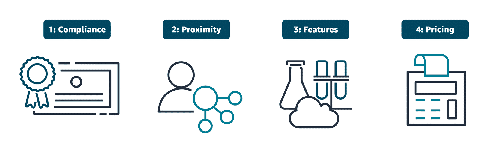
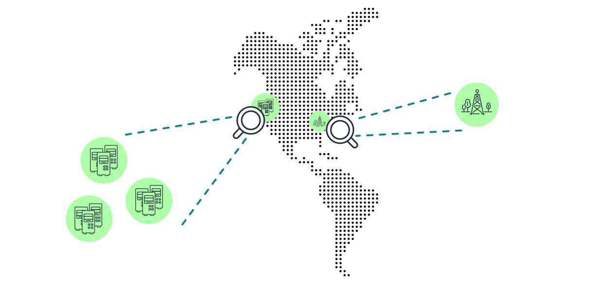
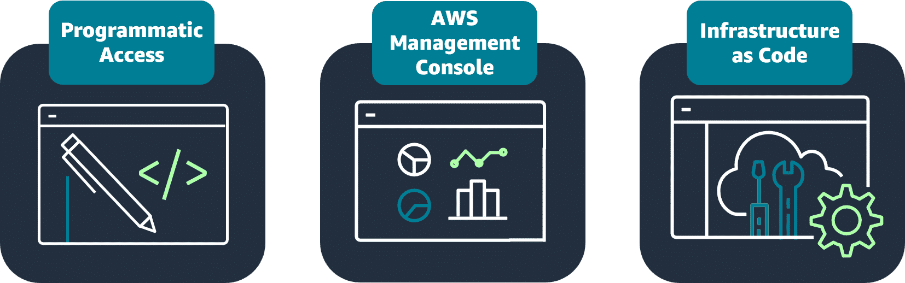

# Module 4: Going Global

## Status: ✅ Completed

## 🔗 Quick Navigation

- Q&A Review: [qa-review.md](qa-review.md)

## 📝 Learning Objectives

- [x] Understand AWS Regions and Availability Zones
- [x] Learn about edge locations
- [x] Explore CloudFront and CDN
- [x] Understand deploying applications globally

## 📚 Key Concepts

### 1. AWS Regions and Availability Zones

**Overview:**
- AWS Global Infrastructure is built around Regions, Availability Zones, and edge locations.
- Each component plays a different role in delivering availability, performance, and reach for cloud workloads.

**Coffee Shop Analogy:**
- Opening new coffee shop locations maps to choosing AWS Regions.
- Smaller coffee carts in key places map to AWS edge locations.
- Standardized recipes and automated machines map to infrastructure as code (IaC) with CloudFormation.

#### Choosing AWS Regions

When selecting a Region or set of Regions for your resources, four factors drive the decision:

| Factor                   | Description                                                                                                                                  |
|--------------------------|----------------------------------------------------------------------------------------------------------------------------------------------|
| **Compliance**           | Regulatory and data sovereignty requirements may mandate which Regions are allowed. Example: GDPR requires EU-based data stay within the EU. |
| **Proximity**            | Regions closer to users reduce data travel time, lowering latency and improving application responsiveness.                                  |
| **Feature availability** | Not all AWS services and features are available in every Region simultaneously. Choose a Region that supports what you need.                 |
| **Pricing**              | Cost varies by Region due to differences in tax structure and operational expenses.                                                          |

**Key Insight:**
Compliance is typically evaluated first — if a regulation restricts where data can reside, that narrows the selection before any other factor applies. Proximity comes second as a performance driver. Each AWS Region is also fully isolated from every other Region; data does not move between Regions unless explicitly configured.

#### Designing Highly Available Architectures

Deploying resources across multiple Availability Zones and Regions takes advantage of three key properties of the AWS Global Infrastructure:

**High availability:**
- The capability of a system to operate continuously without failing.
- Applications handle the failure of individual components without significant downtime.

**Agility:**
- The ability to quickly adapt to changing requirements or market conditions.
- AWS infrastructure lets you modify and deploy services rapidly.

**Elasticity:**
- The ability to scale resources up or down automatically in response to changes in demand.
- Pay only for what you consume, scaling back when demand drops.

**Multi-AZ Architecture:**
- Deploy resources across multiple Availability Zones within a Region for redundancy.
- If one AZ experiences an interruption, applications can automatically switch to a backup AZ — users may not notice a difference.
- Benefits include quicker disaster recovery, improved business continuity, lower latency, and regulatory compliance support.

**Multi-Region Architecture:**
- Deploying to multiple Regions extends resilience beyond a single geographic area.
- If a whole Region experiences an interruption, traffic can fail over to another Region.

**Key Takeaway:**
Start with Multi-AZ for practical high availability within a Region. Escalate to Multi-Region when business continuity requirements demand protection against full Region-level disruptions.

---

**Q: A cloud engineer for a government agency is tasked with selecting an AWS Region to deploy the agency's resources. Which factors are MOST important to consider when selecting a Region? (Select TWO.)**

A: **Any regulatory compliance standards the agency requires and proximity to users**

**Explanation of other options:**
- ❌ Number of files stored = File count alone is not a Region-selection driver
- ❌ Personal preference of the chief information officer = Region choice should be based on compliance and technical/business requirements
- ❌ How recently the Region was constructed = Region age is not a key decision criterion in this scenario
- ✅ Compliance standards + proximity = Compliance determines legal feasibility and proximity helps reduce latency for users

### 2. Edge Locations and CloudFront

**What are Edge Locations?**
- Edge locations are globally distributed AWS facilities outside of standard Regions.
- They cache content — images, videos, data, and application assets — so users can access it with lower latency.
- Edge locations are part of the Amazon Global Edge Network and are separate from Regions and AZs.

**Coffee Shop Analogy:**
Like smaller mobile coffee carts located in key spots around the city, edge locations bring popular content closer to where users are — reducing the need to travel all the way back to the central kitchen (Region) for every request.

**Services Hosted at Edge Locations:**
- **Amazon CloudFront** — CDN service that caches and serves content (images, videos, APIs, applications) to users from the nearest edge location.
- **AWS Global Accelerator** — Routes application traffic through the AWS global network to improve performance and availability.
- **Amazon Route 53** — DNS service that translates human-readable URLs into machine-readable IP addresses, routing users to the correct application endpoint.

#### AWS Global Infrastructure Elements

| Element                      | Definition                                                                                                                           |
|------------------------------|--------------------------------------------------------------------------------------------------------------------------------------|
| **AWS Regions**              | Geographical areas around the world made up of multiple data centers. Each Region has three or more Availability Zones.              |
| **Availability Zones (AZs)** | Distinct locations within a Region, each with independent power, networking, and connectivity. Each AZ has one or more data centers. |
| **Edge locations**           | Globally distributed sites outside of Regions that cache and deliver content with low latency using services like CloudFront.        |

**Key Takeaway:**
Regions and AZs are the compute and infrastructure layer. Edge locations are the content delivery layer — they are not used for running application workloads; they accelerate delivery of cached content to end users.

---

**Q: Match each AWS Global Infrastructure element with its correct definition.**

A:
- **Edge location** → Locations that cache content to deliver data, video, and applications to users with lower latency
- **AWS Region** → A physical location around the world where AWS operates multiple data centers
- **Availability Zone** → Separate, distinct locations with one or more data centers that are engineered to be isolated from failures in other areas

**Explanation:**
Regions are physical locations around the world that contain multiple data centers. Each Region contains at least three Availability Zones. Each Availability Zone contains one or more data centers. Edge locations are devices in areas outside of Regions that provide user access to frequently accessed data with low latency.

### 3. Global Application Deployment

**Overview:**
- As infrastructure grows across multiple Regions and accounts, manual provisioning becomes slow, error-prone, and hard to reproduce.
- Infrastructure as code (IaC) solves this by defining infrastructure in version-controlled template files — a blueprint for your AWS architecture — that can be deployed consistently any number of times.

**Coffee Shop Analogy:**
Standardized recipes and programmable automated machines allow the coffee shop to open new locations consistently — every franchise produces the same product. CloudFormation templates do the same for AWS infrastructure: the same setup is reproduced identically each time.

#### AWS CloudFormation

CloudFormation is a declarative IaC service that provisions and configures AWS resources from text-based templates without requiring step-by-step build instructions.

**How CloudFormation Works:**
1. Define the resources you want in a CloudFormation template.
2. CloudFormation parses the template and calls the required AWS APIs to provision everything.
3. Deploy the same template across multiple Regions or accounts to create identical environments — every time.

**Key Benefits:**
- Reduces manual configuration drift between environments
- Lower room for human error through full automation
- Supports version control so infrastructure changes are tracked alongside code

**Use Cases:**
- Managing infrastructure in DevOps CI/CD pipelines
- Scaling EC2 instances and full stack environments consistently across multiple Regions
- Reproducing staging and production environments identically

#### Interacting with AWS Resources

All AWS resource management is done by invoking AWS APIs. Three primary methods are available, each suited to a different context:

| Method                     | Best For                                                  | Example Use Cases                                         |
|----------------------------|-----------------------------------------------------------|-----------------------------------------------------------|
| **AWS Management Console** | Visual management, billing dashboards, graphical services | Cost visualization, Amazon QuickSight, Amazon Neptune     |
| **AWS CLI**                | Scripting and automation from the command line            | Automating routine backups (e.g., Amazon EBS snapshots)   |
| **AWS SDKs**               | Application-level AWS integration in code                 | Storing user data in Amazon S3 from inside an application |
| **CloudFormation (IaC)**   | Repeatable, version-controlled infrastructure lifecycle   | Multi-Region deployments, CI/CD pipelines                 |

**Key Takeaway:**
Use the Management Console for visual and administrative tasks. Use CLI and SDKs when programmatic access is needed. Use CloudFormation when consistency and repeatability across environments matters most.

---

**Q: Would AWS CloudFormation be a good solution for managing the company's infrastructure?**

A: **CloudFormation would be ideal because it supports infrastructure as code (IaC), enabling consistent, repeatable deployments across different environments.**

**Explanation of other options:**
- ❌ CloudFormation would not be useful because it only supports simple setups = Incorrect; CloudFormation supports complex, multi-resource, multi-environment infrastructure.
- ❌ CloudFormation should be used only for static websites = Incorrect; it is used broadly for many AWS architectures and workloads.
- ❌ CloudFormation is too complicated and would slow deployment = Incorrect; IaC automation typically reduces manual effort and deployment errors over time.
- ✅ IaC-based consistent repeatable deployments = Correct; this is one of CloudFormation's core benefits.

## 🔗 References & Links

| Resource link                                                                        | Description                                                          |
|--------------------------------------------------------------------------------------|----------------------------------------------------------------------|
| [AWS Global Infrastructure](https://aws.amazon.com/about-aws/global-infrastructure/) | Learn more about the AWS Global Infrastructure.                      |
| [AWS for the Edge](https://aws.amazon.com/edge/?nc2=type_a)                          | Learn more about AWS edge locations and edge networking.             |
| [AWS CloudFormation](https://aws.amazon.com/cloudformation/)                         | Learn more about the infrastructure as code service, CloudFormation. |

## ❓ Key Questions to Review

- What is the difference between Regions, Availability Zones, and Edge Locations?
- What four key factors should guide Region selection?
- Why is compliance usually the first Region selection filter?
- How does CloudFront improve application performance?
- What are the benefits of deploying globally?

## 📌 Summary

**Module Recap**

This module gave you a practical understanding of the AWS Global Infrastructure and how to make sound architectural decisions with it. You learned how to evaluate Regions using four factors — compliance, proximity, feature availability, and pricing — and how deploying across AZs and Regions improves availability and resilience. You discovered how edge locations accelerate content delivery through services like CloudFront, and how CloudFormation makes infrastructure deployment consistent, repeatable, and automated across any number of environments.

**Key Takeaways:**
- **Region selection follows a prioritized checklist** — compliance constrains your options first; proximity, features, and pricing refine the choice.
- **Multi-AZ is the first availability step** — redundancy within a Region with automatic failover between AZs.
- **Multi-Region extends disaster tolerance** — required when full Region-level failures must be survivable.
- **Edge locations are not Regions** — they serve cached content to end users via CloudFront, Global Accelerator, and Route 53; they do not run application workloads.
- **CloudFormation enables infrastructure as code** — templates define resources declaratively; the same template creates identical environments across accounts and Regions.
- **Choose the right AWS access method** — Console for visual tasks, CLI/SDK for programmatic access, CloudFormation for repeatable infrastructure lifecycle management.
