# Module 5: Networking

## Status: ✅ Complete

## 🔗 Quick Navigation

- Q&A Review: [qa-review.md](qa-review.md)

## 📝 Learning Objectives

- [x] Understand VPC (Virtual Private Cloud)
- [x] Learn about subnets and network connectivity
- [x] Explore security groups and NACLs
- [x] Understand routing and gateways

## 📚 Key Concepts

### 1. Introduction to Networking

The term networking refers to interconnected devices that can exchange data and resources. Networking in the AWS Cloud consists of the infrastructure and services working together to host applications, data, and other resources.

#### Networking Components

So far, you've learned about the AWS Cloud, AWS Regions, and Availability Zones. Now you will review two more foundational networking components used in the AWS Cloud.

**Amazon Virtual Private Cloud (Amazon VPC)**

An Amazon VPC lets you provision a logically isolated section of the AWS Cloud where you can launch AWS resources in a virtual network that you define.

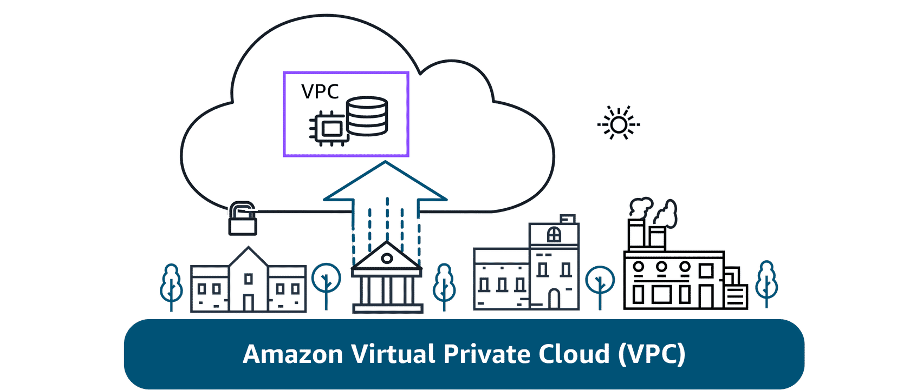

- Resources within a VPC can be **public-facing** (internet-accessible) or **private** (no direct internet access).
- Public-facing resources have access to the internet; private resources do not.

**Coffee Shop Analogy:**
- Cashiers work at the front of the shop — publicly accessible resources that face customers directly.
- Baristas work in the back without direct customer contact — private resources focused on their work.
- VPC applies this same separation: public resources interact with customers; private resources stay protected.

**Subnet**

Subnets are used to organize your resources and can be made publicly or privately accessible.

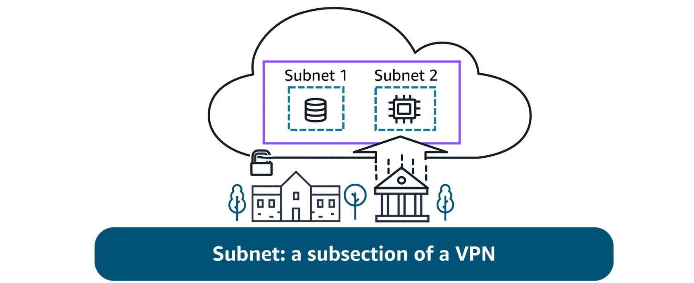

- A **private subnet** is commonly used to contain resources like a database storing customer or transactional information.
- A **public subnet** is commonly used for resources like a customer-facing website.

#### Networking Components: Understanding Connections Through Diagrams

A network diagram is a schematic or map of your network in the AWS Cloud. With a quick glance, you can see if the network was built for redundancy, security, and scalability. It also serves as a blueprint so you don't forget important connections when building solutions.

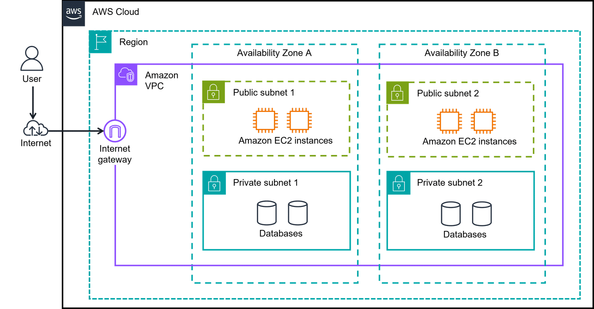

**Diagram Basics 1: AWS Cloud, Regions, Amazon VPC, and AZs**

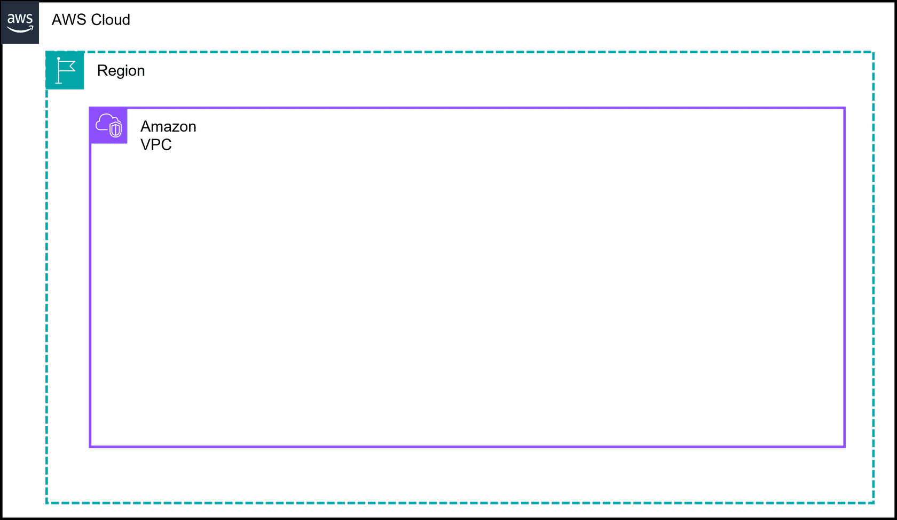

| Component              | Description                                                                                                                                                                                     |
|------------------------|-------------------------------------------------------------------------------------------------------------------------------------------------------------------------------------------------|
| **AWS Cloud**          | The outermost box in most diagrams                                                                                                                                                              |
| **AWS Region**         | Separate geographic area; chosen based on users' location (lower latency), compliance requirements, available services, and cost                                                                |
| **Amazon VPC**         | A solid box representing your isolated, logically segmented network within AWS; controls network resources and security                                                                         |
| **Availability Zones** | Separate boxes across a Region; consist of one or more discrete data centers with redundant power, networking, and connectivity; multiple AZs protect applications from single-location failure |

**Diagram Basics 2: Private Subnets**

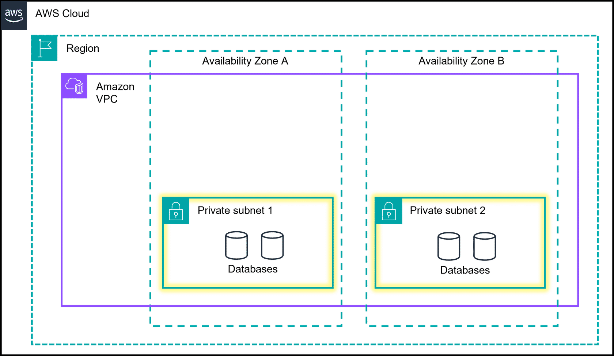

- Subnets are segments of your VPC that divide it into smaller, manageable sections. A subnet is a range of IP addresses in your VPC.
- **Private subnets** isolate resources that shouldn't be directly exposed to the public internet.
- In diagrams, private subnets are illustrated with **solid boxes**.

**Diagram Basics 3: Public Subnets**

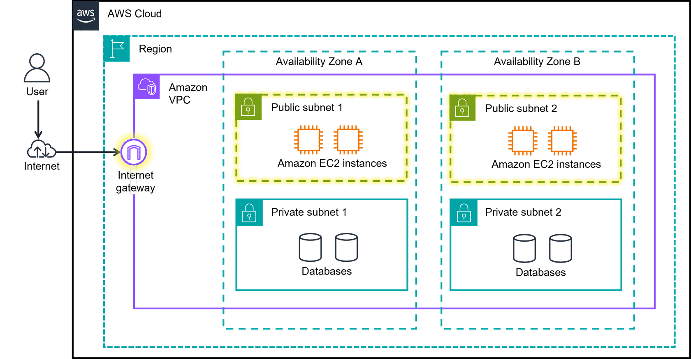

- **Public subnets** provide direct internet access to resources placed inside them.
- To allow access, they are connected with an internet gateway (covered in a later lesson).
- In diagrams, public subnets are drawn with **dashed boxes**.

---

**Q: What are the uses of a subnet in an Amazon VPC? (Select THREE.)**

**Options:**
- A) Can be used to share public resources
- B) Can be used to organize your resources
- C) Can be used to provide high availability because they consist of one or more discrete data centers
- D) Can provide a centralized interface for accessing and managing various AWS resources and services
- E) Can be used to isolate resources and keep them private
- F) Can be used as an on-demand and scalable computing capacity in the AWS Cloud

A: **A) Can be used to share public resources, B) Can be used to organize your resources, and E) Can be used to isolate resources and keep them private**

**Explanation of other options:**
- ✅ Share public resources = Correct; public subnets contain publicly accessible resources like customer-facing websites.
- ✅ Organize resources = Correct; subnets divide a VPC into smaller, manageable sections.
- ❌ High availability from discrete data centers = Incorrect; this describes Availability Zones, not subnets. AZs consist of discrete data centers with redundant infrastructure; subnets are IP address ranges within a VPC.
- ❌ Centralized interface for managing AWS resources = Incorrect; this describes the AWS Management Console, not subnets.
- ✅ Isolate resources and keep them private = Correct; private subnets prevent direct internet access to resources.
- ❌ On-demand and scalable computing capacity = Incorrect; this describes Amazon EC2, not subnets.

### 2. Organizing AWS Cloud Resources

In this lesson, you will explore more components in a VPC — organizing your resources using boundaries and subnets, and controlling access using gateways.

#### Organizing Resources in the AWS Cloud

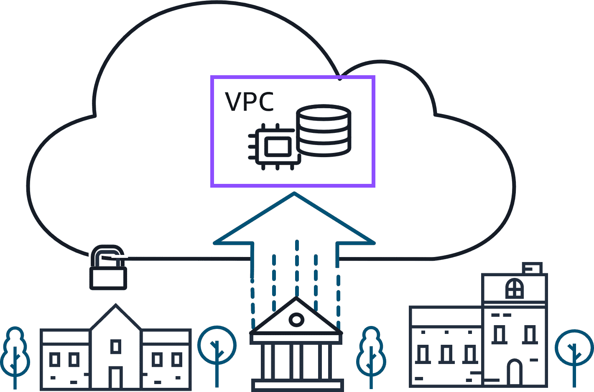

Imagine the millions of customers who use AWS services and the millions of resources they have created. Without boundaries around all these resources, network traffic can flow between them unrestricted. Two key components help organize and protect your resources:

- **Amazon Virtual Private Cloud (VPC)** — establishes boundaries around your AWS resources
- **Gateways** — control how traffic connects to your resources

#### Amazon VPC

With Amazon VPC, you can provision an isolated section of the AWS Cloud and launch resources in a virtual network that you define.

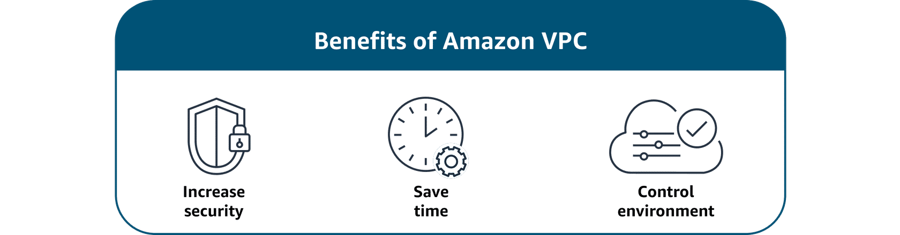

Amazon VPC provides three main benefits:

| Benefit          | Description                                                                                                          |
|------------------|----------------------------------------------------------------------------------------------------------------------|
| **Security**     | Secure and monitor connections, screen traffic, and restrict instance access                                         |
| **Full control** | Full control over resource placement, connectivity, and security                                                     |
| **Convenience**  | Spend less time setting up, managing, and validating your virtual network compared to on-premises network management |

**Subnets:**
Within an Amazon VPC, you can organize your resources into subnets. A subnet is a section of an Amazon VPC that can contain resources such as Amazon EC2 instances. Subnets, along with networking rules, control whether resources are publicly or privately available.

#### Connecting Your Resources with an Internet Gateway

To allow public traffic from the internet to access your VPC, you attach an **internet gateway** to the VPC.

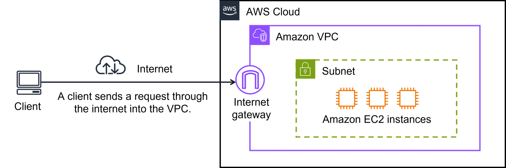

- An internet gateway is a connection between a VPC and the internet.
- Without an internet gateway, no one can access the resources within your VPC.
- **Analogy:** An internet gateway is like a doorway that customers use to enter the coffee shop — without a front door, no one gets in.

#### Virtual Private Gateways

What if you have a VPC that includes only private resources?

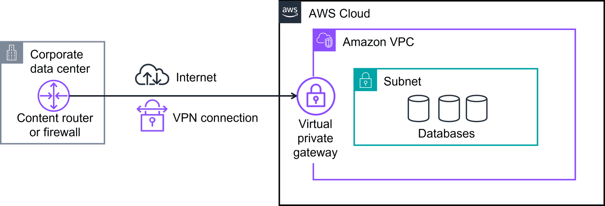

- A **VPN (virtual private network)** creates a secure, encrypted tunnel through the internet, hiding and protecting everything you send and receive from outside eyes.
- A **virtual private gateway** is the component in the AWS Cloud that allows VPN-protected traffic to enter the VPC.
- With a virtual private gateway, you can establish a VPN connection between your VPC and a private network — such as an on-premises data center or internal corporate network.
- A virtual private gateway allows traffic into the VPC **only if it is coming from an approved network**.
- **Analogy:** The virtual private gateway is like a badge-access door inside a private corporate office building — only authorized people can enter. VPN = traveling through shared hallways in that building: secure but shared infrastructure, which can cause slowdowns under heavy use.

**Note on Direct Connect:** When higher bandwidth or a dedicated line is needed, AWS Direct Connect provides a completely private, dedicated fiber connection from your data center to AWS — bypassing the public internet entirely for consistent, high-performance access.

#### Flashcards: VPC, Virtual Private Gateway, and VPN

Several of the preceding networking components have similar abbreviations and are often confused. These are core building blocks used in many AWS Cloud solutions.

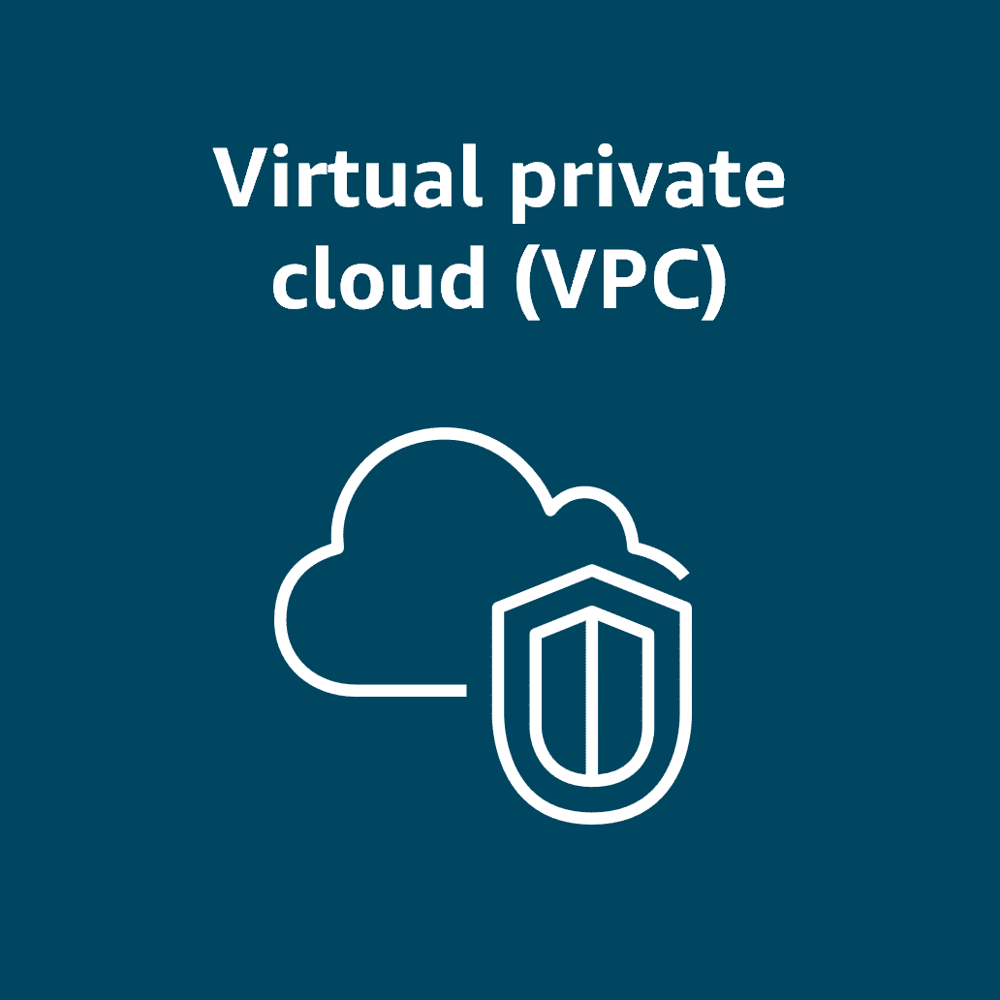

**Amazon Virtual Private Cloud (Amazon VPC)** — Amazon VPC is used to establish boundaries around your AWS resources.

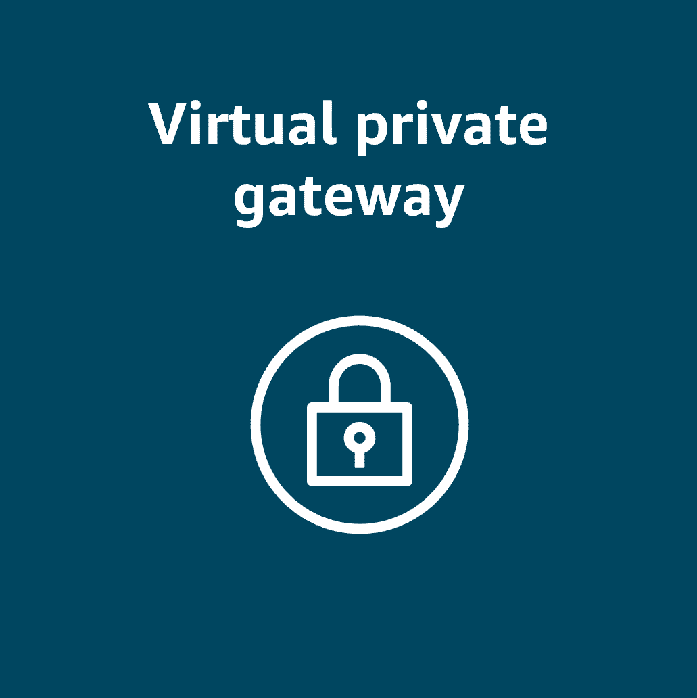

**Virtual private gateway** — A virtual private gateway allows protected internet traffic to enter into the VPC.

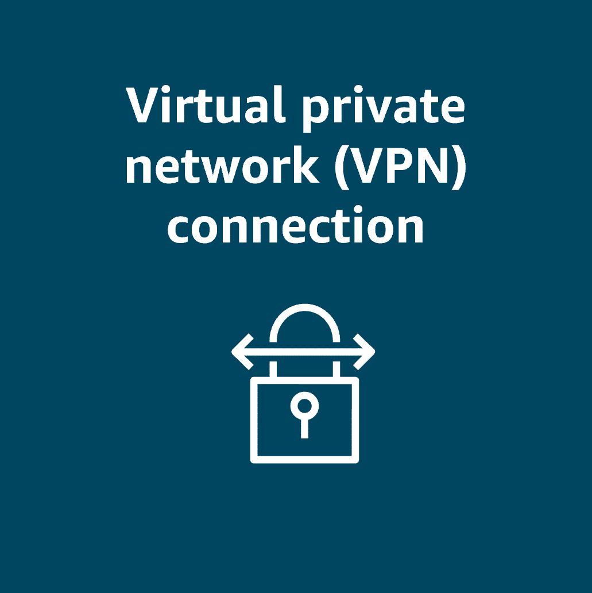

**Virtual private network (VPN)** — A VPN encrypts your internet traffic, helping protect it from anyone who might try to intercept or monitor it.

---

**Q: A company is setting up their Amazon VPC. They need to connect their corporate data center through the internet with a secure connection. They also want to make sure the resources are isolated from the public. Which solution would BEST meet their needs?**

**Options:**
- A) An internet gateway with a public subnet holding the resources in the Amazon VPC
- B) A virtual private gateway with a VPN connection and a private subnet in the Amazon VPC
- C) An internet gateway with an Amazon VPC and no subnets
- D) An internet gateway with an Amazon VPC and a public subnet

A: **B) A virtual private gateway with a VPN connection and a private subnet in the Amazon VPC**

**Explanation of other options:**
- ❌ Internet gateway with a public subnet = Incorrect; an internet gateway opens the VPC to the public internet, and a public subnet makes resources publicly accessible — the opposite of the isolation requirement.
- ✅ Virtual private gateway + VPN + private subnet = Correct; the virtual private gateway allows only approved encrypted traffic from the corporate data center, and the private subnet keeps resources isolated from the public.
- ❌ Internet gateway with no subnets = Incorrect; an internet gateway allows public traffic, and having no subnets provides no mechanism to organize or isolate resources.
- ❌ Internet gateway with a public subnet = Incorrect; same problem — exposes resources to the public internet rather than isolating them.

### 3. More Ways to Connect

In this lesson, you will learn how to do the following:
- Describe AWS Client VPN and when to use it.
- Describe AWS Site-to-Site VPN and when to use it.
- Describe AWS PrivateLink and when to use it.
- Describe AWS Direct Connect and when to use it.

In this lesson, you will explore more hybrid cloud connections with the AWS Cloud. Specifically, you'll learn more ways to connect your clients, datacenters, and sites to the AWS Cloud.

#### Connecting to the AWS Cloud

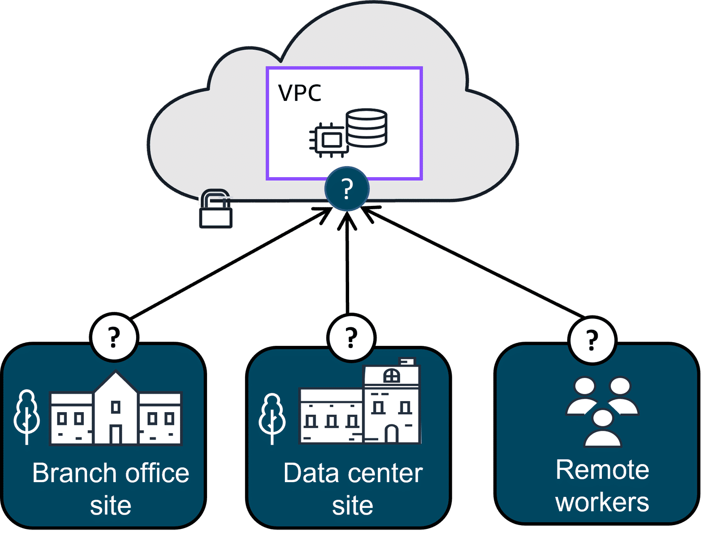

With so many different types of networks, on-premises datacenters, and remote workers, companies need a wide range of ways to connect to the AWS Cloud. In the following section, you will learn four ways to connect to the AWS Cloud:
- AWS Client VPN
- AWS Site-to-Site VPN
- AWS PrivateLink
- AWS Direct Connect

#### Securely Connect a Remote Workforce to AWS Cloud Resources

Imagine a company with a recent acquisition needing to securely connect their new remote workforce to their AWS Cloud resources. Even the largest companies with worldwide remote workers can quickly scale up and connect to the AWS Cloud. That's where AWS Client VPN can help.

#### AWS Client VPN

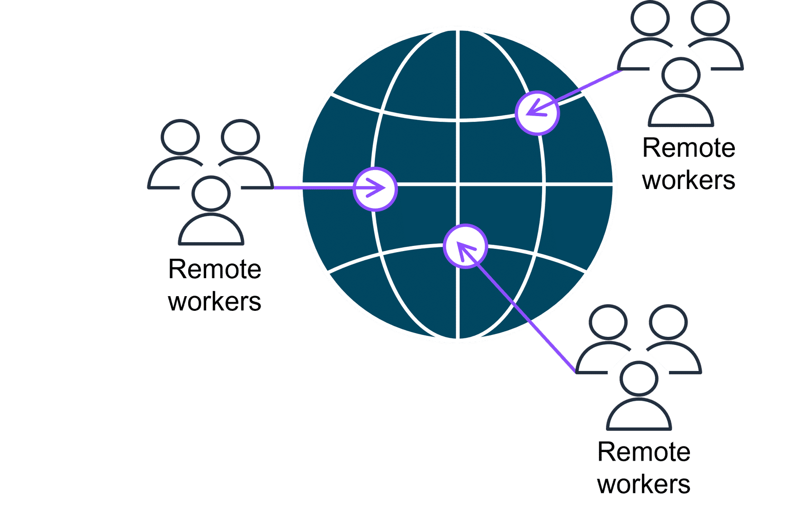

AWS Client VPN is a networking service you can use to connect your remote workers and on-premises networks to the cloud. It is a fully managed, elastic VPN service that automatically scales up or down based on user demand. Because it is a cloud VPN solution, you don't need to install and manage hardware or try to estimate how many remote users to support at one time.

|              |                                                                   |
|--------------|-------------------------------------------------------------------|
| **Benefits** | Advanced authentication, remote access, elastic and fully managed |
| **Use case** | Quickly scale remote-worker access to AWS Cloud resources         |

Client VPN, a managed VPN service, provides secure access to AWS resources and on-premises networks from anywhere. It uses an OpenVPN-based client, and it works with global Regions by using the AWS global network.

#### Securely Connect Sites to Other Sites

Some companies might want to establish secure, encrypted connections between their on-premises networks like data centers or branch offices and their resources in their Amazon VPC. That's where Site-to-Site VPN can help.

#### AWS Site-to-Site VPN

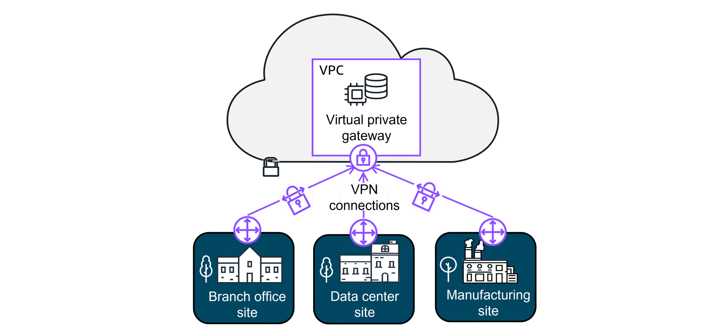

Site-to-Site VPN creates a secure connection between your data center or branch offices and your AWS Cloud resources.

|               |                                                                          |
|---------------|--------------------------------------------------------------------------|
| **Benefits**  | High availability, secure and private sessions, accelerates applications |
| **Use cases** | Application migration, secure communication between remote locations     |

#### Securely Connect Resources, Even in Other VPCs

Other companies sometimes need the flexibility to privately connect to resources in other cloud providers as though they were in their own VPC. They need a way to communicate with these resources and don't want the hassle of setting up gateways or site-to-site VPNs. That's where AWS PrivateLink can help.

#### AWS PrivateLink

AWS PrivateLink is a highly available, scalable technology that you can use to privately connect your VPC to services and resources as if they were in your VPC. You do not need to use an internet gateway, NAT device, public IP address, Direct Connect connection, or AWS Site-to-Site VPN connection to allow communication with AWS services or resources from your private subnets. Instead, you control the specific API endpoints, sites, services, and resources that are reachable from your VPC.

|              |                                                                        |
|--------------|------------------------------------------------------------------------|
| **Benefits** | Secure traffic, simplified management rules                            |
| **Use case** | Connecting clients in your VPC to resources, other VPCs, and endpoints |

Even though the preceding connections are highly available and scalable, traffic jams are possible because you're using the same connection as other clients. That's why for some use cases, you might need a dedicated private connection with a lot of bandwidth.

#### Dedicated Private Connections for Increased Bandwidth

#### AWS Direct Connect

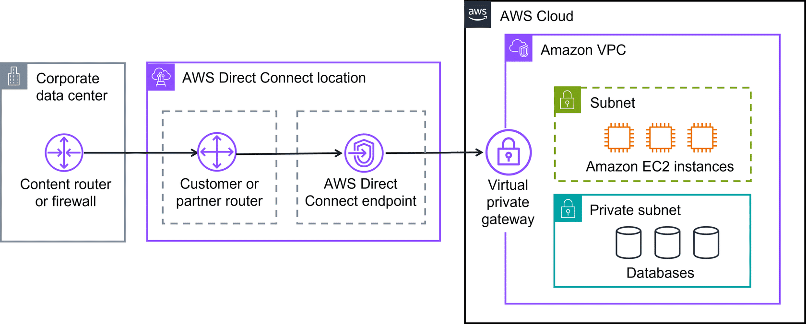

Direct Connect is a service that makes it possible for you to establish a dedicated private connection between your network and VPC in the AWS Cloud.

|              |                                                                 |
|--------------|-----------------------------------------------------------------|
| **Benefits** | Reduces network costs and increases amount of bandwidth         |

To learn more about Direct Connect, expand each of the following three categories.

**Latency-sensitive applications:**

Direct Connect bypasses the internet and provides a consistent, low-latency network experience. This makes it ideal for applications like video streaming and other real-time applications that require high performance.

**Large-scale data migration or transfer:**

Direct Connect helps ensure smooth and reliable data transfers at massive scale for real-time analysis, rapid data backup, or broadcast media processing.

**Hybrid cloud architectures:**

You can use Direct Connect to link your AWS and on-premises networks to build applications that span environments without compromising performance.

#### Additional Gateway Services

There are several different types of gateways you can use to connect your AWS resources. To learn more about these additional gateway types, expand each of the following three categories.

**AWS Transit Gateway:**
AWS Transit Gateway is used to connect your Amazon VPCs and on-premises networks through a central hub. As your cloud infrastructure expands globally, inter-Region peering connects transit gateways together using the AWS Global Infrastructure. To learn more, refer to [AWS Transit Gateways](https://aws.amazon.com/transit-gateway/).

**Network Address Translation (NAT) Gateway:**
A NAT gateway is a NAT service. You can use a NAT gateway so that instances in a private subnet can connect to services outside your VPC but external services can't initiate a connection with those instances. To learn more, refer to [NAT gateway](https://docs.aws.amazon.com/vpc/latest/userguide/vpc-nat-gateway.html).

**Amazon API Gateway:**
You learned about Application Programming Interface (APIs) earlier. An API defines how different software systems can interact and communicate with each other. The Amazon API Gateway is an AWS service for creating, publishing, maintaining, monitoring, and securing APIs at any scale. To learn more, refer to [Amazon API Gateway](https://aws.amazon.com/api-gateway/).

#### Flashcards: Connectivity Options

In this lesson, you identified services that help you connect your AWS Cloud to your clients, datacenters, and sites. To review the four types of connectivity options, choose each of the following flashcards.

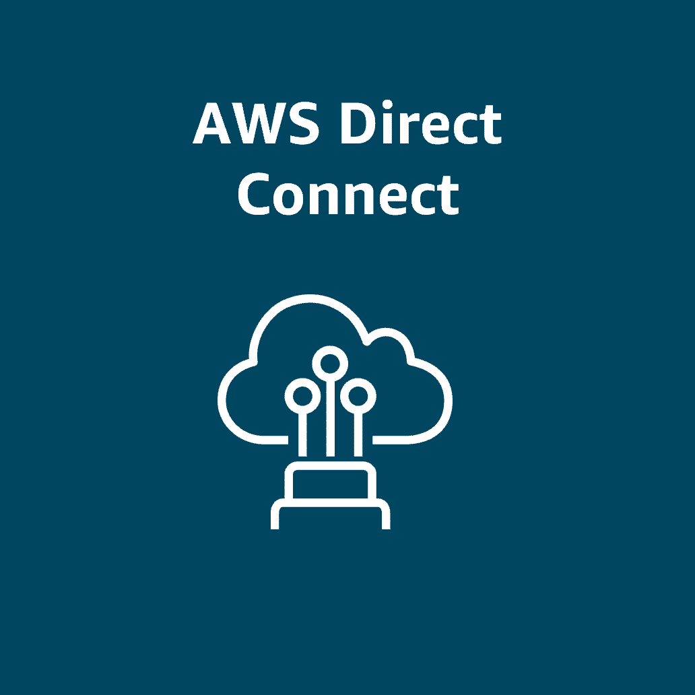

**AWS Direct Connect** — AWS Direct Connect is a private, dedicated AWS connection to your data center or office.

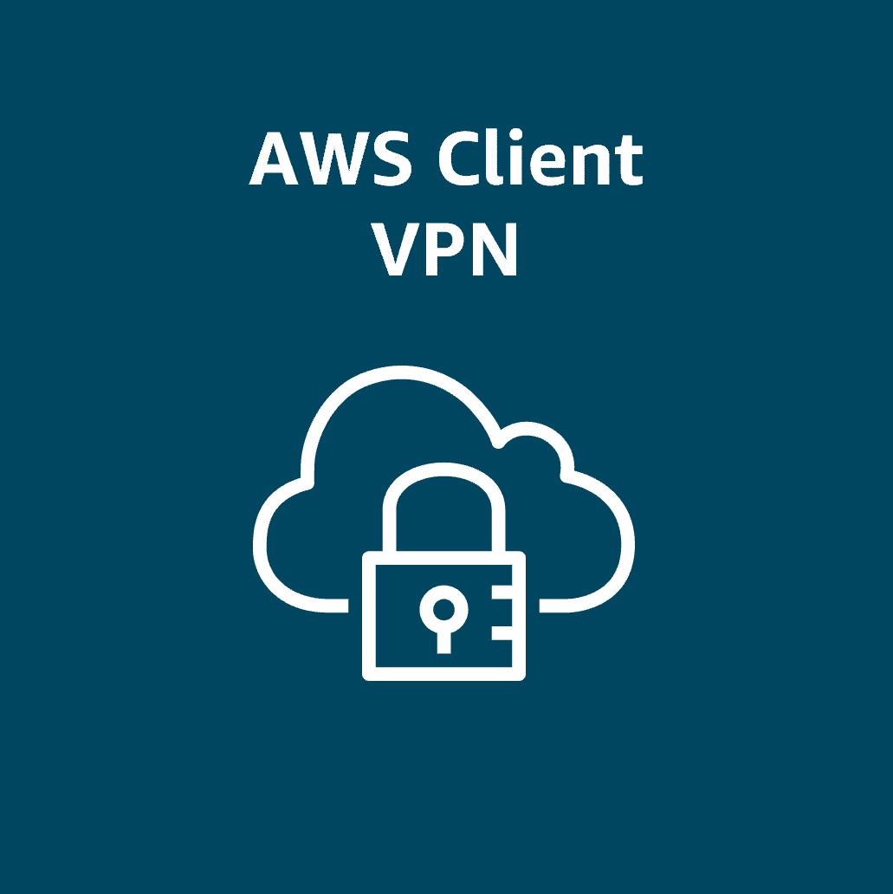

**AWS Client VPN** — AWS Client VPN connects your remote workforce to AWS or on-premises with a VPN.

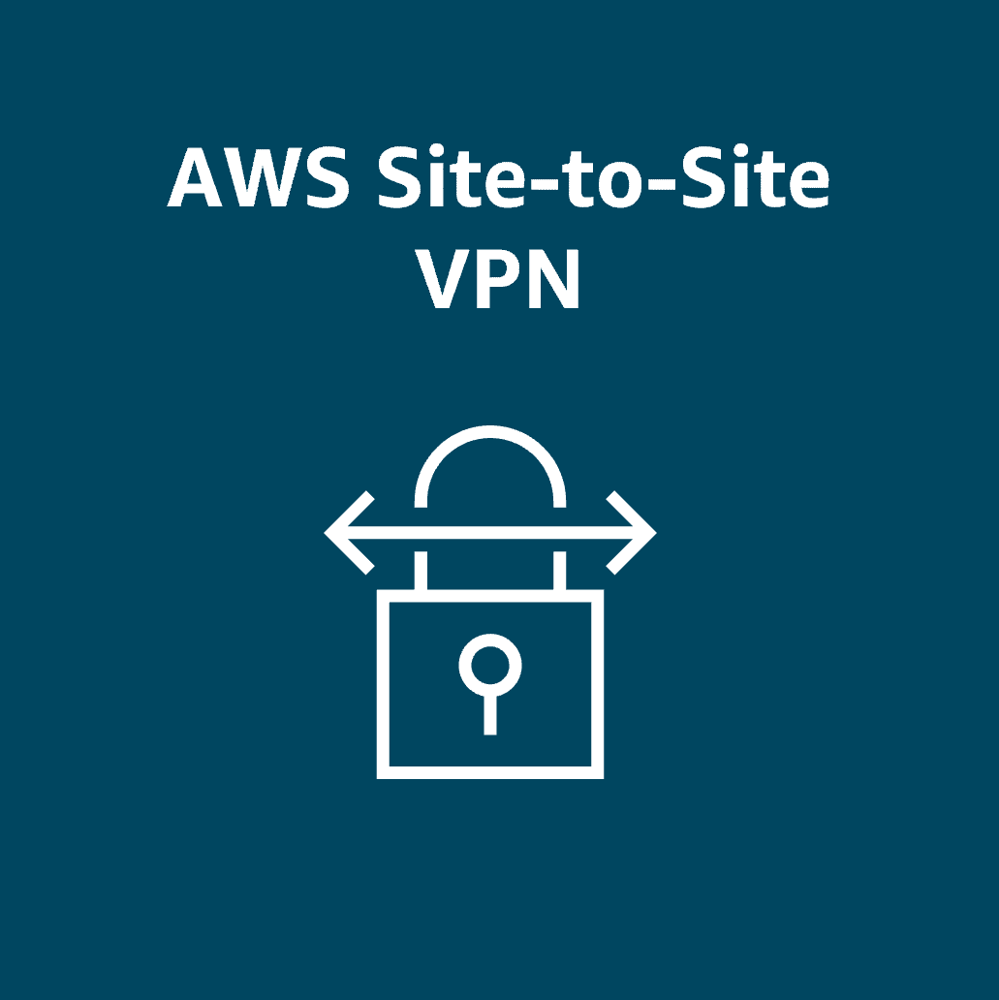

**AWS Site-to-Site VPN** — AWS Site-to-Site VPN is an encrypted network connection to your Amazon VPCs.

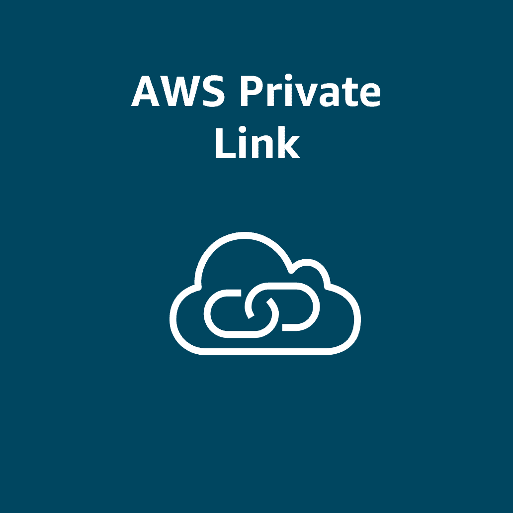

**AWS PrivateLink** — AWS PrivateLink connects your VPC privately to services and resources as though they were in your VPC.

---

**Q: A company is conducting a large-scale migration of their on-premises data center with their data warehouse and data backup. They need a solution that will meet the large amount of bandwidth requirements during migration. The solution will also be used for their ongoing data transfers after the move because they will retain part of their on-premises data center for a hybrid cloud solution. Which AWS solution would best meet their needs?**

**Options:**
- A) AWS Client VPN
- B) AWS Site-to-Site VPN
- C) AWS Direct Connect link to their on-premises network and the AWS Cloud
- D) AWS Private Link to their on-premises datacenter

A: **C) AWS Direct Connect link to their on-premises network and the AWS Cloud**

**Explanation of other options:**
- ❌ AWS Client VPN = Incorrect; Client VPN is designed for remote worker access to AWS resources, not for high-bandwidth data center migrations.
- ❌ AWS Site-to-Site VPN = Incorrect; Site-to-Site VPN routes through the shared public internet and cannot guarantee the bandwidth required for large-scale data migration or consistent ongoing hybrid transfers.
- ✅ AWS Direct Connect = Correct; Direct Connect is a dedicated private connection with high, consistent bandwidth — ideal for large-scale data migration, real-time analysis, and hybrid cloud architectures.
- ❌ AWS PrivateLink = Incorrect; PrivateLink provides private connectivity between VPCs and services within AWS; it is not designed for connecting on-premises data centers to AWS.

---

**Q: A company is choosing the type of gateway for their network. They need to connect their corporate data center with their private subnet in their Amazon Virtual Private Cloud. Their gateway needs to allow only protected internet traffic to enter into the Amazon VPC. It should also allow a connection between their Amazon VPC and a private network only if it is coming from an approved network. Which type of gateway would BEST meet their needs?**

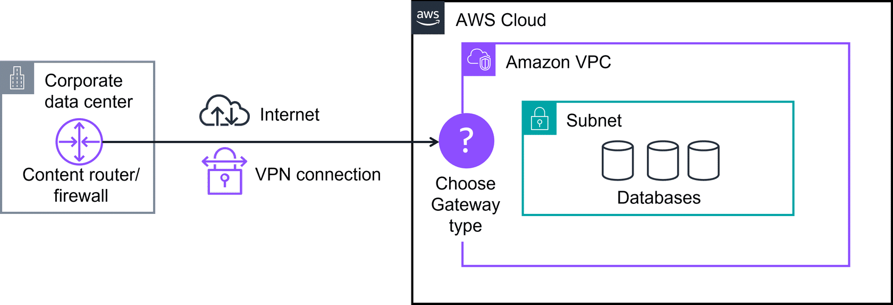

**Options:**
- A) Internet gateway
- B) Virtual private gateway
- C) AWS Transit Gateway
- D) Amazon API Gateway

A: **B) Virtual private gateway**

**Explanation of other options:**
- ❌ Internet gateway = Incorrect; an internet gateway allows any public internet traffic into the VPC and does not restrict access to approved networks only.
- ✅ Virtual private gateway = Correct; a virtual private gateway allows only protected, encrypted VPN traffic from an approved private network (such as a corporate data center) to enter the VPC.
- ❌ AWS Transit Gateway = Incorrect; Transit Gateway connects multiple VPCs and on-premises networks through a central hub — it is not designed as the dedicated endpoint for approved-only private access to a single VPC.
- ❌ Amazon API Gateway = Incorrect; Amazon API Gateway is used for creating, publishing, and managing APIs — it is not a network gateway for VPC connectivity.

### 4. Subnets, Security Groups, and Network Access Control Lists

In this lesson, you will learn how to do the following:
- Describe how network traffic works in a VPC.
- Describe how security groups work (stateful).
- Describe how network access control lists (network ACLs) work (stateless).
- Describe who is responsible for securing subnets with security groups and network ACLs according to the AWS Shared Responsibility Model.

Now that you know the basic components of a network, you'll want to start thinking about security. Two very powerful and flexible ways to control network traffic in your VPC are security groups and network access control lists, or network ACLs. In this lesson, you will learn about defining the rules for your security groups and network ACLs, including how they work. Using these two hardworking security components in your network design will help you to meet your specific application requirements, while also helping to ensure basic network security.

#### Subnets

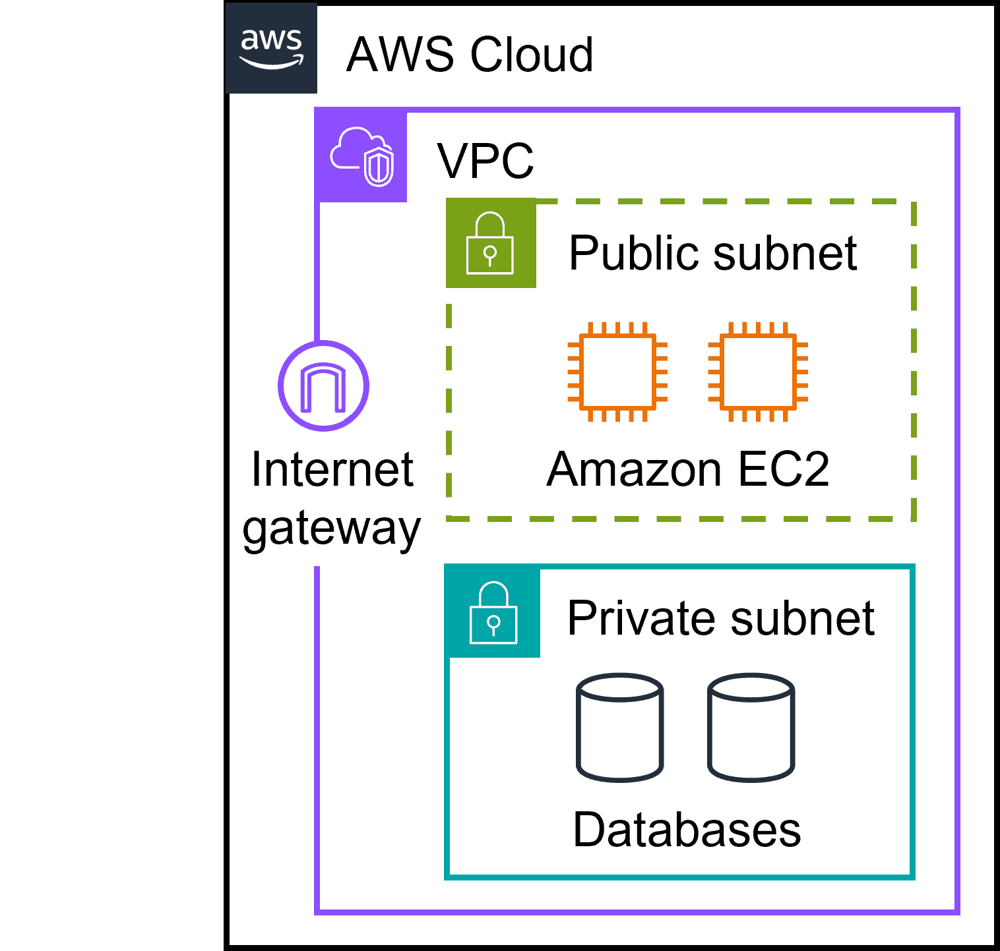

A subnet is a section of a VPC in which you can group resources based on security or operational needs. Subnets can be public or private.

- **Public subnets** contain resources that need to be accessible by the public, such as an online store's website.
- **Private subnets** contain resources that should be accessible only through your private network, such as a database that contains customers' personal information and order histories.

In a VPC, you can define rules to allow resources in different subnets to communicate with each other. For example, you might have an application that uses Amazon EC2 instances in a public subnet communicating with databases that are located in a private subnet.

#### Network Traffic in a VPC

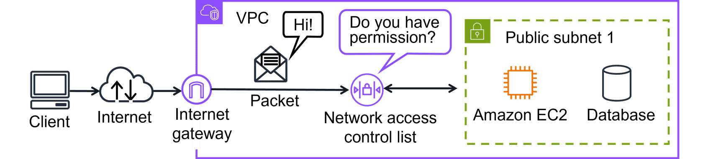

When a customer requests data from an application hosted in the AWS Cloud, this request is sent as a packet. A packet is a unit of data sent over the internet or a network.

It enters into a VPC through an internet gateway. Before a packet can enter into a subnet or exit from a subnet, it will run into several checks for permissions, one being a network ACL associated with the subnet the packet is being routed to. The permissions defined by the network ACLs indicate what is allowed or denied. It is based on who sent the packet and how the packet is trying to communicate with the resources in a subnet.

The VPC component that checks packet permissions for subnets is a network ACL.

#### Network ACLs

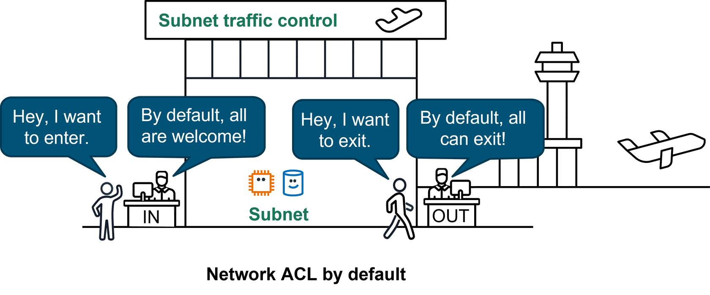

A **network ACL** is a virtual firewall that controls inbound and outbound traffic at the subnet level.

For example, imagine that you are at the airport. Travelers are trying to enter into a different country. You can think of the travelers as packets and the passport control officer as a network ACL. The passport control officer checks travelers' credentials when they are both entering and exiting the country. This is similar to how a network ACL checks permissions every time a packet travels across a subnet boundary.

Each AWS account includes a default network ACL. When configuring your VPC, you can use your account's default network ACL or create custom network ACLs. By default, your account's default network ACL allows all inbound and outbound traffic, but you can modify it by adding your own rules.

For custom network ACLs,

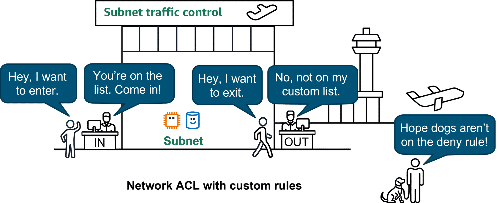

all inbound and outbound traffic is denied until you add rules to specify which traffic to allow. Additionally, all network ACLs have an explicit deny rule. This rule makes sure that if a packet doesn't match any of the other rules on the list, the packet is denied.

**Stateless packet filtering:**

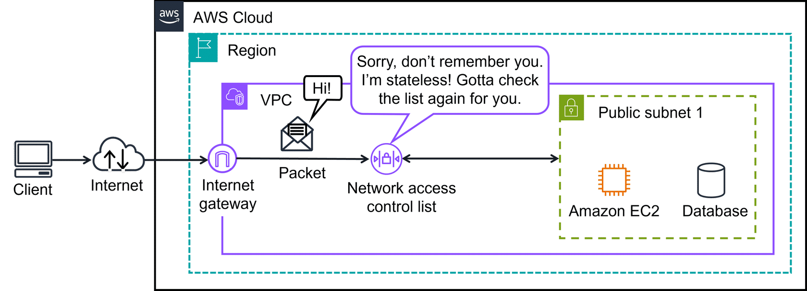

Network ACLs perform stateless packet filtering. They remember nothing and check packets that cross the subnet border each way: inbound and outbound.

When a packet response for that request comes back to the subnet, the network ACL does not remember your previous request. The network ACL checks the packet response against its list of rules to determine whether to allow or deny.

#### Security Groups

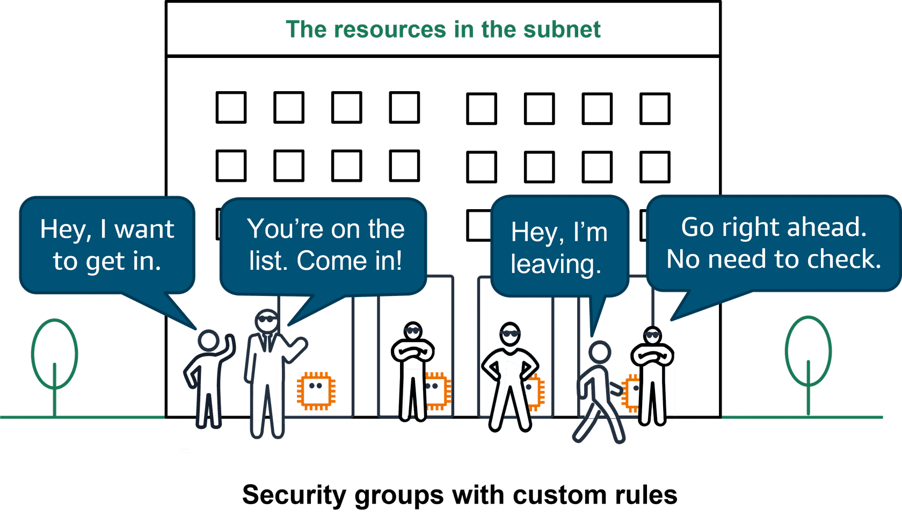

After a packet has entered a subnet, it must have its permissions evaluated for resources within the subnet, such as Amazon EC2 instances. A security group is the VPC component that checks packet permissions for an Amazon EC2 instance. It is a virtual firewall that controls inbound and outbound traffic for specific AWS resources, like Amazon EC2 instances.

By default,

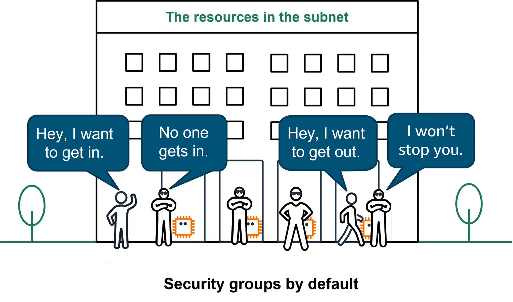

a security group denies all inbound traffic and allows all outbound traffic. For this example, suppose that you are at an apartment building with a door attendant who greets guests at the door. You can think of the guests as packets and the door attendant as a security group. With the default settings, the security groups won't let anyone in and allows all outbound traffic out.

With security groups, you can add custom rules to configure which traffic should be allowed. Any other traffic would then be denied. For example, custom rules can be given separately for inbound and outbound traffic. As guests arrive, the door attendant checks a list to makes sure they can enter the building. However, the door attendant does not check the list again when guests are exiting the building.

Note: If you have multiple Amazon EC2 instances within the same VPC, you can associate them with the same security group or use different security groups for each instance.

**Stateful packet filtering:**

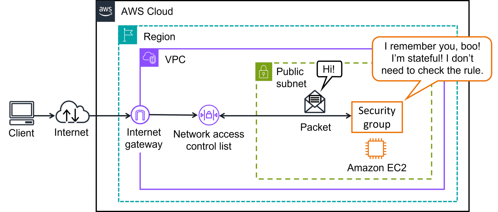

Security groups perform stateful packet filtering. They remember previous decisions made for incoming packets.

When a packet response for that request returns to the instance, the security group remembers your previous request. The security group allows the response to proceed, regardless of inbound security group rules.

#### Security Groups vs. Network ACLs

With both network ACLs and security groups, you can configure custom rules for the traffic in your VPC. The following table will help you understand which to use.

| Feature            | Security Groups                                                       | Network ACLs                                                 |
|--------------------|-----------------------------------------------------------------------|--------------------------------------------------------------|
| **Scope**          | Instance level (attached to EC2 instances)                            | Subnet level (associated with subnets)                       |
| **State**          | Stateful (remembers state)                                            | Stateless (doesn't remember state)                           |
| **Rule types**     | Only allow type rules                                                 | Both allow and deny type rules                               |
| **Return traffic** | Return traffic is automatically allowed if inbound traffic is allowed | Return traffic must be implicitly allowed in both directions |
| **Uses**           | Fine-grained control of traffic for individual EC2 instances          | Broad control of traffic in and out of subnets               |

#### Shared Responsibility

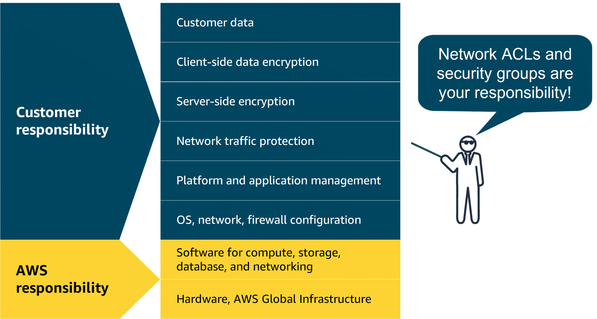

When it comes to securing the subnets and resources in your VPC with network ACLs and security groups, that is your responsibility. These components make up networking traffic protection and are critical defenses in protecting your applications IN the cloud.

---

**Q: A retail customer is setting up their application in the AWS Cloud. The application requires a lot of control in defining traffic rules for the individual Amazon EC2 instances in their public subnet. Which solution would BEST meet the requirements for securing the resources?**

**Options:**
- A) Change all the subnets to private subnets to avoid accessing from the public internet.
- B) Set up security groups for the EC2 instances based on the application requirements.
- C) Set up network ACLs for the EC2 instances based on the application requirements.
- D) Set up a public subnet with strong passwords that meet the customer's requirements.

A: **B) Set up security groups for the EC2 instances based on the application requirements.**

**Explanation of other options:**
- ❌ Change all subnets to private = Incorrect; making subnets private would remove public accessibility. The requirement is fine-grained traffic control for EC2 instances, not changing subnet visibility.
- ✅ Security groups for EC2 instances = Correct; security groups operate at the instance level and allow granular, per-instance inbound and outbound traffic rule definitions — exactly what is needed.
- ❌ Network ACLs for EC2 instances = Incorrect; network ACLs operate at the subnet level, not the instance level. They apply broad rules to all traffic entering or exiting a subnet, not fine-grained rules per EC2 instance.
- ❌ Strong passwords = Incorrect; passwords are an authentication mechanism, not a network traffic control mechanism. They do not define traffic rules.

---

**Q: Which network component performs stateless packet filtering?**

**Options:**
- A) Private subnet
- B) Network access control list (network ACL)
- C) Amazon VPC
- D) Security groups

A: **B) Network access control list (network ACL)**

**Explanation of other options:**
- ❌ Private subnet = Incorrect; a private subnet is a network segment that restricts public internet access; it does not itself perform packet filtering or evaluate traffic rules.
- ✅ Network ACL = Correct; network ACLs are stateless — they evaluate every packet crossing a subnet boundary independently, with no memory of previous requests or responses.
- ❌ Amazon VPC = Incorrect; a VPC is the isolated network boundary in AWS; it does not itself perform stateless or stateful packet filtering.
- ❌ Security groups = Incorrect; security groups perform stateful packet filtering — they remember prior decisions and automatically allow return traffic for established connections.

### 5. Amazon VPC Demo

In this lesson, you will learn how to do the following:
- Navigate in the AWS Management Console.
- Review the steps to create a VPC.
- Create both public and private subnets.
- Create and attach an internet gateway.
- Create a route table, add routes, and associate public subnets.

In the previous lessons, you have learned about the Amazon VPC and its core components. In this demonstration video, you will get to see the steps to bring it to reality. You will learn the steps to create a VPC, public and private subnets in two AZs, an internet gateway, and even routing tables.

#### Building an Amazon VPC in the AWS Cloud

It's helpful to understand how resources are created using the AWS Management Console. The following is a high-level overview of the resources and core components created in the preceding demonstration.

**Create the Amazon VPC:**

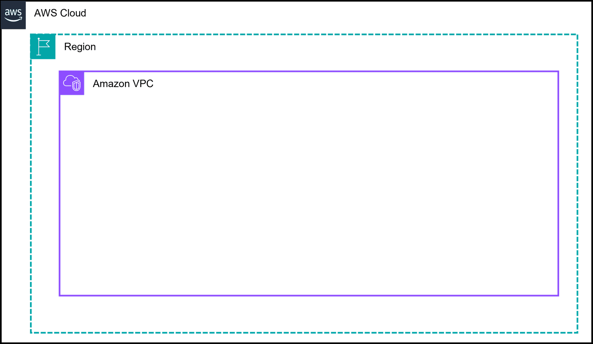

Before you can create resources in the AWS Cloud, the first step is to create your own Amazon VPC. You will also specify the Region best located for your resources.

**Create the subnets:**

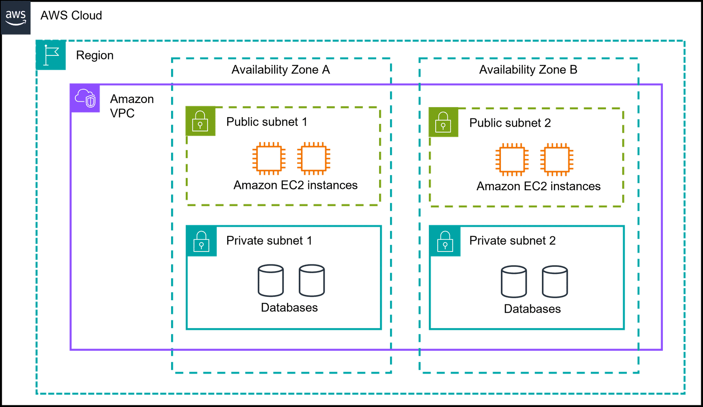

You will create two public and private subnets across two availability zones. This is a best practice to achieve high availability.

**Create an internet gateway and route traffic:**

Without an internet gateway, your users can't get to your resources. First, you create the internet gateway. Then, you create route tables to route traffic to allow internet traffic in and local traffic out.

You are well on your way to creating your resources in your Amazon VPC. At this point, you would consider what type of security you need and filter the traffic coming in and out. Remember security groups and network ACLs? That's where they come in handy! And finally, you'd be ready to add your resources like EC2 instances or databases in your subnets.

### 6. Global Networking

In this lesson, you will learn how to do the following:
- Define what Domain Name System (DNS) is and what it does.
- Describe benefits and use cases of Amazon Route 53.
- Describe benefits and use cases of Amazon CloudFront.

Edge networking is the process of bringing information storage and computing abilities closer to the devices that produce that information and the users who consume it. Edge computing is important because organizations often need lower latency access to their data and content. By performing tasks or caching data locally or closer to users, organizations can deliver faster, more responsive experiences while maintaining better control over their infrastructure. There are also many different services that are hosted on the edge, like the DNS service, Amazon Route 53.

#### Translating Domain Names to IP Addresses with DNS

Suppose that AnyCompany has a website hosted in the AWS Cloud. Customers enter the web address into their browser and they are able to access the website. This happens because of DNS resolution. DNS resolution involves a customer DNS resolver communicating with a company DNS server.

You can think of DNS as being the phone book of the internet. DNS resolution is the process of translating a domain name to an IP address.

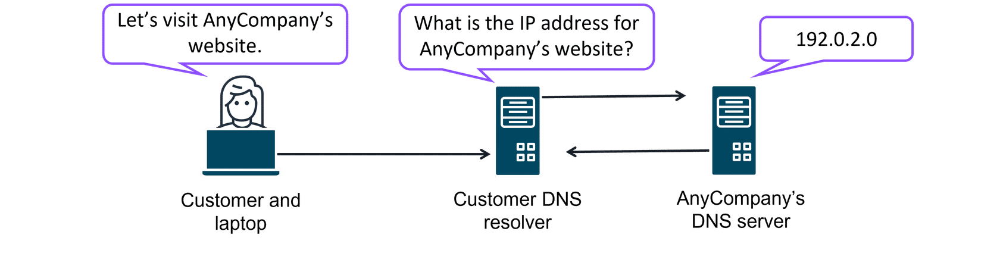

1. **Customer and laptop** — When you enter the domain name into your browser, this request is sent to a customer DNS resolver.
2. **Customer DNS resolver** — The customer DNS resolver asks the company DNS server for the IP address that corresponds to AnyCompany's website.
3. **AnyCompany's DNS server** — The AnyCompany DNS server responds by providing the IP address for AnyCompany's website, 192.0.2.0.

#### Amazon Route 53

Route 53 is a DNS that provides a reliable and cost-effective way to route end users to internet applications.

Route 53 directs end users to your resources with globally dispersed DNS servers and automatic scaling. It gives developers and businesses a reliable way to route end users to internet applications hosted in AWS. It connects user requests to infrastructure running in AWS, such as Amazon EC2 instances and load balancers. It also routes users to infrastructure outside of AWS.

Another feature of Route 53 is the ability to manage the DNS records for domain names. You can register new domain names directly in Route 53. You can also transfer DNS records for existing domain names managed by other domain registrars. This makes it possible for you to manage all of your domain names within a single location.

Route 53 also works with the next AWS edge networking service, Amazon CloudFront.

#### Amazon CloudFront

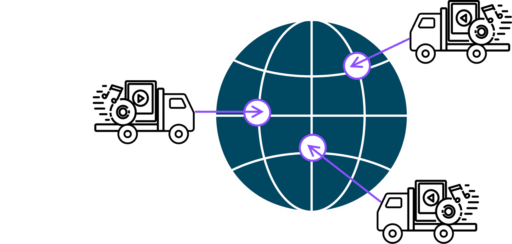

CloudFront is a content delivery network (CDN) service that delivers your content with faster loading times, cost savings, and reliability.

CloudFront is like a global network of delivery trucks that quickly brings web content to users around the world. Instead of all requests traveling back to one central warehouse (your original server), CloudFront stores copies of your content at locations closer to your users. This means websites, videos, images, and applications load much faster, no matter where your customers are located.

**Streaming video service:**

A company that offers online workout videos uses CloudFront to make sure videos play smoothly without buffering, even during peak exercise times when thousands of users log in simultaneously.

**Ecommerce website:**

An online store uses CloudFront to deliver product images and web pages quickly during busy shopping seasons. This faster experience keeps customers engaged and reduces abandoned shopping carts.

**Mobile app:**

A travel app uses CloudFront to deliver map data and images to users' phones quickly to help travelers navigate new cities without frustrating delays.

**How Route 53 and CloudFront work together:**

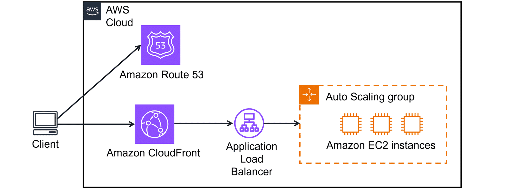

1. **Customer request** — A customer requests data from the application by going to AnyCompany's website.
2. **Amazon Route 53** — Amazon Route 53 uses DNS resolution to identify AnyCompany.com's corresponding IP address, 192.0.2.0. This information is sent back to the customer.
3. **CloudFront** — The customer's request is sent to the nearest edge location through CloudFront.
4. **Application Load Balancer** — Amazon CloudFront connects to the Application Load Balancer, which sends the incoming packet to an Amazon EC2 instance.

#### AWS Global Accelerator

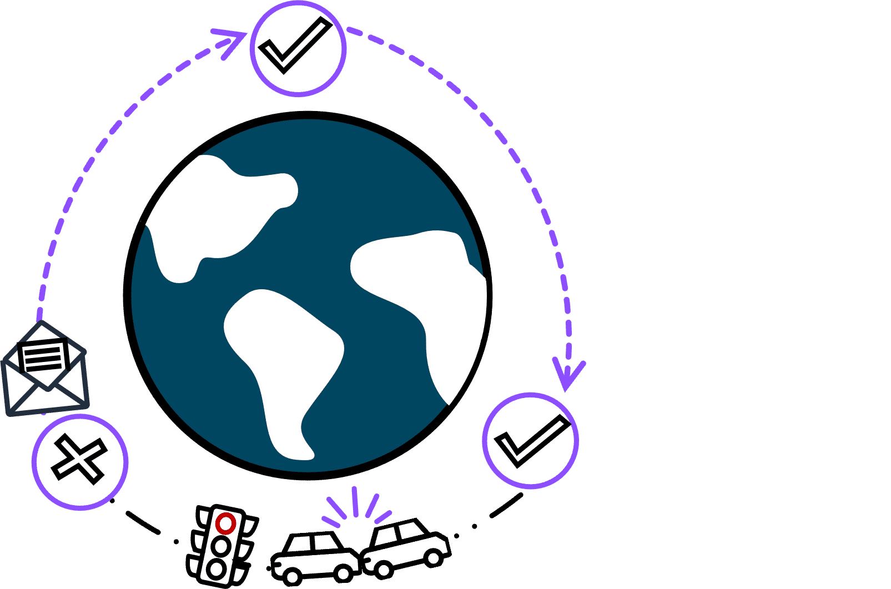

Global Accelerator is a service that uses the AWS global network to improve application availability, performance, and security. It uses intelligent traffic routing and fast failover if something goes wrong in one of your application locations.

Global Accelerator is a networking service that helps your applications run faster and more reliably across the globe. Think of it like creating express lanes on the internet highway specifically for your application's traffic. Instead of your users' requests taking the regular, sometimes congested internet routes, Global Accelerator directs traffic through the AWS private global network — getting your users to your application faster and more reliably.

**Global gaming company:**

A gaming company uses Global Accelerator to reduce lag and provide smoother gameplay for players around the world. Players in Tokyo, New York, and London all experience similar, responsive gameplay because their connections are optimized.

**Financial services application:**

A banking app uses Global Accelerator to ensure their customers always have fast, reliable access to their accounts. Even during peak times or when network conditions in one area are poor, customers can check balances and make transactions without frustrating delays.

#### Flashcards: AWS Edge Services

Several AWS edge services are similar and are used in global networking solutions. To review these AWS edge services, choose each of the following flashcards.

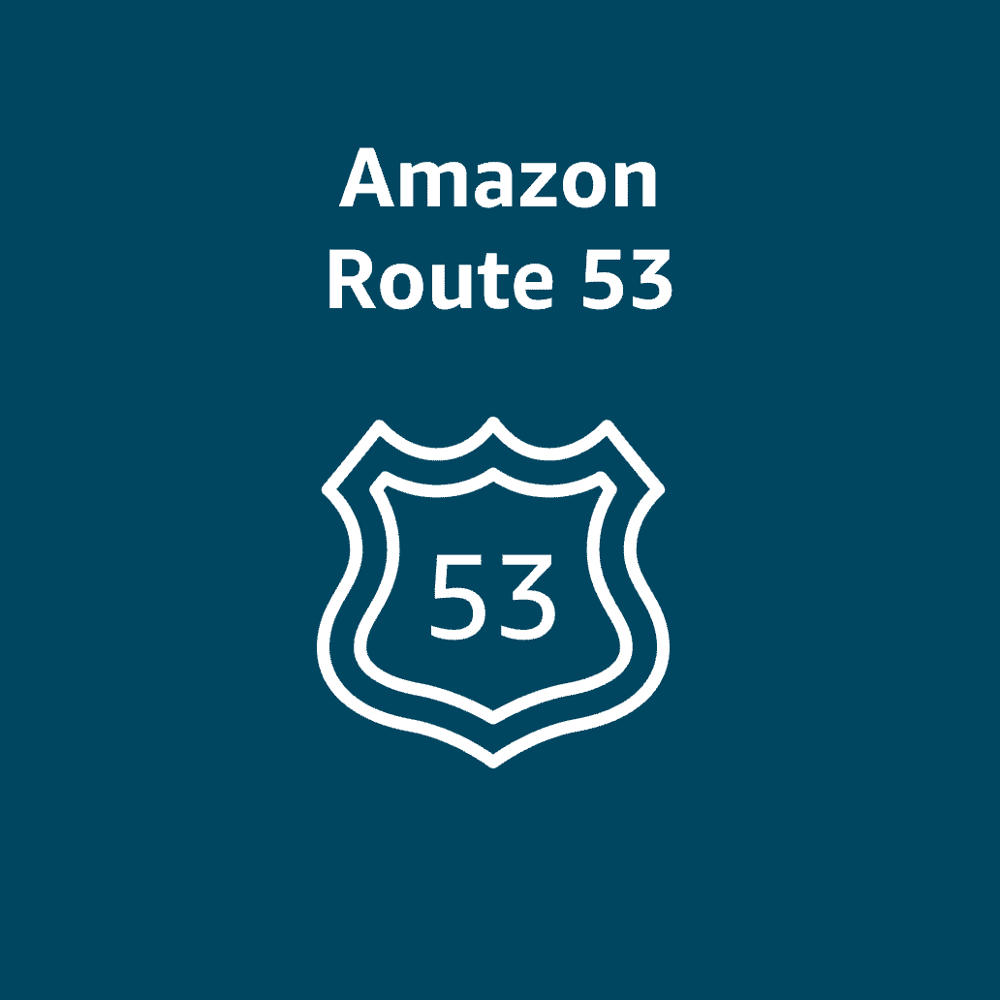

**Amazon Route 53** — Route 53 is a highly available and scalable cloud DNS service.

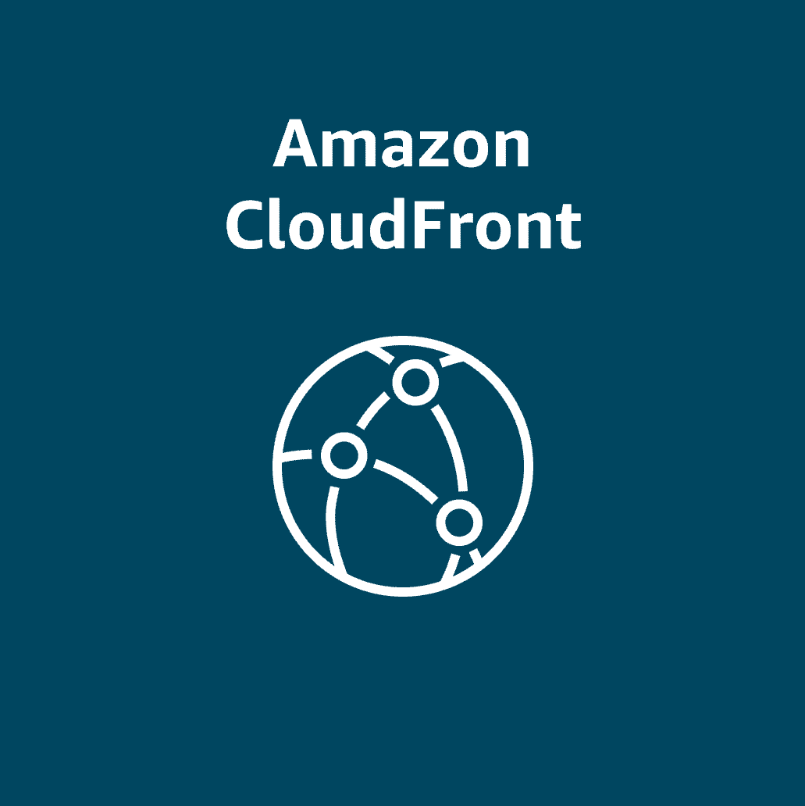

**Amazon CloudFront** — CloudFront is a CDN service that delivers your content with low latency and high speeds.

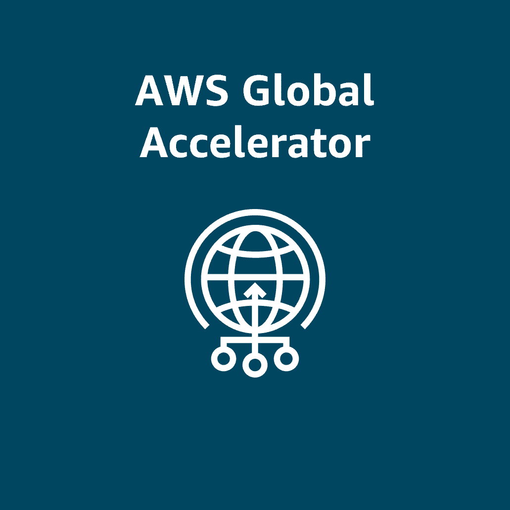

**AWS Global Accelerator** — Global Accelerator is a service that uses the AWS global network to improve application availability, performance, and security.

---

**Q: An enterprise customer with a worldwide sales force is looking to deliver their large library of sales training content. They want to make sure their sales force can access the media-rich training content with low latency and reduced costs. Which AWS service would BEST fit the customer's need?**

**Options:**
- A) Amazon VPC
- B) Amazon Route 53
- C) Amazon CloudFront
- D) AWS Global Accelerator

A: **C) Amazon CloudFront**

**Explanation of other options:**
- ❌ Amazon VPC = Incorrect; a VPC provides private network isolation for AWS resources. It does not distribute or cache content globally and has no CDN capability.
- ❌ Amazon Route 53 = Incorrect; Route 53 is a DNS service that routes user requests to endpoints. It translates domain names to IP addresses but does not store or deliver content.
- ✅ Amazon CloudFront = Correct; CloudFront is a CDN that caches content at edge locations worldwide, delivering media-rich libraries with low latency and reduced origin-server load.
- ❌ AWS Global Accelerator = Incorrect; Global Accelerator accelerates network-layer performance using the AWS private network. It does not cache content or function as a CDN.

---

**Q: After years of working with different domain registration companies, a media company is looking for a solution to manage all their existing domain names. They also want to register new domain names. Ideally, they would like to manage all their domain names in a single service. Which AWS service would BEST fit the customer's need?**

**Options:**
- A) Amazon VPC
- B) Amazon Route 53
- C) Amazon CloudFront
- D) AWS Global Accelerator

A: **B) Amazon Route 53**

**Explanation of other options:**
- ❌ Amazon VPC = Incorrect; a VPC creates an isolated virtual network for AWS resources. It has no domain name registration or DNS management capabilities.
- ✅ Amazon Route 53 = Correct; Route 53 allows businesses to register new domain names and transfer DNS records from other registrars, enabling management of all domain names in one location.
- ❌ Amazon CloudFront = Incorrect; CloudFront is a CDN for delivering content with low latency. It does not manage domain names or DNS records.
- ❌ AWS Global Accelerator = Incorrect; Global Accelerator optimizes routing through the AWS private network. It does not offer domain registration or DNS record management.

### 7. Global Architectures

In this lesson, you will learn how to do the following:
- Identify examples of when to use a VPN or Direct Connect.
- Describe at a high level how a VPC with a virtual private network (VPN) connection and Direct Connect work together.
- Describe how a multi-Region architecture works with CloudFront and Route 53.

In this video, you will review a multi-Region architecture to show how CloudFront, Route 53, Direct Connect, and VPNs all work together.

#### Direct Connect Failover When You Need Much Higher Bandwidth with Dedicated Lines

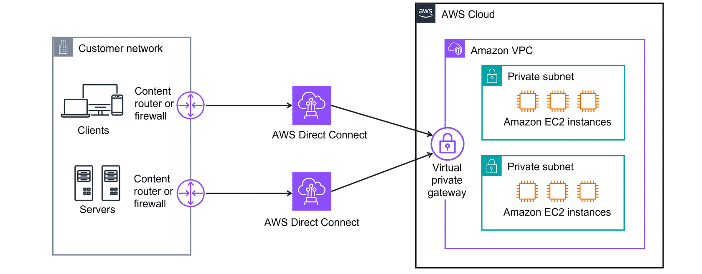

You've seen a basic VPN and AWS Direct Connect setup in previous lessons. Here is an example of a company with clients and servers that demand high bandwidth connections for large data transfers and critical application performance. They chose to access their AWS resources securely with multiple Direct Connect connections for failover.

1. **Customer network** — The customer network clients and servers need a secure, high-bandwidth connection for large data transfers and critical application performance.
2. **Content router or firewall** — The customer has a content router or firewall connecting their network to Direct Connect.
3. **Multiple Direct Connect connections** — In addition to fault tolerance, the customer wanted increased bandwidth. They can even combine multiple connections to achieve higher aggregate bandwidth.
4. **Virtual private gateway** — Using a virtual private gateway, the clients can securely access the private resources in the Amazon VPC.

#### Delivering Content to Several Different Regions Globally

Here is an example of how a company with offices around the world can deliver content with low latency for a seamless experience across multiple Regions.

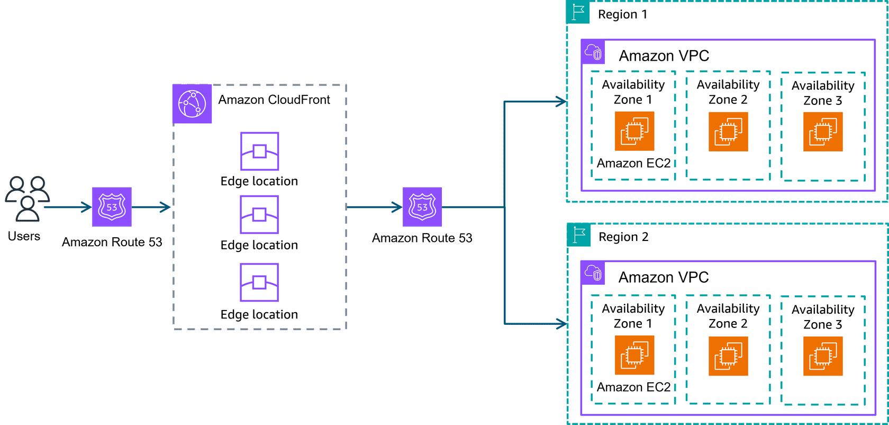

1. **Users** — The users access the company's website using a custom domain. The request is first sent to a Route 53 DNS record.
2. **Routing policy** — Route 53 uses a routing policy to determine which Region is closest to the user. Route 53 directs the user to the appropriate CloudFront edge location.
3. **Direct to edge locations** — Route 53 directs the user to the CloudFront edge location in the appropriate Region.
4. **Content in multiple AZs** — The content is fetched from the designated origin server in the chosen Region. Also note, the website was built with resources in multiple Availability Zones for high availability.

---

**Q: A healthcare company is looking to create a dedicated network connection to AWS. They would use this connection for their heavy payloads of data being sent over the internet to AWS. They also have compliance requirements due to the sensitive nature of their patient data. Which type of connection to the AWS Cloud would BEST meet their needs?**

**Options:**
- A) Standard internet connection from the client to an internet gateway in the VPC in the AWS Cloud
- B) VPN connection from their corporate data center to the AWS Cloud
- C) VPN connection from their corporate data center to a virtual private gateway to their Amazon VPC
- D) AWS Direct Connect connection from their corporate data center to a virtual private gateway in their VPC in the AWS Cloud

A: **D) AWS Direct Connect connection from their corporate data center to a virtual private gateway in their VPC in the AWS Cloud**

**Explanation of other options:**
- ❌ Standard internet connection = Incorrect; a standard internet connection provides no encryption, no dedicated bandwidth, and no compliance guarantees. It is unsuitable for sensitive patient data.
- ❌ VPN to the AWS Cloud = Incorrect; a VPN encrypts traffic but shares public internet bandwidth. Heavy data payloads will cause slowdowns, and it may not satisfy strict compliance requirements.
- ❌ VPN to virtual private gateway = Incorrect; while more specifically correct in its target, VPN still shares internet bandwidth and is not a dedicated connection. It does not meet the high-bandwidth and compliance requirements described.
- ✅ Direct Connect to virtual private gateway = Correct; Direct Connect is a dedicated private fiber connection that bypasses the public internet, provides consistent high bandwidth for large data transfers, and addresses compliance requirements by keeping traffic off shared public infrastructure.

## 🔗 References & Links

| Resource Link                                                                                                       | Description                                                                                                                                                                                                                                                                |
|---------------------------------------------------------------------------------------------------------------------|----------------------------------------------------------------------------------------------------------------------------------------------------------------------------------------------------------------------------------------------------------------------------|
| [Amazon Virtual Private Cloud](https://aws.amazon.com/vpc/)                                                         | Amazon VPC is a service to provision a logically isolated section of the AWS Cloud where you can launch AWS resources in a virtual network that you define.                                                                                                                |
| [Subnet](https://docs.aws.amazon.com/vpc/latest/userguide/configure-subnets.html)                                   | A subnet is a section of a VPC that can contain resources and is used to organize your resources. They can be either public or private.                                                                                                                                    |
| [Internet gateway](https://docs.aws.amazon.com/vpc/latest/userguide/VPC_Internet_Gateway.html)                      | An internet gateway is a connection between a VPC and the internet. It allows public traffic from the internet to access your VPC.                                                                                                                                         |
| [Virtual private gateway](https://docs.aws.amazon.com/vpn/latest/s2svpn/how_it_works.html#VPNGateway)               | A virtual private gateway is the component that allows protected internet traffic to enter into the VPC. It allows a connection between your VPC and a private network only if it is coming from an approved network.                                                      |
| [AWS Client VPN](https://aws.amazon.com/vpn/client-vpn/)                                                            | Amazon Client VPN is a networking service you can use to connect your remote workers and on-premises networks to the cloud. It is a fully managed, elastic VPN service that automatically scales up or down based on user demand.                                          |
| [AWS Site-to-Site VPN](https://aws.amazon.com/vpn/site-to-site-vpn/)                                                | AWS Site-to-Site VPN creates a secure connection between your data center or branch offices and your AWS Cloud resources.                                                                                                                                                  |
| [AWS PrivateLink](https://docs.aws.amazon.com/vpc/latest/privatelink/what-is-privatelink.html)                      | AWS PrivateLink is a highly available, scalable technology that you can use to privately connect your VPC to services and resources as though they were in your VPC.                                                                                                       |
| [AWS Direct Connect](https://aws.amazon.com/directconnect/)                                                         | AWS Direct Connect is a service that provides a dedicated private connection between your data center and a VPC.                                                                                                                                                           |
| [Network Access Control List (network ACL)](https://docs.aws.amazon.com/vpc/latest/userguide/vpc-network-acls.html) | A network ACL allows or denies specific inbound or outbound traffic at the subnet level using stateless packet filtering.                                                                                                                                                  |
| [Security groups](https://docs.aws.amazon.com/vpc/latest/userguide/vpc-security-groups.html)                        | Security groups control the inbound and outbound traffic for a resource at the instance level using stateful packet filtering.                                                                                                                                             |
| [Domain Name System (DNS)](https://aws.amazon.com/route53/what-is-dns/)                                             | DNS translates human readable domain names to machine readable IP addresses (for example, 192.0.2.0).                                                                                                                                                                      |
| [Amazon Route 53](https://aws.amazon.com/route53/)                                                                  | Route 53 is a scalable and reliable DNS web service that helps developers and businesses route end users to internet applications, whether they're hosted in AWS or elsewhere. It also supports domain registration, health checks, and advanced traffic routing policies. |
| [Amazon CloudFront](https://aws.amazon.com/cloudfront/)                                                             | CloudFront is a web service that speeds up distribution of your web content to your users through a worldwide network of data centers called edge locations. It securely delivers content with low latency and high transfer speeds.                                       |
| [AWS Global Accelerator](https://aws.amazon.com/global-accelerator/)                                                | Global Accelerator is a networking service that helps improve the availability and performance of applications for global users by routing traffic through the AWS global network. It helps improve application availability, performance, and security.                   |
| [Amazon Transit Gateway](https://aws.amazon.com/transit-gateway/)                                                   | Amazon VPC Transit Gateways is a network transit hub used to interconnect VPCs and on-premises networks.                                                                                                                                                                   |
| [NAT Gateway](https://docs.aws.amazon.com/vpc/latest/userguide/vpc-nat-gateway.html)                                | NAT gateway allows instances in a private subnet to connect with services outside your VPC. External services can't initiate a connection with those instances.                                                                                                            |
| [API Gateway](https://aws.amazon.com/api-gateway/)                                                                  | The Amazon API Gateway is an AWS service for creating, publishing, maintaining, monitoring, and securing APIs at any scale. It handles all the tasks involved in accepting and processing up to hundreds of thousands of concurrent API calls.                             |

## ❓ Key Questions to Review

- What is a VPC and why is it important?
- How do security groups and NACLs differ?
- What is the difference between public and private subnets?
- When should you use Direct Connect vs. VPN?
- What is the difference between stateful and stateless packet filtering?
- How do Route 53 and CloudFront work together?

## 📌 Summary

**Module Recap**

Module 5 covered networking in the AWS Cloud from the ground up. It began with the foundational components — Amazon VPC, subnets, and internet gateways — and progressed through connectivity options (VPN, Direct Connect, Client VPN, Site-to-Site VPN, PrivateLink), network security (security groups and network ACLs), a hands-on VPC demo, and global networking services (Route 53, CloudFront, Global Accelerator). The module concluded with real-world multi-Region architectures showing how these services integrate to deliver secure, high-performance, globally available applications.

**Key Takeaways:**
- Amazon VPC provides an isolated virtual network; subnets (public/private) organize and control access to resources within it
- Security groups (stateful, instance-level) and network ACLs (stateless, subnet-level) are both required for layered network security; securing them is the customer's responsibility
- Direct Connect provides dedicated private bandwidth for heavy workloads and compliance requirements; VPN is encrypted but shares internet bandwidth and suits smaller-scale or remote-access needs
- Route 53 (DNS + routing policies), CloudFront (CDN edge caching), and Global Accelerator (private network routing) work together to deliver content globally with low latency
- Multi-Region architectures combine multiple VPCs, Availability Zones, Route 53 latency-based routing, and CloudFront edge locations for high availability and seamless global user experience
